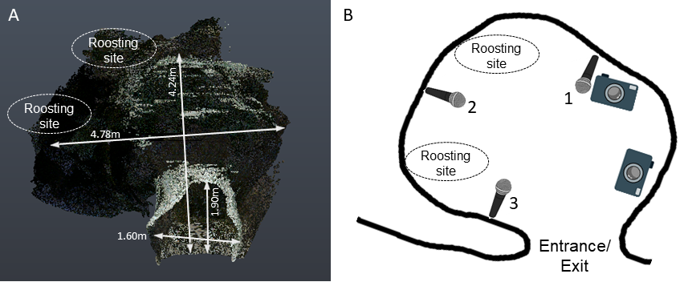
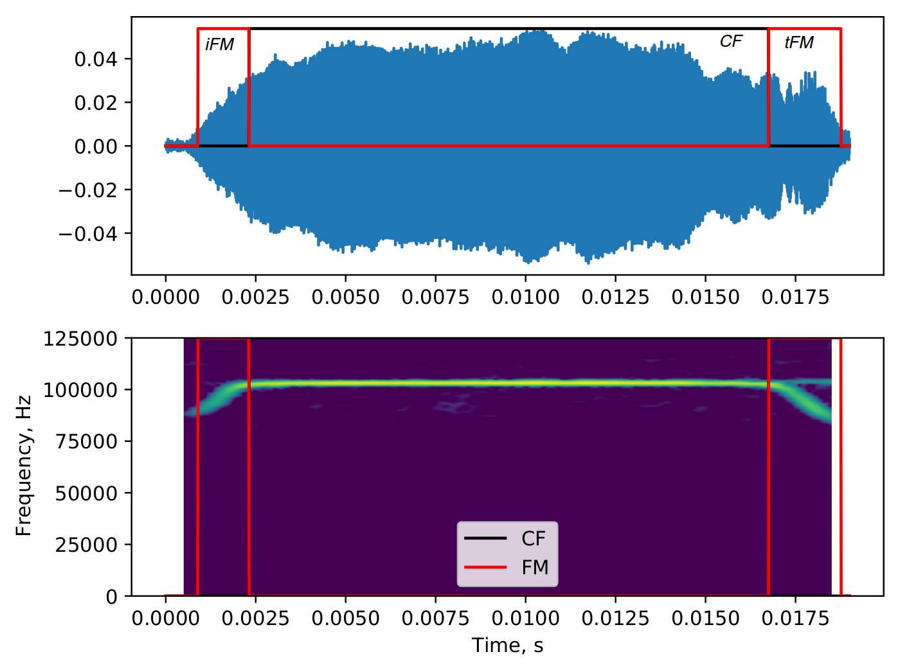
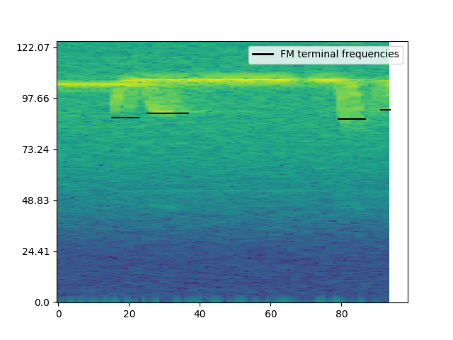
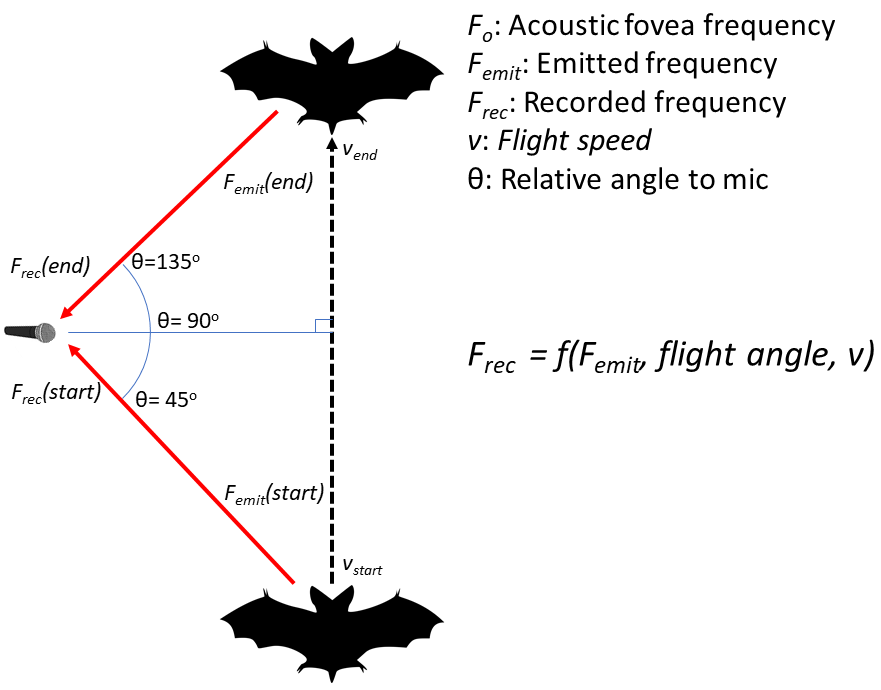

```{r echo=FALSE}
library(knitr)
#opts_knit$set(eval.after = "fig.cap")
```
## Introduction 
Living in groups provides both costs and benefits to the group members, which individuals have to balance [@pulliam1984living]. Advantages of being in a group might be increased foraging success, offspring survival, or thermoregulation, while challenges might include increased parasitism, and competition. An individual’s sensory perception is also challenged in groups, due to the multitude of dynamic sensory information from group members, for example in leks, roosting sites, or even at human gatherings. Only a small fraction of this information is relevant to a receiver [@socialintegr], which necessitates various adaptations to filter out irrelevant information, including unique calls (e.g., mate contact calls in penguins) or avoiding signal overlap with neighbours (e.g., in frogs and cricket pairs) [@socialintegr]. 

Many studies to date have focused on sensory filtering in passive sensing animals, i.e., animals that sense their surroundings by receiving external energy (e.g., penguins, frogs, humans)[@zweifel2020defining;@nelson2006a]. As each passively-sensing group member receives external information independently, their sensory processes do not affect other individuals around them. In contrast, active sensing animals like electrolocating fish or echolocating bats face a unique sensory challenge when actively sensing in social groups [@ulanovsky2008bat;@gillambrasiliensis;@watanabe1963change). Echolocating bats emit intense ultrasonic calls and detect their surroundings by listening for the echoes reflecting off objects around them [@griffin1958listening]. In groups however, a bat’s returning echoes can be overlapped by the calls and echoes from its neighbours, preventing detection of its surroundings[@ulanovsky2008bat].  Active sensing animals thus face the issue that their information of interest is potentially masked by the multitude of surrounding signals in a group. An echolocating bat in a group may thus end up metaphorically flying ‘blind’, as without detecting its own echoes it cannot sense its environment. 

A combination of laboratory and field studies have shown the diverse behavioural responses of bats in response to sensory challenge from groups and experimental playbacks. Bats increase call levels, alter temporal features such as call rate, duration and duty cycle [@amichai2015calling;@jarvis2013groups;@lu2020echolocating; @hage2013ambient;@lin2016a], and spectral properties such as bandwidth and terminal frequency [@hase2018bats;@cvikel2015board;@gotze2016no;@fawcett2015echolocation]. These responses however are not uniform across species, with different species showing seemingly opposite responses to similar situations [@ulanovsky2004dynamics; @amichai2015calling;@jarvis2013groups;@adams2017suppression]. 

There are two broad groups of echolocating bats [@fenton2012evolution] characterised by their duty cycle, i.e., the fraction of time spent emitting calls. The first and major group of bats are low-duty cycle bats. They typically emit frequency-modulated (FM) calls. The second group are high-duty cycle bats which typically emit calls with a long constant-frequency (CF) component and one or two flanking short FM components (CF-FM calls). In contrast to low-duty cycle bats, the calls of high-duty cycle bats are longer (10 to $\geq$ 50ms) and thus have higher duty cycles of ~34-57$\%$ [@fenton2012evolution]. Higher duty cycle directly increases the probability of temporal overlap and thus masking of echoes by calls [@beleyur2019modeling]. High-duty cycle bats such as rhinolophids and hipposiderids are thus likely to be more affected in group echolocation than low-duty cycle bats, making them a unique system to understand the sensory strategies echolocators use in challenging conditions. Most studies on group echolocation so far investigated low-duty cycle bats [@lin2016a;@fawcett2015clutter;@gotze2016no], likely due their speciosity (~87% of all echolocating bats [@fenton2012evolution;@mammdivdatabase] and ease of call analysis. A wider variety of species need to be studied, to understand the echolocation responses in context of their ecology and auditory systems.

A typical CF-FM call has of up to three call components: a short initial upwards FM sweep (iFM), a long central CF segment (CF), and a short terminal downward FM sweep (tFM) (sensu @tian1997echolocation). The CF component is used for the flutter detection of prey wingbeats [@schnitzler2011auditory] based on high-resolution frequency analysis around the CF frequency in the bat’s auditory fovea [@neuweiler2000biology]. Different species and even individuals within a species use different CF-frequencies that are matched to the frequency tuning of their acoustic foveas [@schnitzler1976peripheral]. Individual bats also compensate for flight-induced Doppler shifts to keep the CF-frequency of the returning echo within their acoustic fovea [@schnitzler1973control; @schoeppler2018precise]. Despite potential temporal overlap of emitted call and returning echo, Doppler-shift compensation spectrally separates the CF parts of the echo and call when a bat is echolocating alone. In groups however, temporal and spectral overlaps between neighbours’ calls and own incoming echoes is bound to occur. While the CF component is involved in prey detection, the tFM component is thought to be involved in target ranging [@tian1997echolocation;@neuweiler1987foraging], and the role of the iFM remains ambiguous. Comparable to call alterations in FM-bats [@Fenton2014], CF-FM bats show rapid alterations in tFM bandwidth and duration based on the behavioural context, e.g. resting, landing or prey capture [@neuweiler1987foraging;@schoeppler2018precise;@tian1997echolocation]. 

Previous investigations of group echolocation in CF-FM bats found no support for changes in CF frequencies to avoid spectral overlap (“jamming avoidance response”)[@jones1993echolocation;@jones1994individual;@fawcett2015echolocation]. Recent studies in low duty cycle FM bats also questioned the efficacy of a jamming avoidance response in groups [@gotze2016no;@mazar2020sensorimotor]. In contrast to the CF-component, we are only aware of one study that quantified changes of the FM-component in group flight, reporting an increased tFM duration and bandwidth [@fawcett2015echolocation]. Given the tFM’s flexibility and role in ranging, there is a strong need for its explicit quantification in multi-bat contexts. The tFM may show the same kinds of changes in multi-bat contexts as shown in low-duty cycle bats, which also use their FM calls primarily for ranging [@fawcett2015clutter;@amichai2015calling;@hase2018bats].

Studying group echolocation in high-duty cycle bats entails analysing audio with overlapping calls. The analysis of recordings with overlapping calls is a nascent field (but see @izadi2019segmentation), and call-related acoustic measurements have not been attempted to the best of our knowledge . Even studies with multiple high-duty cycle bats have been limited to 2-3 bats in flightroom conditions [@fawcett2015echolocation;@jones1993echolocation;@jones1994individual]. Here, we developed methods to extract echolocation parameters in the presence of overlapping calls and  to investigate the high-duty-cycle echolocation of group-flying horseshoe bats in a natural cave 

## Methods

### 2.1 Study species and site
Two species of rhinolophid bats *Rhinolophus mehelyi* and *R. euryale* were recorded in their natural environment. Both study species emit CF-FM calls with peak frequencies between 102-112 kHz, and are not acoustically distinguishable  due to overlap in their call characteristics [@dietz2016bats]. While phylogenetically different species, for the purposes of this study we treat them as a single group of bats that may face the problem of acoustic jamming due to the similarity in spectro-temporal call structure.

We used an audio-video recording setup positioned in a dome-shaped cave (Figure 1) next to the main entrance of the Orlova Chuka cave system, Bulgaria. The cave was 5x3x1.6m (lxbxh) in dimensions. The cave had only one opening with roosting sites on the inside where most bats flew in and out of through the night. 

### 2.2 Experimental setup

The experimental setup consisted of an audio-video recording system made of three microphones and two infrared cameras. The audio and video feeds were synchronised using the low-cost method described in Laurijssen et al. 2018. ON-OFF signals between 0.08-0.5 s were generated by a portable computer (Raspberry Pi 3). The ON-OFF voltage signal was directly fed into one of the channels of the soundcard. The same voltage signal was also used to drive the blinking of an LED that was recorded by  the two cameras. (See Supplementary Information (SI) 1.0 for signal generation script, electronic circuit and associated notes).

For the video recording, two consumer grade CCTV cameras with infrared lamps were connected to a digital video recorder to record the flight of bats as they flew in and out of the cave. The system recorded video mostly at 22 Hz, however there was frame rate variation between 18-27 Hz. The video stream of the two cameras was not frame-synchronised, however, we were still able to view the same bat flight on both cameras due to the common timestamps burnt-in on each frame. The two cameras were placed in approximately the same position on every recording night. The cameras were so placed to maximise the total cave volume recorded while also capturing the blinking LED light. Only sections of the video that had stable camera positions were analysed. Video was recorded continuously through the night and resulted in two video files (one per camera) for each recorded hour.

Three Avisoft CM16 microphones (Avisoft Bioacoustics, Germany) were connected to an Avisoft 416H (Avisoft Bioacoustics, Germany) soundcard running at 250kHz sampling rate. Horseshoe bat calls are known to be directional (Matsuta et al. 2013), and the three microphones were placed at different positions in the cave to increase the number of on-axis calls captured. Microphones were placed in the same location with an estimated +/- 10cm error in the cave across multiple nights. The fourth channel of the Avisoft 416H was used to record the audio sync signal. Audio was recorded continuously through the night in the form of consecutive multichannel files of 1 minute length. Our audio recordings showed that the dome was visited by multiple species of bats aside from our two main study species, and we only analysed audio data with *R. euryale* and/or *R. mehelyi* calls in it.


```{r cavesetupschematic, echo=FALSE,  fig.cap="\\label{fig:cavesetupschematic} Scan of cave volume and schematic of microphone positions with reference to the entrance/exit and roosting sites of the cave. A) Point cloud scan of the cave as seen with the entrance/exit facing the viewer. (3D scanning by Klaus Hochradel, UMIT Tirol) B) Schematic of the microphone and video camera positions as seen from a top-view of the cave. The numbers next to the microphone icons are the corresponding channel numbers. "}

#include_graphics('figures/point_cloud_KlausHochradel.png')
```

## 3. Data analysis


### 3.1 Video analysis to determine group sizes

Bat activity in the cave was recorded for a total of about 12 hours across four nights in the cave. Bats flew in and out of  the cave often showing different flight behaviors such as circling, approaching and following. Sometimes however, bats spent time (few seconds to several minutes) in the roosting sites within the cave and then exited. The start and end of all bat flight bouts in the video was manually annotated following a series of pre-defined criteria to ensure repeatability (SI 2.0). Each flight bout annotation recorded the number of flying bats as seen in the two camera views.


### 3.2 Matching video annotation to obtain synchronised audio 

For each video annotation of a bat flight bout, we attempted to match the corresponding region of recorded audio. For each successfully matched video annotation, we created a separate audio file. Audio matching was done by cross-correlating the blinking ON/OFF LED signal over the video annotation with the recorded ON/OFF voltage signal in the audio. We managed to successfully find audio matches for 1181 video annotations, ($N_{total \:video \:annotations=2132}$ i.e., 55% of all video annotations). The low match rate is primarily due to the fluctuating camera frame rates, and because many of the matched audio files had non-target bat species calls. Multiple species were seen in the audio files as during video annotation it was not possible to distinguish bat species by their flight behaviour. The other observed bat calls were from *R. ferrumequinum*, vespertilionid and miniopterid FM bats, all of which are known to occur in the Orlova Chuka cave system [@ivanova2005important]. For the acoustic analysis we chose matched audio files that only had *R. euryale* and/or *R. meheyli* calls. The audio files varied in duration between 0.08-62.08 seconds ($N_{matched \:audio \:files}=1181$, median duration: 1.04s , 95%ile range: 0.5-8.54s). 

## 4.0 Acoustic parameter analysis

All matched audio files were first forward-backward high-pass filtered at 70 kHz. For the analysis we used recordings from the first microphone, as it appeared to have consistently  captured calls with the least reverberance of the three channels. The first microphone was located facing the cave opening, perhaps therefore capturing calls of both entering and exiting bats well.

We quantified frequency, duration and amplitude across different parts of the echolocation call (iFM,CF and tFM) using two complementary acoustic analyses. The first analysis is the ‘individual call' analysis, where we measured parameters of one horseshoe bat call from each matched audio. The second analysis is the ‘window’ analysis. Each matched audio was split into 50ms windows. We then measured the acoustic parameters from all windows of a matched audio file. In recordings with multiple bats, the 50 ms windows could have overlapping calls. 

The advantage of the individual call analysis is that the measurements made on the calls are directly interpretable as call component alterations reveal the sensory decisions of the bats. On the other hand, the disadvantage of the individual call analysis is that especially in multi-bat recordings, it can be difficult to find a non-overlapped call. The window analysis complements individual call analysis by enabling measurements even on audio with overlapping calls. Window analysis also allows a kind of null-hypothesis testing where the observed multi-bat audio can be compared with 1) single bat audio and 2) ‘virtual’ multi-bat audio files created by adding multiple single bat audio files. These 'virtual' multi-bat audio files recreate a scenario where two bats echolocate in the same volume without actively responding to each other's presence. The disadvantage with window analysis is the lack of call-level measurements. Ultimately, using the two approaches simultaneously strengthens the interpretation of our results.

### 4.1 Individual call measurements

```{r, samplesizes, echo=FALSE}
sampsizes <- read.csv('../combined_analysis/indcall_sample_sizes.csv')

```
Individual calls that were not overlapped by other calls and with sufficient signal-to-noise ratio (Figure \@ref(fig:itsFMdemo)) were manually chosen through a random search protocol (SI 3.0). Briefly, an experimenter began searching from a randomly chosen time point in an audio file for a non-overlapped horseshoe bat call. From this point in the file, the experimenter randomly began searching to the left or right until a suitable horseshoebat call could be identified. The start and end time of this call in the audio file were noted. 

We were able to find a total of `r sampsizes$N[1]` individual calls ($N_{single \:bat}$: `r sampsizes$N[2]`, $N_{multi \:bat}$: `r sampsizes$N[3]`) across all the synchronised audio files.  Calls were automatically segmented into their corresponding parts iFM, tFM or CF [@tian1997echolocation] (Figure \@ref(fig:itsFMdemo)) using the *itsfm* package [@itsfmcitation;*biorxivpaper*]. Most approaches to date focus on indirectly segmenting CF-FM calls into their components by high/low pass filtering around the peak frequency of the call [@siemers2005species;@schuchmann2012horseshoe;@tian1997echolocation;@lu2020echolocating;@schoeppler2018precise].
For an accurate estimate of the peak frequency, this approach requires an on-axis recording of the call with a prominent CF component. While suitable for laboratory studies, filtering around the peak frequency fails in the analysis of CF-FM calls recorded in the field under a variety of conditions eg. calls with loud FM and faint CF components. *itsfm* overcomes these limitations by tracking the *change* in frequency over the call to segment it into FM and CF components. 


```{r itsFMdemo,echo=FALSE, fig.cap="\\label{fig:itsFMdemo} Example of a single CF-FM call with automatically segmented iFM, CF and tFM regions. The raw data is a manually selected audio segment, which is then automatically segmented by the *itsfm* package based on frequency modulation across the call. The *itsfm* package allows accurate segmentation into call parts under challenging recording conditions"}




#\begin{figure}
#\includegraphics{figures/fig1_labelled_original_from_20180816_21502300_30.png}
#\caption{Example of a single CF-FM call with automatically segmented iFM, CF and tFM regions. The raw data is a manually selected audio segment, which is then automatically segmented by the *itsFM* #package based on frequency modulation across the call. The *itsFM* package allows accurate segmentation into call parts under challenging recording conditions}
#\label{itsFM_demo}
#\end{figure}
```

From the segmented CF and FM components we measured specific parameters. In the CF component, we measured the peak frequency, RMS amplitude and duration. The CF peak frequency was quantified as bats may shift their CF frequencies in the presence of conspecifics. ‘Jamming avoidance’ type reponses have been a parameter of investigation in previous studies [@habersetzer1981adaptive;@jones1994individual;@jones1993echolocation;@fawcett2015echolocation;
@lu2020echolocating]. From the FM components, we measured the lower frequency (-10 dB peak frequency of the FM audio segment), bandwidth (defined as difference between the CF peak frequency and  the lower frequency of the FM segment), RMS amplitude and duration. The bandwidth is important for target ranging in CF-FM bats. An increase in bandwidth in the presence of conspecifics has been shown in at least one previous study [@fawcett2015echolocation]. We also calculated the relative i/tFM-CF amplitude ratios (in dB). The relative call component measures were calculated as CF-FM bats are known to independently vary the level of call components in a context specific manner [@tian1997echolocation;@lu2020echolocating].


### 4.2 Window measurements

Each audio file was split into consecutive 50ms windows (SI 4.0). The time window of 50ms was chosen as it provided high spectral resolution (20Hz for 12500 samples at 250kHz sampling rate) to distinguish multiple CF components that may be in it. Often in the multi bat recordings, the 50 ms windows consisted of one to many horseshoe bat calls. Initial observations showed that 50 ms was about the longest observed duration of a bat call in our data, and was also about twice the length of typical calls. We therefore chose a 50 ms duration as it could contain one long call or multiple short calls. 

Over the course of an audio file, there may be multiple windows without calls or very faint calls in them. These 'silent' windows were removed from the analysis, and only the 'non-silent' windows with bat calls in them were analysed. Non-silent windows were defined as those that were 20 dB RMS more than manually annotated silent audio segments (SI 4.1). On each non-silent window, the following acoustic measurements were performed: 1) received level (dB RMS), 2) dominant frequencies and 3) FM terminal frequencies. Dominant frequencies here are defined as frequency peaks in the smoothed power spectrum that are within 14 dB of the window's peak frequency. Dominant frequencies are extracted from the various peaks of the power spectrum and are thus a proxy measurement for the CF component frequencies of calls in a window (SI 4.2). FM terminal frequencies were determined by a spectrogram based method which identified FM regions and chose the lowest frequency in each FM region of a given audio window (SI 4.3). There could be multiple terminal and dominant frequency values for a single window, however only one received level measurement per window. All measurements chosen in the whole audio analysis were done to be analogous to the measurements performed in the individual call analyses. For instance, the dominant frequencies in the whole audio analysis complements the CF peak frequency measurements in the individual call analysis. The FM terminal frequencies and RMS measurements are again analogous to the bandwidth and RMS of the individual call analysis.

### 4.3 Virtual multi-bat audio

The advantage of the window analysis is the possibility to make ‘virtual multi-bat’ data [@fawcett2015echolocation;@ratcliffe2004conspecifics] by combining observed single bat call measurements or sequences. We created virtual multi-bat audio files by combining single bat files that were of similar durations (SI 4.4). This allowed us to create a ‘null’ dataset where multiple bats were echolocating, but not responding to each other’s presence. Acoustic measurements were also performed on the virtual multi-bat audio using the window analysis described above.

## 5.0 Statistical analysis 

We observed upto 1-4 bats flying in the cave at the same time. However, the sample sizes in group sizes $\geq$ 2 bats were low (SI 5.0), and we thus decided to combine all annotations with $\geq$ 2 bats into a 'multi' bat class. We thus performed comparisons of 'single' and 'multi' bat calls in the individual call analysis. To maintain consistency with individual call analysis we also performed comparisons of 'single','multi' and 'virtual-multi' audio in the window analysis. 


### 5.1 Individual call measurements

We calculated the median difference ($median_{multi}-median_{single}$) between multi and single bat call parameters for all parameters except CF peak frequency. For CF peak frequencies, we calculated the range difference ($Range_{multi}-Range{single}$) of CF peak frequencies in multi bat and single calls. The range difference was calculated as 'jamming avoidance' type responses imply an alteration in the range of frequencies used. Bats may decide to shift their call frequencies in groups, leading to an increased range [@habersetzer1981adaptive], or as has been experimentally observed, paradoxically converge [@furusawa2012convergence]. Permutation tests were performed to assess the significance of the observed median and range difference between the groups. 

Our dataset has calls from a group of resident wild bats that may have visited the cave site multiple times over the course of a night. Moreover, bat activity over the course of a single night was relatively clustered in time, and flight annotations were thus fairly close to each other at <= 1 minute (median inter-annotation times was 36 s for annotations used in individual calls and 54 s for annotations used in window analysis). Due to the clustered nature of activity, our dataset may have had a disproportionate representation of a few individuals, leading to pseudo replication, and thus a lowering of variation in the data.

To account for the temporal pseudo-replication in our data, we repeated the median/range difference analysis by creating two subsets from our full dataset. We created the 'clustered' subset, where all calls from annotations that were $\leq$ 1 min from each other were taken together. The 'isolated' subset included all calls from annotations that were at least 1 minute away from another annotation. The 'isolated' and 'clustered' subsets had unique datapoints, with no overlap in the calls used. One minute was chosen as it was slightly larger than the observed median inter-annotation interval. Broadly speaking, we expect that if the results of our analysis are comparable across the isolated and clustered subsets, there is a common underlying effect that is independent of temporal clustering. However, if the results of the subset analysis do not corroborate each other, it hints at an effect due to temporal clustering/isolation in the dataset. 

### 5.2 Window measurements

In analogy to CF peak frequency range in the individual call analysis, we calculated the dominant frequency range ($max_{dominant \: frequency}-min_{dominant \:frequency}$) across an audio file. Even in single bat audio files, we expect variation in recorded dominant frequency due to the combined effect of the bat's active Doppler shift compensation and Doppler shift due to its flight past the microphone (SI 8.0).  Multi-bat and virtual-multi bat audio files are expected to have an increased range due to presence of multiple bats. We performed a comparison of the median difference in dominant frequency range between multi-single and multi-virtual multi audio. A permutation test was performed to assess the significance of the observed difference. To understand the expected dominant frequency range from single and multi bat flights, (and thus the expected range difference) we also performed simulations quantifying Doppler shift and Doppler shift compensation parametrised by the observed data (SI 8.0). The dominant frequency range estimates from the simulations informed the interpretation of the observed data.

Unlike one value per file for the dominant frequency range measurement, there are multiple potentially correlated received level and terminal frequency measurements from each file. We accounted for this potential file-level pseudo-replication by resorting to repeated random subsampling and median difference calculation. To estimate the median difference between groups we randomly chose one measurement value per file for the single, multi and virtual-multi bat groups. The median difference between multi-single and multi-virtual multi groups were calculated and followed by the next subsampling round. We performed 10,000 such subsampling iterations, and report the 95 percentile range of median differences in received level and terminal frequency. No tests were run on the median difference estimates obtained for received level and terminal frequency. 

To account for temporal pseudo-replication in our study, we also repeated the entire window analysis using clustered and isolated subsets as described in section 5.1. 

### Software packages used in this paper
This paper was enabled by a series of open-source packages. Signal analysis, data manipulation and visualisation were done in Python [@van1995python] through its scientific ecosystem: the scipy, numpy, matplotlib, soundfile and pandas packages [@2020SciPy;@numpy;@matplotlib;@soundfile;@pandas]. Median difference and permutation tests were performed with dabest [@ho2019moving] while reproducible analysis, documentation and presentation were enabled by the Jupyter Notebook and Rmarkdown projects[@jupyter;@rmarkdown]. Audio visualisation, preliminary measurements and single call annotations were done with Audacity [@audacity].

## 6.0 Results

### 6.1 Individual call measurements

```{r indcallsampsizes,echo=FALSE}
indcall <- read.csv('../combined_analysis/indcall_final.csv')
nindcalls <- as.data.frame(table(indcall$groupsize))
nmulti_indcall <- nindcalls[1,2]
nsingle_indcall <- nindcalls[2,2]
```

```{r include=FALSE, echo=FALSE}
singleind <- subset(indcall, num_bats==1)
multiind <- subset(indcall, num_bats>1)

getminmax<-function(X){c(min(X,na.rm=TRUE), max(X,na.rm=TRUE))}

# ifm durns
single.ifmdurn <- getminmax(singleind$ifm_duration)
multi.ifmdurn <- getminmax(multiind$ifm_duration)

# tfm durns
single.tfmdurn <- getminmax(singleind$tfm_duration)
multi.tfmdurn <- getminmax(multiind$tfm_duration)

```

```{r indcallrawdata, echo=FALSE, fig.cap=paste("\\label{fig:indcallrawdata} Measured acoustic parameters for the CF, iFM and tFM components of individual calls emitted under single and multi bat conditions. Each column shows the measurements on a call component, while each row shows a group of related measurements A-C) duration  D-F) spectral measurements G-I) received level J-K) relative FM-CF ratios L-M) FM component bandwidths. $Ncalls_{single}=$",nsingle_indcall, ", $Ncalls_{multi}$=",nmulti_indcall)}

include_graphics('../combined_analysis/measurements_and_derivedparams_multipanel.png')
```

The measured acoustic parameters of call components are shown in Figure \@ref(fig:indcallrawdata). Call parameters showed little difference between multi and single bat groups (Table \@ref(tab:alldataindcall)). Among the temporal parameters, median CF duration appeared to show a ~3ms decrease in multi-bat calls, indicating shorter calls. The iFM and tFM median durations seemed to differ between the groups by around 0.1 ms in opposite directions. Among the spectral parameters, CF peak frequency range, iFM and tFM lower frequencies all differed by around 1 kHz in different directions. Among the received level parameters, iFM and CF components showed a ~ 1.5 dB decrease, while tFM level showed a slightly larger ~-3 dB decrease in multi-bat calls.  The i/tFM-CF level ratios however showed very slight differences of less than 1 dB magnitude. Median tFM bandwidth seemed to be slightly increased in multi-bat calls by 1.8 kHz, while iFM bandwidth did not show very much difference (~300 Hz). Our 'whole dataset' results broadly match with the results using the 'clustered' and 'isolated' subset data (SI 6.0). One complicating factor in the interpretation of the isolated subset is however the severe drop in sample sizes of the multi-bat calls in this subset. In the isolated subset, $N_{multi}$ = 5 calls, in contrast to the much higher $N_{single}$=53. 


```{r alldataindcall, echo=FALSE, tab.cap="\\label{tab:alldataindcall} *Difference between multi and single bat call parameters. The median difference is reported for all parameters except CF peak frequency, where the difference in range is reported.*"}
library(flextable)
indcall.analysis <- read.csv('../combined_analysis/alldata_indcall_ci.csv')
msmt.names <- c("CF duration (median ms)", "tFM duration (median ms)", "iFM duration (median ms)",
                "CF peak frequency (range kHz)", "tFM lower frequency (median kHz)", "iFM lower frequency (median kHz)",
                "CF level (median dB RMS)", "tFM level (median dB RMS)", "iFM level (median dB RMS)",
                "tFM-CF ratio (median dB)", "iFM-CF ratio (median dB)", "tFM bandwidth (median kHz)", "iFM bandwidth (median kHz)")

pvalues <- round(indcall.analysis$perm_pvalue,2)
pvalues[1] <- round(indcall.analysis$perm_pvalue[1],3)
meddiff <- round(indcall.analysis$difference,2)

meddiff.table<- data.frame(cbind(msmt.names, meddiff, pvalues))
colnames <- c("Measurement","Difference (Multi-Single)","Permutation test p-value")
medditab <- flextable(meddiff.table)
medditab <- set_header_labels(medditab, msmt.names= colnames[1], 
    meddiff = colnames[2], pvalues= colnames[3]
    )
medditab <- autofit(medditab)
medditab
```


### 6.2 Window analysis 
```{r windowsampsizes,echo=FALSE}

get.window.samplesizes <- function(df)
  {
  n_samples <- as.data.frame(table(df$groupsize))
  n_samples
  }


domfreq_singlemulti_whole <- read.csv('../combined_analysis/obs_singlemulti_domfreq.csv')
ndomfreq_singlemulti_whole <- get.window.samplesizes(domfreq_singlemulti_whole)

domfreq_multivirt_whole <- read.csv('../combined_analysis/multivirtmulti_domfreq.csv')
ndomfreq_multivirt_whole <- get.window.samplesizes(domfreq_multivirt_whole)


```

```{r domfreqranges,echo=FALSE,fig.cap="\\label{fig:domfreqranges} Measured dominant frequency range (max-min) across flight activities in single-bats, multi-bat and virtual multi-bat conditions. Variation in dominant frequency in single-bat condition arises from the combination of active Doppler-shift compensation by the bat and Doppler-shift due to bat flight past the microphone. The dominant frequency range in multi-bat and virtual multi-bat is larger because of there are more than one bat. The median multi-bat dominant frequency range is greater than single-bat range by 2.2 kHz (p<10-4). Virtual multi-bat and multi-bat median range difference was much lower and negligible at 0.48 kHz (p=0.16)."}

include_graphics('../combined_analysis/domfreqranges.png')
```

Multi-single comparisons (Table \@ref(tab:windowsinglemulti)) revealed an increased dominant frequency range in multi bat audio windows by around 2 kHz. The estimated median differences for received level and FM terminal frequency showed no systematic trend, indicating no relative increase or decrease. Subset analysis also revealed similar trends (SI 7.0).

```{r windowsinglemulti, echo=FALSE, tab.cap=paste("\\label{tab:windowsinglemulti}*Multi-single bat comparison of window parameters. For dominant frequency, the range difference was calculated along with running permutation test. Dominant frequency range is larger by 2.2 kHz in multi-bat windows as expected. 95 percentile estimated range for median difference are reported for received level and FM terminal frequency. Received levels and FM terminal frequency median differences indicate no systematic trend towards a relative increase or decrease in multi-bat audio windows.*","$Nfiles_{single}$=",ndomfreq_singlemulti_whole[2,2],"$Nfiles_{multi}=$",ndomfreq_singlemulti_whole[1,2])}
wholewindow.results <- read.csv('../combined_analysis/whole_window_summary.csv')
wholewindow.results <- wholewindow.results[,-1]
window.colnames <- c("Parameter",
                     "Difference",
                     "Permutation test p-value",
                     "Median difference, 2.5%ile",
                     "Median difference, 97.5%ile",
                     "comparison")
colnames(wholewindow.results)<- window.colnames

singlemulti.wholewindow <- subset(wholewindow.results,comparison=='multi-single')
ft.sm.ww <- flextable(singlemulti.wholewindow[,seq(1,5)])
ft.sm.ww <- fit_to_width(ft.sm.ww, max_width =6.6)

ft.sm.ww
```

Multi-virtual multi comparisons (Table \@ref(tab:windowmultivirt)) revealed a small increase in dominant frequency range  of around 0.5 kHz in multi bat audio windows. Received level and FM terminal frequency median differences indicate no systematic trend towards a relative increase or decrease in multi-bat audio windows. Subset analysis also revealed similar trends (SI 7.0)

```{r windowmultivirt, echo=FALSE, tab.cap=paste("\\label{tab:windowmultivirt}*Multi-virtual multi bat comparison of window parameters. For dominant frequency, the range difference was calculated along with running permutation test. Dominant frequency range difference is small and hints at a scenario with no active change in CF frequencies. 95%ile estimated ranges are reported for received level and FM terminal frequency. Received levels and FM terminal frequency median differences indicate no trend towards a relative increase or decrease in multi-bat audio windows.* $Nfiles_{multi}$=",ndomfreq_multivirt_whole[1,2],"$Nfiles_{virtual \':multi}$=",ndomfreq_multivirt_whole[2,2])}
multivirt.wholewindow <- subset(wholewindow.results,comparison=='multi-virtual multi')

ft.mvm.ww <- flextable(multivirt.wholewindow[,seq(1,5)])
ft.mvm.ww <- fit_to_width(ft.mvm.ww, max_width =6.6)
ft.mvm.ww
```

## Discussion 


```{r echo=FALSE}
# broad overview of what we did and that we didnt find any difference
```
We quantified the difference in horseshoe bat echolocation calls when alone and with conspecifics in the field. Our results do not support a biologically meaningful difference in echolocation calls with reference to group size for all of the call parameters measured using two different approaches. This may seem somewhat unexpected, especially considering the fact that bats in our field site were flying in an enclosed reverberant volume - which would only amplify the problem of masking in multi-bat echolocation. We interpret our results below in more detail.


```{r echo=FALSE}
# The CF peak frequency + dominant frequency range story
```
The idea that bats may alter their call frequencies to reduce spectral overlap in groups has been investigated with mixed results over many studies [@jones1993echolocation;@jones1994individual;@ulanovsky2004dynamics]. Specifically in CF-FM bats  the results do not support the idea that bats may alter their CF frequencies [@jones1993echolocation;@jones1994individual;@fawcett2015clutter;@pye1972bimodal]. @habersetzer1981adaptive seems to suggest CF frequency shifting in a quasi-CF bat, *Rhinopoma hardwickei* (but see @cvikel2015board for an alternative interpretation). However, the echolocation of *R. hardwickei* is not entirely comparable with those of the hipposiderids and rhinolophids in previous studies [@simmons1984echolocation]. Hipposiderids and rhinolophids are more constrained in their echolocation as they show a marked individual-specific acoustic fovea that does not vary over short periods of time [@neuweiler2000biology;@schnitzler1976peripheral]. CF-FM bats are thus constrained to emit calls so that the Doppler-shifted echoes arrive within their own acoustic fovea's range. Our data (Figure \@ref(fig:indcallrawdata), Tables \@ref(tab:alldataindcall),\@ref(tab:windowsinglemulti),\@ref(tab:windowmultivirt))) also support previous studies showing an absence of active CF frequency shifting in the presence of conspecifics. If bats were to show 'jamming avoidance' type responses, one would expect an overall increase in the CF frequency range in groups, and thus an increased range difference between single and multi bat audio. If they were to show 'convergence' [eg. as in @furusawa2012convergence], we expect a reduction in range.  The observed CF and dominant frequency range differences of around 2 kHz  between single and multi bats falls within the expected magnitude seen when bats do not show any special responses to each other (SI 8.0). More convincingly however, the low difference in dominant frequency range between multi and virtual multi audio shows that even when bats are indeed flying together they are not actively altering their CF frequencies to reduce or increase overlap. Our simulations (SI 8.0) and experimental data show that a receiver (eg. a microphone or another bat) placed in the proximity of a flying CF-FM bat may hear a series of CF frequencies that vary by upto $\pm$ 3 kHz from the emitted frequency. This relatively large variation in the received frequency thus decreases the extent of spectral overlaps during multi-bat echolocation. The combination of individual specific acoustic foveas and Doppler-shift driven variation in received CF frequency make it unlikely that the CF component would be masked effectively even in groups. 


```{r echo=FALSE}
# the i/tFM components, bandwidth
```
The tFM call component may also be expected to undergo alterations in groups. @fawcett2015echolocation found an average of 5 kHz tFM minimum frequency (-10 dB call peak frequency) increase in pairs. We failed to find effects that matched their results, with a drop in tFM lower frequency (-10 dB tFM peak frequency) of around 1 kHz at most, and an increase in tFM bandwidth of at most 1.8 kHz. Our window analysis revealed no systematic differences in terminal frequency estimates between single and multi bat windows. Alterations to duration are also known to occur in calls in the presence of conspecifics and noise [@fawcett2015echolocation;@lu2020echolocating]. @fawcett2015echolocation found an average increase in tFM duration  by 1.8 ms in pairs, while we find a slight median increase by about 0.1 ms in multi-bat calls. In another study with artifical playbacks, @lu2020echolocating found an increase of 0.6ms in comparison to calls in silence. Compared to previous studies, our effects are small, and unlikely to have biological significance. We also found a median decrease in CF component duration by around 3 ms in multi-bat calls. This decrease matches a similar finding of @fawcett2015echolocation where average call duration decreases by around 1.2 ms in pairs. However, whether our observed decrease in CF duration is a result of an increased call duty cycle or an artifact of our individual call selection protocol is difficult to tell apart. Our individual call selection protocol specifically looked for non-overlapping calls, meaning that it may have favoured the selection of shorter calls. 

```{r echo=FALSE}
# The received level story -- needs a bit more work
```
Bats are known to increase their call levels in the presence of experimental playbacks [@hage2013ambient;@hage2014ambient;@lu2020echolocating]. In our study, we did not have access to the source level of the calls as we did not track the bats' position in 3D space. We only had access to the *received* level at the microphone, which is modulated broadly by 1) the bat-microphone distance, and 2) source level of the call. With these caveats in mind, we discuss our results. Aside from the 3dB median drop in tFM received level, the multi-single difference in other call components were smaller (~1.5dB) in the individual call analysis. Window analysis revealed no systematic alteration in received level in multi-single and multi-virtual multi comparisons. The relative iFM-CF and tFM-CF ratios were at most 1 dB. Why was there no major difference in received levels even in the window analysis, where overlapping calls are expected to lead to a higher received level? The similarity in received levels of multi and single bat windows can be explained by the inequal contribution the nearest bat's call makes to the received level. Due to the spherical spreading of sound, the received level at the microphone primarily reflects that of the bat calling closest to the microphone. Thus, even when there are multiple bats - the nearest bats' call dominates the received level measurements. This nearest-bat dominance means we typically measure the received level of one bat's call even when the audio has overlapping calls. Multi and virtual-multi bat audio-segments having similar received levels thus indirectly suggests there is no change in source level even in the presence of another bat. However, the tFM received level showed a drop of around 3dB that we are not sure how to interpret. This apparent drop in received level could be the result of bats flying further away or emitting more directional calls. 


```{r echo=FALSE}
# What new things did we bring to the field?
```
We introduced two automated analyses that can be performed on audio recordings of multiple CF-FM bats. Automated individual call analyses using the open-source ```itsfm``` package allows call component segmentation according to the rate of frequency modulation across the sound.  The frequency-modulation based segmentation in our experience is also more robust to field recordings with fainter CF components, and thus performs better than filtering around the peak frequency as done in previous studies. To analyse audio with overlapping calls we measured acoustic parameters of short audio windows without assigning the measurements to individual calls. While coarser than the individual call analysis, the window based approach still provides complementary support to the individual call analyses by parametrising variables such as FM terminal frequency and dominant frequency range. 

```{r echo=FALSE}
# WHAT WE DID NOT MEASURE --- POINTING IT OUT 
```
There are a set of parameters that we were not able to measure and thus excluded in our analyses. We did not measure call-sequence related parameters such as inter-call-intervals or duty-cycle. Bats in acoustically difficult situations are known to alter their call rate [@amichai2015calling;@jarvis2013groups], and thus their duty cycle. Measuring inter-call-intervals is possible in single bat contexts, but extremely challenging in multi-bat recordings with overlaps and reverberation. The study of call-sequence related measures in multi-bat recordings is hindered by the difficulty in call assignment. In our individual call analyses we specifically avoided audio recordings with only overlapping calls, and this represents an unavoidable observational bias in our dataset. The use of a microphone array with at least four microphones to assign calls to the emitting bats is the next step in the study of CF-FM group echolocation. 


```{r echo=FALSE}
# Why did we not see anything? Discussing possibilities
tfm.95pctile <- round(quantile(indcall$tfm_duration,0.975,na.rm=TRUE),1)
tfm.2.5pctile <- round(quantile(indcall$tfm_duration,0.025,na.rm=TRUE),1)

dutycycle.range <- tfm.95pctile/c(40,50)
dutycycle.sorted <-  sort(dutycycle.range)*100

# load simulation results
overlap.probs <- read.csv('associated_docs/2-3bat_tfm_overlap_prob.csv')
overlap.probs2 <- subset(overlap.probs,num_bats==2)
tfm.probs <- round(sort(overlap.probs2$tfm_overlap_prob),3)*100

```
What are the possible explanations for the absence of a strong echolocation response in groups? The main explanation we posit is that situations with 2-3 bats may not be very challenging echolocation-wise for multiple reasons. CF-FM bats rely on the tFM component to detect the distance of objects around them [@tian1997echolocation]. The tFM components are short ($\\leq$ `r tfm.95pctile`ms, 95 percentile value), and likely emitted every 40-50 ms (calculated using typical duty cycle values. Interval includes CF duration and inter-pulse interval), which is equivalent to a tFM duty cycle between `r dutycycle.sorted[1]`-`r dutycycle.sorted[2]`%. For a pair of bats at these duty cycles, the probability of one tFM echo being overlapped by another bat's tFM call component is relatively low at most between `r paste(tfm.probs[1],'-',tfm.probs[2])`% (SI 9.0). Even if a single tFM echo is overlapped by another call, a bat may still be able to detect it if the signal-to-noise ratio is sufficient. Bats in small groups are unlikely to face major detriments to their echolocation [@Beleyur26662], and thus not show specific alterations from solitary echolocation. Secondly,  @fawcett2015echolocation observed an increased tFM duration and bandwidth in *R. capensis* flying in pairs in a novel flight room setting. The combination of flight room characteristics [@surlykke2009echolocating] and species differences, may perhaps have led to the difference in results between their study and ours. Bats show long-term spatial memory [@barchi2013spatial;@mohres1949versuche] and familiarity with the cave's structure may have allowed them to easily recognise their location over time.  Bats also use echoes across multiple calls and are thus resistant to occasional disruptions in echo arrival [@Salles202011719]. The combination of spatial memory and multi-echo integration may have allowed our bats to continue echolocating with conspecifics without altering their calls drastically. 

Previous manipulative studies [@hage2013ambient;@hage2014ambient;@lu2020echolocating] have revealed the exquisite control bats have over each call component. However, these call alterations are typically elicited in response to artifical stimuli with little resemblance to their natural auditory scenes. Our results suggest that bats may not regularly be employing strategies observed from playback and flightroom studies to enhance their echo detection while flying with conspecifics. We highlight the importance of observational studies in field settings to understand the frequency with which various sensory strategies are actually employed in ecological contexts. 

```{r, other-comments, echo=FALSE}
#1. ONE VERY IMPORTANT FACTOR TO CONSIDER -- overlapping calls -- the FM segments are relatively short (2-5ms), and at group sizes of 2-5, there's very unlikely to be an issue with detecting objects in their surroundings. ref Beleyur & Goerlitz. Even though Fawcett et al. 2015 see a difference..
#1. An important reason we don't see any difference between single and multi bat calls may also be because the bats are flying in a familiar natural setting. This may exclude the need for bats to 'compensate'.

#Our results stand in contrast to other comparable studies that show differences in echolocation call parameters based on conspecific presence in CF-FM and quasi-CF bats [@fawcett2015echolocation;@habersetzer1981adaptive;@cvikel2015board]. 


#1. **importance of field studies**: Bats may not show the same kinds of dramatic responses to conspecifics when studied in their natural habitat. Despite its challenging nature, we stress the importance of observing echolocation/behaviour in the wild. 
#1. We also present a method to assess differences in call behaviour with overlapping calls in the form of 'windows' than can incorporate a few calls. 
#1. One important aspect of the dataset missing in our study is the position of the bats as they called. 
#1. It maybe surprising that single and multi-bat audio windows didn't seem to show very much difference. This does not mean that bats did  not change their source level, and may be explained by a simple geometric consideration. The simplest factor is that when two sounds overlap, their dB received level is often dominated by the loudest sound. This means that in our case, when two bats fly past each other, one bat is always closer to the microphone - and its call is likely to dominate the measured received level (See Supplementary Information). Assessing source levels from the received levels requires knowledge of the bat positions. The source level calculations are in turn challenging due to the overlap of calls. One solution despite the presence of overlap is to exploit the slight interindividual difference in CF peak frequencies, and infer the individual call received levels from the power spectrum, and thus back calculate the source levels of the two overlapping calls. 

#1. Our study has the advantage of wild bats flying in relatively small volumes. Unlike observational studies done in the wild, where it is difficult to assess how far away the bats may have been - we can be sure that the bats were flying at most +/-X m away from each other. 
#1. Our measurement methods advance the state of the art a bit, but there is still a long way to go. All of our whole audio analysis methods include a lot of noise from echoes and reverberation. It would be good to be able to account/exclude such things. 
```

## Data and code availability
All data and code used process data and generate the results and figures in the paper are available at the following Github repository: .

## Acknowledgements 
The authors would like to specially thank the electronics team (Markus Abels, Hannes Sagunsky, Reinhard Biller) at the MPIO workshop for help preparing the electronic circuits to run the ON/OFF signal splitting. We would also like to thank Antoniya Hubancheva for logistical support, Stefan Greif for help collecting the data, the 2018 Tabachka field crew, Klaus Hochradel for the point-cloud scan of the cave and Diana Schoeppler and Hans-Ulrich Schnitzler for their helpful discussions. We also thank Manjari Jain for her support and and encouragement of the project. TB was funded by a DAAD doctoral fellowship and the IMPRS for Organismal Biology, HRG was funded by the Emmy Noether program of the DFG (German Research Foundation) *INCLUDEDFGGRANTNUMBERHERE????*. 

## Author Contributions 
Study design and conception: NMR, TB; Data collection: AK, NMR, TB;  Audio and video annotation: AK, NMR; Audio-video synchronisation: TB; Analysis: HRG, NMR, TB; Interpretation of results: HRG, NMR, TB;  Manuscript preparation: HRG, NMR, TB. 

\newpage 
# Supplementary Information 

## Audio-video synchronisation: hardware and software implementations

The audio and video data were synchronised using the protocol of [@laurijssen2018low]. A Raspberry Pi 3 was used to drive an ON/OFF signal from a GPIO port. This ON/OFF signal was then split between an LED and a circuit linked to capacitor. The capacitor converted the DC ON/OFF signal into positive and negative spikes - thus allowing the signal to be correctly digitised. Not all soundcards are capable of digitising DC voltages, and thus the capacitor helps in making the protocol independent of soundcard type. The entire circuit can be assembled from easily available parts (Figures \@ref(fig:breadboard), \@ref(fig:circuitschematic))

```{r breadboard, echo=FALSE, fig.cap="\\label{fig:breadboard} The experimental realisation of the audio-video synchronisation signal splitting. The components can easily be assembled onto a hobby breadboard, and are easily portable. Here the breadboard is pasted on the inside of a lunch box lid, allowing easy and safe transport of the breadboard and the Raspberry Pi in the box itself."}

include_graphics('associated_docs/breadboard_circuit_trim_labelled.png')

#\begin{figure}[H]
#    \includegraphics{associated_docs/breadboard_circuit_trim_labelled.png}
#    \caption{The experimental realisation of the audio-video synchronisation signal splitting. The components can easily be assembled onto a hobby breadboard, and are easily portable. Here the breadboard #is pasted on the inside of a lunch box lid, allowing easy and safe transport of the breadboard and the Raspberry Pi in the box itself.}
#    \label{breadboard}
#\end{figure}
```

```{r circuitschematic, echo=FALSE, fig.cap="\\label{fig:circuitschematic} The circuit plan of the synchronisation signal splitter shown in the figure above"}
include_graphics('associated_docs/rpi_circuit.png')

#\begin{figure}[H]
#    \includegraphics{associated_docs/rpi_circuit.png}
#    \caption{The circuit plan of the synchronisation signal splitter shown in Figure \ref{breadboard}}
#    \label{circuit_schematic}
#\end{figure}
```

The code to drive the GPIO port runs on Python 2 (and should also run on Python 3). For best results the python file 
can be set to automatically run on boot-up. This makes the synchronisation protocol field-friendly, and reduces the need
of the experimenter manually running the code. 

```
#!/usr/bin/python
'''
script that switches a RED LED on and off
This script and the circuit used to
run the system is based on the post at thePiHut
'Turning on an LED with your Raspberry Pi's GPIO Pins' 
URL: https://thepihut.com/blogs/raspberry-pi-tutorials/
27968772-turning-on-an-led-with-your-raspberry-pis-gpio-pins
Accessed June 11 2015
'''
import RPi.GPIO as GPIO
import sys
import time
GPIO.setmode(GPIO.BCM)
GPIO.setwarnings(False)
GPIO.setup(18,GPIO.OUT)
import numpy as np

time_ranges = np.arange(0.08,0.5,0.0001)

while True:
    try:
        #print ('LED ON')
        GPIO.output(18,True)
        on_time = np.random.choice(time_ranges,1)
        time.sleep(on_time)
        #print('LED OFF')
        off_time = np.random.choice(time_ranges,1)
        GPIO.output(18,False)
        time.sleep(off_time)
    except KeyboardInterrupt:
        GPIO.output(18,GPIO.LOW)
        sys.exit()

 ```

One optional change that can be made to the code above is to set the seed manually with ```np.random.seed``` after the numpy import. 
Setting a fixed seed can have the advantage that problems in audio-video file synchronisation post data collection can be better
fixed. A fixed seed however means that the output signal is the same across all sessions used - which might make distinguishing 
audio and video recordings from different sessions difficult, though not exclude it.

Another important aspect to pay attention to is the ```time_ranges``` variable. In this experiment it was assumed that the camera frame rate
was going to be 25 Hz, and thus the lowest ON/OFF time was set to 0.08s, which corresponds to a signal with 12.5Hz periodicity of the Nyquist frequency. However, as @laurijssen2018low suggest, it would have been better to set the lowest duration to a longer period, which was a few times lower than the Nyquist frequency of 12.5 Hz, eg. 0.2s (5 Hz). In our experiments, the cameras turned out to have a frame rate of 22Hz, which meant that the LED signal was aliased. However, despite the
aliasing, we were still able to synchronise audio and video - showing the robustness of the methodology. 


## Video annotation of bat flights in the cave (*Needs cleaning and finalisation from N and Aditya*)
Manual annotation of the video data was carried out to determine the group sizes of free-flying horseshoe bats in their natural habitat. To annotate, the video feeds from both IR cameras were viewed simultaneously on Shotcut [@shotcut]. The following information was documented from the video: the start and end times of bat flight activity from the burnt in timestamps from either camera 1 or 2 in “yyyy-mm-dd hh:mm:ss” format, frame number, number of bats flying, flight behavior. To have an unbiased approach at annotating video flight behaviors, for a given hour of recording eight random numbers were generated using “star trek”, an online tool, to generate random numbers (https://stattrek.com/statistics/random-number-generator.aspx#error). For each of the random numbers, 2 minutes from the random number were annotated. We defined the start of bat activity as the moment a bat is visible/observed to fly in either camera views. Similarly, the end of bat flight activity was when a bat is not observed in either camera view. In multi-bat contexts that can have dynamic transitions in the number of bats, we annotated the multi-bat activity start and end times with parts of the video that had the maximum number of bats showing flight behaviour. In order to separate one flight activity from another, we ensured a difference of at least 6 frames between successive bat activity annotations. A gap of 6 frames was chosen because it corresponds to a duration of about (240-)273 ms for a frame rate of 22 fps. This time gap corresponds to the length of 2-3 horseshoe bat calls and we considered a gap of this length to be sufficient to separate one event from the next. 

We prioritized obtaining a clean data set and refrained from annotating extremely difficult bat flight annotations because of how dynamic the group size shifts can be in groups of horseshoe bats flying in a tight cave space like in our field site. We also annotated the parts of video where there are no flying bats observed as control data set. These control data annotations were used for parameter extraction to serve as a measure to account for bats calling from the roost or perching sites in the cave space or the bats that are vocalising just outside the cave space and yet the calls are picked up by the microphones inside the cave. We chose to annotate at least half the number of bat flight annotations and annotated no bat activity for 1 s long. 


## Individual call analysis 

### Individual call selection 

Individual calls were selected from the audio files based on a set of pre-defined search protocol:

* All measurements and signal processing will be done using Audacity. 
* dB rms measurements made with the 'Contrast' function in Audacity. Highpassing done with the inbuilt highpass filter. The SNR is calculated by difference between the foreground (bat call region) and background (silent region)

    1. Load annotation audio file, and delete all non-target channels. 
    1. View audio in spectrogram mode. Set dynamic range of spectrogram to 60dB. 
    1. Highpass filter audio file with 12 dB roll off/octave at 80 kHz cutoff frequency
    1. For given audio file, choose  a start point using a random number generator between 0-1. 
    1. Go to that fraction of time corresponding to the length of the annotation audio file 
    1. Choose another random number between 0-1. If it's <=0.5 search towards left, else search towards right. 
    1. Look for a horseshoebat call with no overlaps, no interference patterns in the CF or FM, that can be isolated well. 
    1. While selecting horseshoe bat calls, zoom in max till 60 milliseconds of audio occupy the whole screen. Do not zoom in more or less while selecting. 
    1. Check the SNR of the selected horseshoe bat call by using a 'silent period' of the audio file as background.  If there is not suitably long 'silent period' to serve as background in this audio file, choose another random audio file and measure the background dB rms. 
        a. If SNR >= 20 dB, this is a suitable call to measure. Note down the start and end time of this call in the audio file.
        b. If SNR < 20dB
            i. Go back to search start point calculated in 4), and begin searching in opposite direction. 
            ii. Look for first suitable call to measure using criteria in 7) onwards.
        c. If a suitable call is still NOT found:
            i. No measurement takes place in this audio annotation. Proceed to next audio annotation file.

Audacity version 2.3.3 was used during the manual call selection.


##  Window analysis 

### Choosing the 'silent window threshold'

A series of manually annotated audio clips were used to set the reference silent window threshold. The manually annotated audio clips were the same as those used to calculate the reference 'silence' segments in the individual call analysis ($N_{files}=406$, min-max duration=0.002-0.03s). The threshold for a window to be chosen as silent was set at 20dB above the maximum measured dB rms of all silent windows. This resulted in any window that was less than -23 dB rms as being considered 'silent'. This is a conservative approach that prevents windows with poor signal-to-noise ratio from being analysed. 

The code to execute this analysis is available in the ```what qualifies as a silent audio segment.ipynb``` notebook and its HTML printout. 


### Dominant frequency measurement
Unlike typical measures used to quantify echolocation calls like peak frequency or-10 dB frequency, the dominant frequencies provide a glimpse of what may be happening in the presence of multiple calls. 

The dominant frequency was determined with the following steps:

1. Create a smoothed power spectrum. A smoothed power spectrum is generated by passing the raw spectrum with a running-mean filter of the pre-defined spectral smoothing width. The spectral smoothing width defines the 'width' or the number of frequency bins of the running-mean filter. We used a smoothing width of 100 Hz, which corresponds to 5 frequency bins. The smoothing is necessary as the raw power spectrum can be very 'jagged' otherwise, and impede peak detection which corresponds to the CF components of calls in the input audio. 
1. Extract the peaks in the smoothed power spectrum. Only peaks that are a minimum 'distance' from each other, and that are within a threshold of the highest peak are chosen. We chose an inter-peak distance of 250 Hz, and all valid dominant frequency peaks needed to lie within 14 dB of the peak with the highest power. 
1. Map the valid peaks to the frequencies they correspond to. These are the dominant frequencies in this

The code to execute this function is available in the ```inbuilt_measurement_functions.py``` module. 


###  FM terminal frequency measurement

The FM terminal frequency (Figure \@ref(fig:fmterminal)) is determined in the following steps:

1. Make spectrogram of the audio window (512 samples FFT, 256 samples overlap). 
1. Identify all spectrogram 'pixels' in the FM frequency band that are above the baseline level. The baseline power level across pixels was calculated by looking at 95%ile value of power in a frequency band of the spectrogram without any bat calls in it (below 70 kHz). All pixels that were 46 dB above the baseline power level and below 98 kHz were considered valide FM pixels. 
1. Identify continuous clusters of FM pixels. These clusters represent single iFM or tFM components of calls. 
1. From the identified continuous clusters, extract the lowest frequency pixel in a cluster

Given the current parameter values used for our analysis, the terminal frequency measurements have a spectral resolution of 488 Hz.

The code to execute this function is available in the ```inbuilt_measurement_functions.py``` module. 

```{r, fmterminal, echo=FALSE,fig.cap="\\label{fig:fmterminal}Example showing extracted FM terminal frequencies from the spectrogram of a 50ms window. The method allows extraction of terminal frequencies in the presence of multiple overlapping calls, though it doesn't allow discrimination of iFM and tFM components "}



#\begin{figure}[H]
#  \includegraphics{figures/fm_terminal_0_matching_annotaudio_Aditya_2018-08-16_2324_231_hp..png}
#  \caption{Example showing extracted FM terminal frequencies from the spectrogram of a 50ms window. The method allows extraction of terminal frequencies in the presence of multiple overlapping calls, #though it doesn't allow discrimination of iFM and tFM components}
#\end{figure}
```


### 4.4 Making virtual multi bat audio files


```{r virtualmultibat, echo=FALSE, fig.cap="\\label{fig:virtualmultibat} Example showing the steps involved in creating a virtual multi bat file. Shown here are spectrograms of the first 500ms of two single bat audio files (A), (B), along with the resulting virtual multi bat audio file. Vertical lines delineate 50ms windows that are used for acoustic measurements"}

include_graphics('figures/figX_virtualmultibat.png')

#\begin{figure}[H]
#    \includegraphics{figures/figX_virtualmultibat.png}
#    \caption{Example showing the steps involved in creating a virtual multi bat file. Shown here are spectrograms of the first 500ms of two #single bat audio files A,B, along with the resulting #virtual # multi bat audio file. Vertical lines delineate 50ms windows that are used for #acoustic measurements}
#\end{figure}
```


Virtual multi bat audio files (Figure \@ref(fig:virtualmultibat)) were created with the following steps:

1. For each multi bat file generate a virtual multi bat audio file
    1. Among the pool of single bat audio file choose all files that are within 0.9-1.1 times the length of the current multi bat file.
    1. From the pool of duration matched single bat audio files, randomly select 2 or 3 files - depending on how many bats were observed in the current multi bat file 
    1. Add the chosen single bat audio files together. Set the final virtual multi bat length to the length of the shortest single bat audio file. 
    1. Remove the chosen single bat audio files from the pool of single bat audio files. The single bat audio files will not be used again to generate a virtual multi bat file. 

The code to execute this function is available in the ```Making virtual multi bat audio.ipynb``` notebook and its HTML printout. 


## Individual call measurements: parameter ranges

```{r indcallsampsizes2,echo=FALSE}
indcall <- read.csv('../combined_analysis/indcall_final.csv')
```

```{r include=FALSE, echo=FALSE}
singleind <- subset(indcall, num_bats==1)
multiind <- subset(indcall, num_bats>1)

getminmax<-function(X){ round(c(min(X,na.rm=TRUE), max(X,na.rm=TRUE)),2)}

# durns
single.cfdurn <- getminmax(singleind$cf_duration);multi.cfdurn <- getminmax(multiind$cf_duration)
single.ifmdurn <- getminmax(singleind$ifm_duration);multi.ifmdurn <- getminmax(multiind$ifm_duration)
single.tfmdurn <- getminmax(singleind$tfm_duration);multi.tfmdurn <- getminmax(multiind$tfm_duration)
# freqs
single.cfpfr <- getminmax(singleind$cf_peak_frequency);multi.cfpfr <- getminmax(multiind$cf_peak_frequency)
single.tfmtemfreq <- getminmax(singleind$tfm_terminal_frequency);multi.tfmtemfreq <- getminmax(multiind$tfm_terminal_frequency)
single.ifmtemfreq <- getminmax(singleind$ifm_terminal_frequency);multi.ifmtemfreq <- getminmax(multiind$ifm_terminal_frequency)
# reclevel
single.cflevel <- getminmax(singleind$cf_dbrms);multi.cflevel <- getminmax(multiind$cf_dbrms)
single.tfmlevel <- getminmax(singleind$tfm_dbrms);multi.tfmlevel <- getminmax(multiind$tfm_dbrms)
single.ifmlevel <- getminmax(singleind$ifm_dbrms);multi.ifmlevel <- getminmax(multiind$ifm_dbrms)
# cf-ratios
single.tfmcf <- getminmax(singleind$tfm.cf_dbratio);multi.tfmcf <- getminmax(multiind$tfm.cf_dbratio)
single.ifmcf <- getminmax(singleind$ifm.cf_dbratio);multi.ifmcf <- getminmax(multiind$ifm.cf_dbratio)
# fm bandwidths 
single.tfmbw <- getminmax(singleind$tfm_bw);multi.tfmbw <- getminmax(multiind$tfm_bw)
single.ifmbw <- getminmax(singleind$ifm_bw);multi.ifmbw <- getminmax(multiind$ifm_bw)

```

|Parameter name                  | Single-bat range (min-max)                        | Multi-bat range (min-max)                       |
|--------------------------------|---------------------------------------------------|-------------------------------------------------|
|CF duration (ms)                | `r single.cfdurn[1]`-`r single.cfdurn[2]`         |  `r multi.cfdurn[1]`-`r multi.cfdurn[2]`      |
|tFM duration (ms)               | `r single.tfmdurn[1]`-`r single.tfmdurn[2]`       |  `r multi.tfmdurn[1]`-`r multi.tfmdurn[2]`    |
|iFM duration (ms)               | `r single.ifmdurn[1]`-`r single.ifmdurn[2]`       |  `r multi.ifmdurn[1]`-`r multi.ifmdurn[2]`    |
|CF peak frequency  (kHz)        | `r single.cfpfr[1]`-`r single.cfpfr[2]`           |  `r multi.cfpfr[1]`-`r multi.cfpfr[2]`      |
|tFM lower frequency  (kHz)      | `r single.tfmtemfreq[1]`-`r single.tfmtemfreq[2]` |  `r multi.tfmtemfreq[1]`-`r multi.tfmtemfreq[2]`|
|iFM lower frequency  (kHz)      | `r single.ifmtemfreq[1]`-`r single.ifmtemfreq[2]` |  `r multi.ifmtemfreq[1]`-`r multi.ifmtemfreq[2]`|
|CF level  (dB RMS)      | `r single.cflevel[1]`-`r single.cflevel[2]` |  `r multi.cflevel[1]`-`r multi.cflevel[2]`|
|tFM level  (dB RMS)      | `r single.tfmlevel[1]`-`r single.tfmlevel[2]` |  `r multi.tfmlevel[1]`-`r multi.tfmlevel[2]`|
|iFM level  (dB RMS)      | `r single.ifmlevel[1]`-`r single.ifmlevel[2]` |  `r multi.ifmlevel[1]`-`r multi.ifmlevel[2]`|
|tFM-CF ratio (dB)        | `r single.tfmcf[1]`-`r single.tfmcf[2]` |  `r multi.tfmcf[1]`-`r multi.tfmcf[2]`|
|iFM-CF ratio (dB)        | `r single.ifmcf[1]`-`r single.ifmcf[2]` |  `r multi.ifmcf[1]`-`r multi.ifmcf[2]`|
|tFM bandwidth (kHz)        | `r single.tfmbw[1]`-`r single.tfmbw[2]` |  `r multi.tfmbw[1]`-`r multi.tfmbw[2]`|
|iFM bandwidth (kHz)        | `r single.ifmbw[1]`-`r single.ifmbw[2]` |  `r multi.ifmbw[1]`-`r multi.ifmbw[2]`|

##  Temporal subsets: individual call statistical analysis 

### 'Clustered' data subset results 
```{r clusteredsampsizes, echo=FALSE}
clustindcalls <- read.csv('../combined_analysis/clustered_indcall.csv')
clustindcalls.n <- as.data.frame(table(clustindcalls$groupsize))
```

All individual calls from annotations that are less than 1 minute away from adjacent annotations are included in this subset. $N_{single}$=`r clustindcalls.n[2,2]`,  $N_{multi}$=`r clustindcalls.n[1,2]`.

```{r indcallclustered, echo=FALSE, tab.cap="\\label{tab:indcallclustered}*Difference between multi and single bat call parameters using the clustered data subset. The median difference is reported for all parameters except CF peak frequency, where the difference in range is reported.*"}
library(flextable)
indcall.analysis <- read.csv('../combined_analysis/clustered_subset_clusteringbased_bootci.csv')
msmt.names <- c("CF duration (median ms)", "tFM duration (median ms)", "iFM duration (median ms)",
                "CF peak frequency (range kHz)", "tFM lower frequency (median kHz)", "iFM lower frequency (median kHz)",
                "CF level (median dB RMS)", "tFM level (median dB RMS)", "iFM level (median dB RMS)",
                "tFM-CF ratio (median dB)", "iFM-CF ratio (median dB)", "tFM bandwidth (median kHz)", "iFM bandwidth (median kHz)")

pvalues <- round(indcall.analysis$perm_pvalue,2)
pvalues[4] <- round(indcall.analysis$perm_pvalue[4],3)
meddiff <- round(indcall.analysis$difference,2)
meddiff[9] <- round(indcall.analysis$difference[9],3)

meddiff.table<- data.frame(cbind(msmt.names, meddiff, pvalues))
colnames <- c("Measurement","Difference (Multi-Single)","Permutation test p-value")
medditab <- flextable(meddiff.table)
medditab <- set_header_labels(medditab, msmt.names= colnames[1], 
    meddiff = colnames[2], pvalues= colnames[3]
    )
medditab <- autofit(medditab)
medditab
```

### 'Isolated' data subset results 

```{r isolatedsampsizes, echo=FALSE}
isolatedindcalls <- read.csv('../combined_analysis/isolated_indcall.csv')
isolatedcalls.n <- as.data.frame(table(isolatedindcalls$groupsize))
```

All individual calls from annotations that are more than or equal to 1 minute away from adjacent annotations are included in this subset. $N_{single}$=`r isolatedcalls.n[2,2]`, $N_{multi}$=`r isolatedcalls.n[1,2]`.

The low sample size of the multi-bat calls must be kept in mind while interpreting the results in Table 2 cautiously.

```{r isolatedindcall, echo=FALSE, tab.cap="\\label{tab:isolatedindcall}*Difference between multi and single bat call parameters using the isolated data subset. The median difference is reported for all parameters except CF peak frequency, where the difference in range is reported.*"}
indcall.analysis <- read.csv('../combined_analysis/isolated_subset_clusteringbased_bootci.csv')

pvalues <- round(indcall.analysis$perm_pvalue,2)
pvalues[4] <- round(indcall.analysis$perm_pvalue[4],3)

meddiff <- round(indcall.analysis$difference,2)

meddiff.table<- data.frame(cbind(msmt.names, meddiff, pvalues))
colnames <- c("Measurement","Difference (Multi-Single)","Permutation test p-value")
medditab <- flextable(meddiff.table)
medditab <- set_header_labels(medditab, msmt.names= colnames[1], 
    meddiff = colnames[2], pvalues= colnames[3]
    )
medditab <- autofit(medditab)
medditab
```

## Temporal subsets: window statistical analysis 
```{r echo=FALSE}
get.window.samplesizes <- function(df)
  {
  n_samples <- as.data.frame(table(df$groupsize))
  n_samples
  }


# for clustered data
domfreq_clust_singlemulti <- read.csv('../combined_analysis/clust_domfreq_singlemulti.csv')
domfreq_clust_multivirt <- read.csv('../combined_analysis/clust_domfreq_multivirt.csv')

domfreq_isol_singlemulti <- read.csv('../combined_analysis/isolated_domfreq_singlemulti.csv')
domfreq_isol_multivirt <- read.csv('../combined_analysis/isolated_domfreq_multivirt.csv')

nclust_singlemulti <- get.window.samplesizes(domfreq_clust_singlemulti)
nclust_multivirt <- get.window.samplesizes(domfreq_clust_multivirt)
  

nisol_singlemulti <- get.window.samplesizes(domfreq_isol_singlemulti)
nisol_multivirt <- get.window.samplesizes(domfreq_isol_multivirt)

```


###  Clustered subset results 
```{r capsetting, echo=FALSE}
cap.nclust = paste("\\label{tab:clustered} *Difference in window parameters  in clustered annotations between single and multi-bat audio.*","$Nfiles_{single}$=",nclust_singlemulti[2,2],", $Nfiles_{multi}=$",nclust_singlemulti[1,2],", $Nfiles_{multi \\:virtual}=$",nclust_multivirt[2,2])

cap.nisol = paste("\\label{tab:isolated} *Difference in window parameters  in isolated annotations between single and multi-bat audio.*","$Nfiles_{single}$=",nisol_singlemulti[2,2],", $Nfiles_{multi}=$",nisol_singlemulti[1,2],", $Nfiles_{multi \\:virtual}=$",nisol_multivirt[2,2])

```

```{r clustered, echo=FALSE, tab.cap=cap.nclust}
library(flextable)
clusteredwindow.results <- read.csv('../combined_analysis/clustered_window_summary.csv')
clusteredwindow.results <- clusteredwindow.results[,-1]
window.colnames <- c("Parameter",
                     "Difference",
                     "Permutation test p-value",
                     "Median difference (2.5%ile)",
                     "Median difference (97.5%ile)",
                     "comparison")
colnames(clusteredwindow.results)<- window.colnames

#singlemulti.wholewindow <- subset(clusteredwindow.results,comparison=='multi-single')
ft.sm.ww <- flextable(clusteredwindow.results)
ft.sm.ww <- autofit(ft.sm.ww)

ft.sm.ww
```

### Isolated subset results 

```{r isolated, echo=FALSE, tab.cap=cap.nisol}
isolatedwindow.results <- read.csv('../combined_analysis/isolated_window_summary.csv')
isolatedwindow.results <- isolatedwindow.results[,-1]
window.colnames <- c("Parameter",
                     "Difference",
                     "Permutation test p-value",
                     "Median difference (2.5%ile)",
                     "Median difference (97.5%ile)",
                     "comparison")
colnames(isolatedwindow.results)<- window.colnames

#singlemulti.wholewindow <- subset(isolatedwindow.results,comparison=='multi-single')
ft.sm.ww <- flextable(isolatedwindow.results)
ft.sm.ww <- autofit(ft.sm.ww)

ft.sm.ww
```


## Calculating expected dominant frequency ranges due to Doppler shift

The amount of Doppler shift in our audio recordings is primarily affected by multiple factors: 1) the flight speed of the bat 2) the flight direction of the bat with respect to the microphone 3) active Doppler shift compensation carried out by the bats and 4) the acoustic fovea of each individual bat. These factors may combine to give rise to a dominant frequency (DF) max-min range of upto around 3 kHz even when a single bat flies by the microphone. For example, a bat echolocating with a very high acoustic fovea that flies fast will result in a larger DF range than a slow flying bat with the same foveal frequency but flying slower. 

```{r, dopplerschematic, echo=FALSE,fig.cap="Schematic showing the simple model used to calculate the expected dominant frequency variation arising from a single bat flying past the microphone. $F_{e}$ is the doppler compensated emitted frequency. $F_{rec \\:start}$ is the received frequency at the start of the flight, $F_{rec \\:end}$ the received frequency at the end of the flight. $v_{start}$ and $v_{end}$ are the speed of the bat at the start and end of the flight. $F_{rec}$ is a function of the emitted frequency, relative flight angle and flight speed at the start and end of the fly by."}

```


Our simulations recreated the frequency recorded at the micrphone at the 'start' and 'end' of the bat's flight past the microphone (Figure \@ref(fig:dopplerschematic)). The start position was assumed to be 45 degrees and end position was 135 degrees relative to the microphone (where 90 deg. corresponds to the bat flying exactly perpendicular to the microphone's direction). The speed at the start and end flight positions of the bat was assumed to be between 1.5-4.5 m/s, and the acoustic fovea's of the bat population was assumed to be between 100-111 kHz, matching the range of the study species' *R. euryale/mehelyi*. The frequency recorded at the microphone due to Doppler shift from the bat flying at an angle was calculated by: $\frac{v_{sound}}{v_{sound}-v_{bat}cos(\theta)}$. The bat's Doppler shift compensation was modelled by assuming the bat perfectly compensated for Doppler shift due to it's own flight speed. The $F_{e}$ was calculated at the start and end points as $F_{e}=\frac{F_{o}}{\frac{v_{sound}+v_{bat}}{v_{sound}-v_{bat}}}$, where $v_{bat}$ depended on the flight speed at the start and end points, $v_{sound}=330$m/s, and $F_{o}$ was a randomly chosen value between 100-111 kHz.The DF range was calculated as $DF_{range}=abs(F_{rec\:start}-F_{rec\:end})$. Figure \@ref(fig:singledomfreqrangesim) shows that our the DF ranges from simulations match the observed DF ranges well for the single bat case.

```{r singledomfreqrangesim, echo=FALSE, fig.cap="\\label{fig:singledomfreqrangesim} Calculated (left) and observed (right) dominant frequency range for a single bat flying past the microphone. The calculated and observed ranges match fairly well, indicating the broad processes behind the observed  dominant frequency range have been captured."}
include_graphics('../combined_analysis/domfreq_range_single.png')
```

When two or more bats echolocate in the same volume, it is expected that the DF range will increase because of the unique acoustic fovea's each bat has. What is the range of expected range increase when the two bats echolocate independently however? To understand the expected DF range when multiple bats are flying we simulated the case of two bats echolocating independently in the same volume. The acoustic fovea of both bats was randomly chosen, and so were their start and end speeds. The DF range for the two bat case was thus calculated over a series of 1,000 random parameter combinations to reveal the range of dominant frequency ranges expected in two bat cases. In the two bat case, $DF_{range}=max(F_{rec})-min(F_{rec})$ without reference to when or which bat emitted the call. 

Figure \@ref(fig:multidomfreqsim) shows the dominant frequency ranges expected from single and a pair of bats. The median difference of the multi-single DF ranges is expected to be around 3.9 kHz, even though there is a wide variation in the observed DF ranges. The experimentally observed multi-single DF range difference of ~2 kHz falls within the range difference shown in Figure \@ref(fig:multidomfreqsim), however more detailed parametrisation of the flight speeds and relative positions may lead to a better match of the observed data. 


```{r multidomfreqsim, echo=FALSE, fig.cap="\\label{fig:multidomfreqsim} The distribution of dominant frequency ranges expected when a single bat echolocates (left), observed when a single bat (middle), and calculated when two bats fly."}
include_graphics('../combined_analysis/domfreqrange_singlemultisim.png')
```

The code to implement this calculation is in the ```Combined analysis notebook.ipynb``` and its HTML version. 

## tFM echo-call overlap probabilities
```{r echocall, echo=FALSE}

# load simulation results
overlap.probs <- read.csv('associated_docs/2-3bat_tfm_overlap_prob.csv')
overlap.probs3 <- subset(overlap.probs,num_bats==2)
tfm.probs <- round(sort(overlap.probs3$tfm_overlap_prob),3)*100
```

The probability of a tFM echo overlapping with the tFM portion of another bat's call was derived through simulation. The echo/call duration was fixed at 3.4ms and the inter-tFM duration was set to 40 and 50ms. A tFM echo was placed randomly in a time-span between 0-(echo + inter-tFM duration). A tFM call was also randomly placed in the same time-span, and a temporal overlap was checked. The random placement and overlap checking was done 20,000 times to derive a probability of echo-call overlap at the two inter-tFM intervals. 

For *3* bats, an echo may be overlapped by two calls. The probability of echo-call overlap here is between `r tfm.probs[1]` to `r tfm.probs[2]`%. Further details are in the Jupyter notebook titled ```tFM-overlaps.ipynb```.


## References 
