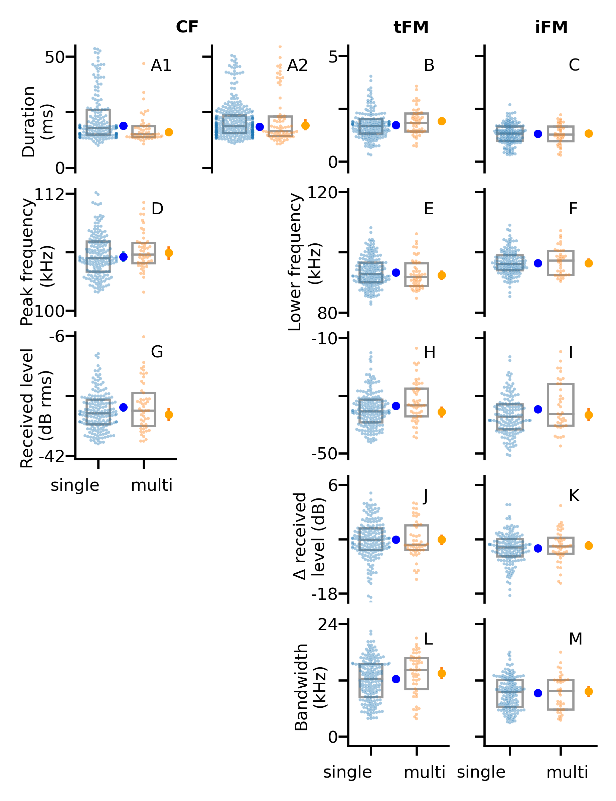
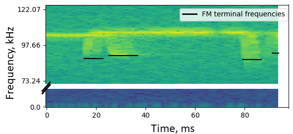

Comment execution status: NM + HRG comments till Section \@ref(indcallstatanalysis) - now working on 
Section \@ref(windowstatanalysis)

```{r echo=FALSE}
library(knitr)
library(stringi)
#opts_knit$set(eval.after = "fig.cap")
``` 

# Introduction {#intro}
Living in groups provides both costs and benefits to the group members, which individuals have to balance. Advantages of being in a group might be increased foraging success, offspring survival, or thermoregulation, while challenges might include increased parasitism, and competition [@pulliam1984living]. An individual’s sensory perception is also challenged in groups, due to the multitude of dynamic sensory information from group members, for example in leks, roosting sites, or even at human gatherings [@cherry1953a;@bee2008a]. Only a small fraction of this information is relevant to a receiver [@carrasco2014spatial;@krauzlis2014attention], which necessitates various adaptations to filter out irrelevant information, including unique calls  or avoiding signal overlap with neighbours [@socialintegr]. 

Many studies to date have focused on sensory filtering in passive sensing animals, i.e., animals that sense their surroundings by receiving external energy (e.g., penguins, frogs, humans)[@zweifel2020defining;@nelson2006a]. As each passively-sensing group member receives external information independently, their sensory processes do not affect other individuals around them. In contrast, active sensing animals like electrolocating fish or echolocating bats face a unique sensory challenge when actively sensing in social groups  [@ulanovsky2008bat;@gillambrasiliensis;@watanabe1963change). Echolocating bats emit intense ultrasonic calls and detect their surroundings by listening for the echoes reflecting off objects around them [@griffin1958listening]. In groups however, a bat’s returning echoes can be overlapped by the calls and echoes from its neighbours, preventing detection of its surroundings[@ulanovsky2008bat].  Active sensing animals thus face the issue that their information of interest is potentially masked by the multitude of surrounding signals in a group. An echolocating bat in a group may thus end up metaphorically flying ‘blind’, as without detecting its own echoes the bat cannot sense the environment. 

A combination of laboratory and field studies have shown the diverse behavioural responses of bats in response to sensory challenge from groups and experimental playbacks. Bats increase call levels, alter temporal features such as call rate, duration and duty cycle [@gillam2007rapid;@amichai2015calling;@jarvis2013groups;@lu2020echolocating; @hage2013ambient;@lin2016a;@gomes2020individual], and spectral properties such as bandwidth and terminal frequency [@hase2018bats;@cvikel2015board;@gotze2016no;@fawcett2015echolocation;@habersetzer1981adaptive]. These responses however are not uniform across species, with different species showing seemingly opposite responses to similar situations [@ulanovsky2004dynamics; @amichai2015calling;@jarvis2013groups;@adams2017suppression]. 

There are two broad groups of echolocating bats [@fenton2012evolution] characterised by their duty cycle, i.e., the fraction of time spent emitting calls. The first and major group of bats are the low-duty cycle bats. They typically emit frequency-modulated (FM) calls. The second group is the high-duty cycle bats which typically emit calls with a long constant-frequency (CF) component and one or two flanking short FM components (CF-FM calls). In contrast to low-duty cycle bats, the calls of high-duty cycle bats are longer (10 to $\geq$ 50ms) and thus have higher duty cycles of ~30-60$\%$ [@fenton2012evolution]. Higher duty cycle directly increases the probability of temporal overlap and thus masking of echoes by calls [@beleyur2019modeling]. High-duty cycle bats such as rhinolophids and hipposiderids are thus likely to be more affected in group echolocation than low-duty cycle bats, making them a unique system to understand the sensory strategies echolocators use in challenging conditions. Most studies on group echolocation so far have investigated low-duty cycle bats [@lin2016a;@fawcett2015clutter;@gotze2016no], likely due their speciosity (~87% of all echolocating bats [@fenton2012evolution;@mammdivdatabase] and ease of call analysis. A wider variety of species need to be studied, to understand the echolocation responses in context of their ecology and auditory systems.

A typical CF-FM call has of up to three call components: a short initial upwards FM sweep (iFM), a long central CF segment (CF), and a short terminal downward FM sweep (tFM) (*sensu* @tian1997echolocation). The CF component is used for the flutter detection of prey wingbeats [@schnitzler2011auditory] based on high-resolution frequency analysis around the CF frequency in the bat’s auditory fovea [@neuweiler2000biology]. Different CF-FM bat species, and even individuals within a species use specific CF-frequencies that are matched to their acoustic foveas [@schnitzler1976peripheral]. Individual bats also compensate for flight-induced Doppler shifts to keep the CF-frequency of the returning echo within their acoustic fovea [@schnitzler1973control; @schoeppler2018precise]. Despite potential temporal overlap of emitted call and returning echo, Doppler-shift compensation spectrally separates the CF parts of the echo and call when a bat is echolocating alone. In groups however, temporal and spectral overlaps between neighbours’ calls and own incoming echoes is bound to occur. While the CF component is involved in prey detection, the tFM component is thought to be involved in target ranging [@tian1997echolocation;@neuweiler1987foraging], and the role of the iFM remains ambiguous. Comparable to call alterations in FM-bats [@Fenton2014], CF-FM bats show rapid alterations in tFM bandwidth and duration based on the behavioural context, e.g. resting, landing or prey capture [@neuweiler1987foraging;@schoeppler2018precise;@tian1997echolocation]. 

Previous investigations of group echolocation in CF-FM bats found no support for changes in CF frequencies to avoid spectral overlap (“jamming avoidance response”)[@jones1993echolocation;@jones1994individual;@fawcett2015echolocation]. Recent studies in low duty cycle FM bats also questioned the efficacy of a jamming avoidance response in groups [@gotze2016no;@mazar2020sensorimotor]. While there are multiple studes investigating the CF component, we are only aware of one study that quantified changes of the FM-component in group flight, reporting an increased tFM duration and bandwidth [@fawcett2015echolocation]. Given the tFM’s flexibility and role in ranging, there is a strong need for its explicit quantification in multi-bat contexts. The tFM may show the same kinds of changes in multi-bat contexts as shown in low-duty cycle bats, which also use their FM calls primarily for ranging [@fawcett2015clutter;@amichai2015calling;@hase2018bats].

To study the effect of group size on free flying horseshoe bats, we recorded bat flight activity in their natural habitat using a synchronized audio and video setup. We used two lines of acoustic analysis, the first extracts parameters from non-overlapping individual calls and the second, which extracts parameters from multiple overlapping and non-overlapping calls. The analysis of recordings with overlapping calls is a nascent field [but see @izadi2019segmentation], and acoustic measurements have not been attempted on overlapping CF-FM calls to the best of our knowledge. We compared the difference in CF and FM call parameters across single and multiple bat flight periods. The results from both lines of acoustic analysis suggest no major differences in the measured call parameters when bats were echolocating alone or in the presence of others. 

# Methods

## Study species and site
Two species of rhinolophid bats *Rhinolophus mehelyi* and *R. euryale* were recorded in their natural environment. Both species emit CF-FM calls with peak frequencies between 102-112 kHz, and are not acoustically distinguishable due to overlap in their call characteristics [@dietz2016bats]. For the purposes of this study, we thus treated them as a single group of bats that may face the problem of acoustic jamming due to the similarity in spectro-temporal call structure.

We observed bats that flew in and out of and rested inside a small dome-shaped cave (Figure \@ref(fig:cavesetupschematic)) next to the main entrance of the Orlova Chuka cave system, NE-Bulgaria. The cave had a size of approximately 5 x 3 x 1.6 m$^{3}$ (l x b x h), and one opening where bats flew in and out of throughout the night.

## Experimental setup

We placed an experimental audio-video setup inside the cave (Figure \@ref(fig:cavesetupschematic)), consisting of three microphones and two infrared cameras. Two consumer grade CCTV cameras (UVAHDBP716, 944x1080 pixels) with infrared lamps were connected to a digital video recorder (XVR1004) to record the flight of bats as they flew in and out of the cave. The system recorded video mostly at 22 Hz, however there was frame rate variation between 18-27 Hz. Video feeds were time-synchronised (but not frame-synchronised) by common time stamps burnt-in on the frame. The two cameras were placed in approximately the same position on every recording nightAudio from three CM16 microphones (Avisoft Bioacoustics, Glienicke, Germany) were recorded by a 416H soundcard (Avisoft Bioacoustics, 250 kHz sampling rate, 16-bit resolution). To increase the number of calls recorded on-axis, the three microphones were placed at three different positions, which remained approximately constant  across recording nights (Figure \@ref(fig:cavesetupschematic)). The audio and video feeds were synchronised by generating ON-OFF signals of variable durations (0.08-0.5 s; Raspberry Pi 3), which were recorded on the soundcard and used to flash an LED that was recorded by the two cameras (Laurijssen et al. 2018; see Supplementary Information (SI) \@ref(avmatching) for signal generation script, electronic circuit and associated notes). The video was recorded continuously throughout the recording nights (16th, 19th and 20th August 2018), which yielded between 1.75-8 hours of analysable video (16/8/2018: 8.17, 19/8/2018: 1.67, 20/8/2018: 2 hours), while audio was recorded as consecutive multichannel files of 1 minute duration.

```{r cavesetupschematic, echo=FALSE, out.width="100%", fig.cap='\\label{cavesetupschematic}Point cloud scan (A) and schematic of the cave, indicating the entrance/exit, the typical roosting sites inside the cave, and the position of microphones and cameras.   (3D scanning by Klaus Hochradel, UMIT Tirol) The numbers next to the microphone correspond to the positions in the main text.'}
include_graphics('figures/pointcloud_and_topview.png')
```

## Video analysis to determine group sizes
After entering the cave, bats typically flew around for a few seconds or flew to one of two roosting sites, where they stayed for several seconds to minutes, and later exited from the cave again. We watched the videos and manually identified periods of bat flight activity (hereby referred to as 'bat activity period'), noting its start and end time and the number of visible bats. We defined a bat activity period as the interval during which the number of visible bats flying inside the cave is constant.
(See SI \@ref(annotprotocol) for more details).


## Synchronising bat flight activity in video and audio
For each bat flight activity period identified in the video, we identified the corresponding region of the recorded audio. We quantified the median intensity of the pixels in the region around the LED for each frame and then cross-correlated the normalized pixel intensity with the recorded ON/OFF voltage signal in the audio files. We managed to successfully find audio matches for 1181 bat flight activity periods (55% of 2132). The low match rate is primarily due to the fluctuating camera frame rates, and because many of the matched audio files originated from non-target bat species, which could not be visually discriminated from our target species *R. mehelyi/euryale* while annotating bat activity periods in the videos. Observed non-target species were *R. ferrumequinum*, vespertilionid and miniopterid FM bats, all of which occur in the Orlova Chuka cave system [@ivanova2005important]. For the acoustic analysis we chose matched audio files that contained only calls of *R. euryale* and/or *R. meheyli*.

## Acoustic parameter analysis

For the acoustic analysis, we used only recordings from microphone 1, because it appeared to suffer least from reverberance and because it recorded calls of both entering and exiting bats. First, all audio files corresponding to the bat activity periods (henceforth referred to as flight-activity audio) were high-pass filtered at 70 kHz (2nd order zero-phase Butterworth filter). Next, we used two complementary acoustic analyses to quantify frequency, duration and amplitude parameters of the three components of the echolocation call (initial FM, CF and terminal FM). The first analysis is the ‘individual call’ analysis, where we measured parameters of one echolocation call from each flight-activity audio. The second analysis is the ‘windowed call’ analysis, were we split each flight-activity audio into consecutive 50-ms-long windows and measured the acoustic parameters of each window. In recordings with multiple bats, each window could contain multiple and potentially overlapping calls.

The analysis of individual calls is advantageous because it directly reveals sensory decisions of the bats. Its disadvantage, however, is that it can be difficult to find a non-overlapped call, particularly in reverberant and multi-bat situations. The windowed call analysis therefore complements the individual call analysis by enabling measurements even on audio with overlapping calls. Windowed call analysis also allows a kind of null-hypothesis testing where the observed multi-bat audio can be compared with 1) single bat audio and 2) ‘virtual’ multi-bat audio files created by adding multiple single bat audio files. These ‘virtual’ multi-bat audio files recreate a scenario where two bats echolocate in the same space without altering their calls in response to each other’s presence. The disadvantage of the windowed call analysis is the lack of call-level measurements. Using both approaches simultaneously strengthens the interpretation of our results.

```{r, samplesizes, echo=FALSE}
sampsizes <- read.csv('../combined_analysis/indcall_sample_sizes.csv')

```

### Individual call analysis {#indcallmethods}

Per flight activity audio, we chose one call that was not overlapped by other calls and that had a signal-to-noise ratio of at least 20 dB (Figure \@ref(fig:fig1composite)) through a random search protocol (SI \@ref(indcallprotocol)). Briefly, from a randomly determined time point, an experimenter began searching into a randomly determined direction (backward or forward in time) until a suitable horseshoebat call was found. We were able to find 226 individual calls  across all the synchronised audio files. Calls were automatically segmented into their corresponding parts iFM, tFM or CF (Figure \@ref(fig:fig1composite)) ) using the itsfm package [@itsfmcitation]. Most approaches to date segment CF-FM calls into their components by high/low pass filtering around the call's peak frequency [@siemers2005species;@schuchmann2012horseshoe;@tian1997echolocation;@lu2020echolocating;@schoeppler2018precise]. For an accurate estimate of the peak frequency, this approach requires a recording of the call with a prominent CF component, which is suitable under controlled laboratory settings. Peak frequency estimation often fails in the analysis of CF-FM calls recorded in the field under a variety of conditions eg. calls with loud FM and faint CF components. *itsfm* overcomes these limitations by tracking the change in frequency over the call time to segment it into FM and CF components. For our analysis, we defined FM components as those portions of a call where frequency modulation was larger than 2 kHz/ms. Further settings were a maximum acceleration of 3 kHz/ms$^{2}$, an extrapolation window of 50 $\mu$s and a window size of 375 samples. Threshold signal level and time-frequency clip range were manually tuned for each calls using the ```pwvd``` method, since each call had differing received levels.

From the three components of each call, we measured specific parameters. For the CF component, we measured the peak frequency, root-mean-square (RMS) level and duration. The CF peak frequency was quantified because bats may shift their CF frequencies in the presence of conspecifics. For the FM components, we measured the lowest frequency (at 10 dB below the level of the peak frequency of the FM component), bandwidth (defined as difference between the CF peak frequency and the lowest frequency of the FM component), RMS level and duration. We also calculated the iFM/CF and tFM/CF level difference, i.e., the level of the iFM and tFM components relative to the CF component, because CF-FM bats independently vary the level of call components in a context specific manner [@tian1997echolocation;@lu2020echolocating].


```{r,include=FALSE,echo=FALSE}
# We were able to find a total of `r sampsizes$N[1]` individual calls ($N_{single \:bat}$: `r sampsizes$N[2]`, $N_{multi \:bat}$: `r sampsizes$N[3]`) across all the synchronised audio files.  Calls were automatically segmented into their corresponding parts iFM, tFM or CF [@tian1997echolocation] (Figure \@ref(fig:fig1composite)) using the *itsfm* package [@itsfmcitation;*biorxivpaper*]. Most approaches to date focus on indirectly segmenting CF-FM calls into their components by high/low pass filtering around the peak frequency of the call [@siemers2005species;@schuchmann2012horseshoe;@tian1997echolocation;@lu2020echolocating;@schoeppler2018precise].
# For an accurate estimate of the peak frequency, this approach requires an on-axis recording of the call with a prominent CF component. While suitable for laboratory studies, filtering around the peak frequency fails in the analysis of CF-FM calls recorded in the field under a variety of conditions eg. calls with loud FM and faint CF components. *itsfm* overcomes these limitations by tracking the *change* in frequency over the call to segment it into FM and CF components. 
```
\newpage

```{r fig1composite,echo=FALSE, out.width="100%",fig.cap="A-B: Examples of a single bat (A) and a multi-bat (B) recording used for windowed call analysis. The vertical lines indicate the borders between the 50-ms-long windows. C-D: Example of a manually selected call used for individual call analysis, showing its spectrogram (C) and waveform (D) representation. The call was automatically segmented into its initial frequency-modulated (iFM), central constant-frequency (CF) and terminal frequency-modulated (tFM) components based on frequency change over time , using the itsfm package"}

# Changes to implement (comments of 2021-07-28)
# make the labels stand out more
# make individual call analysis occupy 1st column, and windowed on second column
# add descriptive text (ind. call analysis and windowed call analysis) above the subplots on the columns 
#	# if required, reduce the size of the panels and add the text description
# Push the 'Time, ms' X label below
# Make the figure into a one column figure
# Reduce x/y tick fontsize (8 points), details in a panel (6/9 points)
# Put the units in brackets 'Time (ms)' or 'Frequency (kHz)'

include_graphics('figures/fig1_composite.png')
```

### Windowed calls analysis {#wincallmethods}

Each flight activity audio was split into consecutive 50 ms windows (See Figure \@ref(fig:fig1composite), SI \@ref(windowdetails) for details of window splitting). We chose a window duration of 50 ms as it provided high spectral resolution (20 Hz at 250 kHz sampling rate) that allows to distinguish between multiple CF components that may be contained in the window. Another reason we chose 50 ms windows was because initial observations showed most calls were much shorter than this duration, thus allowing one or more calls to be found in a window. 

To exclude windows without calls or with vrey faint calls, we excluded all windows whose RMS level was less than 20 dB above the maximum RMS level of silent windows (for details, see SI \@ref(silentwindow)). From the remaining windows that contained echolocation calls, we measured each window's received RMS level, dominant frequencies and FM lower frequencies. We chose these measurements to complement the analogous measurements in the individual call analyses. The dominant frequencies describe the CF frequencies of multiple calls in the same windows and were defined as local peaks of the smoothed power spectrum (rolling mean average, 100 Hz bin-equivalent window) with a level of not more than 14 dB below the highest peak (for details see SI \@ref(domfreqdetails)). Dominant frequencies complement the CF peak frequency measurement of individual calls. FM lower frequencies were defined as the lowest frequencies extracted from each identified FM region in a spectrogram representation of the window (see SI \@ref(lowestfreqdetails)). FM lower frequencies in the windowed analysis are analogous to the i/tFM lower frequency of the individual call analysis.The RMS level describes the received level of the window, and was defined as the root-mean-square of all samples in a window. In a single window, there could be multiple terminal and dominant frequency measurement, but only one received RMS level measurement.

We created 'virtual multi-bat' data [@fawcett2015echolocation;@ratcliffe2004conspecifics] by combining single bat audio-files that were of similar durations (SI \@ref(virtualdetails)). This generated a 'null' dataset of multiple bats that were echolocating together without altering their calls in groups. We performed the same windowed call analysis on the virtual multi-bat audio as described above for the real multi-bat audio, to compare real echolocation during group flight and virtual group flight.

# Statistical analysis {#stats}

We observed up to four bats flying in the cave at the same time. Especially in the individual call dataset the number of recordings of multi-bat ($\geq$ 2 bats) calls was low (N=177, 40, 7, 2 for group sizes of 1, 2, 3, 4 respectively,), we thus combined all annotations with $\geq$ 2 bats into a multi-bat class and compared ‘single’ and ‘multi’ bat ($\geq 2$ bats) calls in the individual call analysis. To maintain consistency with individual call analysis we also performed comparisons of ‘single-bat’, ‘multi-bat’ and ‘virtual-multi-bat’ flight-activity audio in the windowed analysis.


## Individual call analysis {#indcallstatanalysis}

```{r statstodo}
# Convert all intervals to 95% compatibility intervals
# Include the MAP with Comp. Int for 1) Multi-Single and 2) Multi/Single (ratio)
# Include regression model structure in the SI tables 
```

We ran linear mixed-models (LMMs) with group size as the predictor and recording hour as random intercept for all parameters.  Model fit was initially checked by performing residual diagnostics. Model coefficients were estimated using a Bayesian approach with non-informative priors using the ```sim``` function of the 'arm' package [@arm], and the 95% highest posterior-density compatibility intervals (Comp. Int.) were used in reporting. The compatibility interval represents the lower and upper borders of the posterior distribution of the coefficient estimates. We would like to highlight that a compatibility interval is not equivalent to a confidence interval, even though the numerical values may be similar under certain cases [@nalborczyk2019pragmatism]. 

## Windowed call analysis {#windowstatanalysis}

We first calculated the dominant frequency range ($max_{dominant \: frequency}-min_{dominant \:frequency}$) across each flight activity audio. We expect variation in the dominant frequency (and thus a non-zero range of dominant frequency) across a flight activity for two reasons: 1) the effect of the bat’s Doppler shift compensation and 2) the Doppler shift due to the bat’s motion relative to the microphone will cause variation in the dominant frequency.  These two effects will lead to non-zero dominant frequency range even for single-bat flight activities (SI \@ref(simdomfreqranges)). In multi-bat and virtual-multi-bat situations, we expect an increased dominant frequency range due to multiple bats calling at different individual frequencies. The difference in dominant frequency range between multi, single and virtual multi-bat audio was analysed using a linear model with group type as predictor. Residual analysis showed no correlation with any of the predictors, or any form of auto-correlation, and a simple linear model was thus justified.

To understand the theoretically expected dominant frequency range from single and multi bat flights, (and thus the expected range difference) we also performed simulations quantifying Doppler shift and Doppler shift compensation parametrised by the observed data (SI \@ref(simdomfreqranges) for details of simulation and results). Briefly we simulated a Doppler-shift compensating bat emitting frequencies between 100-111 kHz, flying past a microphone at various speeds between 1.5-4.5 m/s. The dominant frequency range was calculated as the absolute difference between the frequency recorded by the microphone at the beginning of the flight and the end of the flight. The dominant frequency range estimates from the simulations informed the interpretation of the observed data.

The received level and lowest frequency measurements resulted in multiple values per flight-activity audio (one value per window). The measurements from one flight-activity audio are potentially correlated. We estimated the difference between single, multi and virtual-multi bat audio using an LMM with group-type as predictor and flight-activity as random intercept. 

# Software packages used in this paper
Signal analysis, data manipulation and visualisation were done in Python [@van1995python] through its scientific ecosystem: the scipy, numpy, matplotlib, soundfile and pandas packages [@2020SciPy;@numpy;@matplotlib;@soundfile;@pandas]. Reproducible analysis, documentation and presentation were enabled by the Jupyter Notebook and Rmarkdown projects[@jupyter;@rmarkdown]. Audio visualisation, preliminary measurements and single call annotations were done with Audacity [@audacity]. LMMs were run in R [@R4] and its statistical ecosystem: the 'lme4','arm' and 'coda' packages [@lme4;@arm;@coda]. 

# Results

We recorded echolocation and flight behaviour of mixed-species groups of the high-duty cycle bats *R. euryale* and *R. mehelyi* as they flew alone and with other bats in a natural cave. The bats performed various flight behaviours in the cave, such as circling, approaches (when two or more bats flew towards each other) and following (one bat behind another) flights.  The duration of continuously observed flight bouts varied strongly, ranging from about 0.1 s to 62 s (median: 1.04 s , 95%ile range: 0.5-8.54 s). 

In general, the acoustic parameters of individual calls mostly did not differ between single-bat and multi-bat conditions. Likewise, the windowed-call-analysis revealed no major differences in received level and FM lowest frequency between single-bat and multi-bat and between multi-bat and virtual-multi-bat conditions. The dominant-frequency range of the windowed analysis, however, was larger in multi-bat conditions compared to single-bat conditions.


## Individual call analysis 

```{r indcallsampsizes,echo=FALSE}
indcall <- read.csv('../combined_analysis/indcall_final.csv')
nindcalls <- as.data.frame(table(indcall$groupsize))
nmulti_indcall <- nindcalls[1,2]
nsingle_indcall <- nindcalls[2,2]
```

```{r include=FALSE, echo=FALSE}
singleind <- subset(indcall, num_bats==1)
multiind <- subset(indcall, num_bats>1)

getminmax<-function(X){c(min(X,na.rm=TRUE), max(X,na.rm=TRUE))}
# tfm durns
single.tfmdurn <- round(getminmax(singleind$tfm_duration),2)
multi.tfmdurn <- round(getminmax(multiind$tfm_duration),2)
# tfm bw
single.tfmbw <- round(getminmax(singleind$tfm_bw),2);multi.tfmbw <- round(getminmax(multiind$tfm_bw),2)
#cfpr
single.cfpfr <- round(getminmax(singleind$cf_peak_frequency),1);multi.cfpfr <- round(getminmax(multiind$cf_peak_frequency),1)


```

```{r indcallrawdata, echo=FALSE, fig.cap=paste("\\label{fig:indcallrawdata} Measured acoustic parameters for the constant frequency (CF), initial frequency modulated (iFM) and terminal frequency modulated (tFM) components of individual calls emitted under single-bat and multi-bat conditions. Each column shows the measurements per call component, while each row shows a group of related measurements: A-C) duration D-F) spectral measurements G-I) received level J-K) relative FM-CF ratios L-M) FM component bandwidths. $Ncalls_{single}=$",nsingle_indcall, ", $N_{multi-bat}$=",nmulti_indcall,". Raw data points are plotted over box plots showing the median, quartiles and whiskers of 1.5 times the inter-quartile range.")}


```

We measured 13 acoustic parameters of the initial and terminal frequency-modulated (iFM, tFM) and of the central constant-frequency (CF) component of 226 individual horseshoe bat echolocation calls (Figure \@ref(fig:indcallrawdata)). Most call parameters showed little or no difference between single-bat and multi-bat observations (Table \@ref(tab:incalldata)).The CF component of multi-bat calls showed slight reduction in duration between 1.37-4.29 ms. The CF, tFM and iFM components seemed to show a slight decrease in amplitude of upto 1-4 dB in multi-bat calls. tFM bandwidth appeared to show an increase in multi-bat calls of between 0.02-2.58 kHz. The rest of the parameters show in Table \@ref(tab:incalldata) showed much smaller differences or the estimate of mean difference was centred around zero. 

<!-- # ```{r alldataindcall, echo=FALSE, tab.cap="\\label{tab:alldataindcall} *Difference between multi and single bat call parameters. The median difference is reported for all parameters except CF peak frequency, where the difference in range is reported.*"} -->
<!-- # library(flextable) -->
<!-- # indcall.analysis <- read.csv('../combined_analysis/alldata_indcall_ci.csv') -->
<!-- # msmt.names <- c("CF duration (median ms)", "tFM duration (median ms)", "iFM duration (median ms)", -->
<!-- #                 "CF peak frequency (range kHz)", "tFM lower frequency (median kHz)", "iFM lower frequency (median kHz)", -->
<!-- #                 "CF level (median dB RMS)", "tFM level (median dB RMS)", "iFM level (median dB RMS)", -->
<!-- #                 "tFM-CF ratio (median dB)", "iFM-CF ratio (median dB)", "tFM bandwidth (median kHz)", "iFM bandwidth (median kHz)") -->
<!-- #  -->
<!-- # pvalues <- round(indcall.analysis$perm_pvalue,2) -->
<!-- # pvalues[1] <- round(indcall.analysis$perm_pvalue[1],3) -->
<!-- # meddiff <- round(indcall.analysis$difference,2) -->
<!-- #  -->
<!-- # meddiff.table<- data.frame(cbind(msmt.names, meddiff, pvalues)) -->
<!-- # colnames <- c("Measurement","Difference (Multi-Single)","Permutation test p-value") -->
<!-- # medditab <- flextable(meddiff.table) -->
<!-- # medditab <- set_header_labels(medditab, msmt.names= colnames[1],  -->
<!-- #     meddiff = colnames[2], pvalues= colnames[3] -->
<!-- #     ) -->
<!-- # medditab <- autofit(medditab) -->
<!-- # medditab -->
<!-- #``` -->

```{r indcallsampsizes2,echo=FALSE}
indcall <- read.csv('../combined_analysis/indcall_final.csv')
```

```{r indcallranges, include=FALSE, echo=FALSE}
singleind <- subset(indcall, num_bats==1)
multiind <- subset(indcall, num_bats>1)

getminmax<-function(X){ round(c(min(X,na.rm=TRUE), max(X,na.rm=TRUE)),2)}

# durns
single.cfdurn <- getminmax(singleind$cf_duration);multi.cfdurn <- getminmax(multiind$cf_duration)
single.ifmdurn <- getminmax(singleind$ifm_duration);multi.ifmdurn <- getminmax(multiind$ifm_duration)
single.tfmdurn <- getminmax(singleind$tfm_duration);multi.tfmdurn <- getminmax(multiind$tfm_duration)
# freqs
single.cfpfr <- getminmax(singleind$cf_peak_frequency);multi.cfpfr <- getminmax(multiind$cf_peak_frequency)
single.tfmtemfreq <- getminmax(singleind$tfm_terminal_frequency);multi.tfmtemfreq <- getminmax(multiind$tfm_terminal_frequency)
single.ifmtemfreq <- getminmax(singleind$ifm_terminal_frequency);multi.ifmtemfreq <- getminmax(multiind$ifm_terminal_frequency)
# reclevel
single.cflevel <- getminmax(singleind$cf_dbrms);multi.cflevel <- getminmax(multiind$cf_dbrms)
single.tfmlevel <- getminmax(singleind$tfm_dbrms);multi.tfmlevel <- getminmax(multiind$tfm_dbrms)
single.ifmlevel <- getminmax(singleind$ifm_dbrms);multi.ifmlevel <- getminmax(multiind$ifm_dbrms)
# cf-ratios
single.tfmcf <- getminmax(singleind$tfm.cf_dbratio);multi.tfmcf <- getminmax(multiind$tfm.cf_dbratio)
single.ifmcf <- getminmax(singleind$ifm.cf_dbratio);multi.ifmcf <- getminmax(multiind$ifm.cf_dbratio)
# fm bandwidths 
single.tfmbw <- getminmax(singleind$tfm_bw);multi.tfmbw <- getminmax(multiind$tfm_bw)
single.ifmbw <- getminmax(singleind$ifm_bw);multi.ifmbw <- getminmax(multiind$ifm_bw)

singlebat.ranges <- rbind(single.cfdurn,  single.tfmdurn,single.ifmdurn,
                          single.cfpfr,   single.tfmtemfreq,single.ifmtemfreq,
                          single.cflevel, single.tfmlevel,single.ifmlevel,
                          single.tfmcf  , single.ifmcf, 
                          single.tfmbw  , single.ifmbw)
multibat.ranges <- rbind(multi.cfdurn,  multi.tfmdurn,multi.ifmdurn,
                          multi.cfpfr,   multi.tfmtemfreq,multi.ifmtemfreq,
                          multi.cflevel, multi.tfmlevel,multi.ifmlevel,
                          multi.tfmcf  , multi.ifmcf, 
                          multi.tfmbw  , multi.ifmbw)

```
\newpage

```{r incalldata, echo=FALSE, message=FALSE, tab.cap="The predicted difference and ratio between multi and single bat call parameters. The maximum a posteriori (MAP) is the most likely estimate, and 95% highest posterior density compatibility intervals (CoI) provides the range of uncertainty in the parameter estimate."}
library(flextable)
library(dplyr)

indcallsummary <- read.csv('../combined_analysis/all_ind_summary.csv')
indcallsummary <- indcallsummary[,2:ncol(indcallsummary)]
indcallsummary <- cbind(indcallsummary[,2], indcallsummary[,1], indcallsummary[3:ncol(indcallsummary)])
colnames(indcallsummary)[c(1,2)] <- c('msmt', 'comp')
indcallsummary$msmt[c(2,3,6,8,9,11,13)] <- ' '
indcallsummary$msmt[10] <- 'Level difference, dB'
indcallsummary[c(7:11),c(6:8)] <- ' - '
ft2 <- flextable(indcallsummary) 
ft2 <- fontsize(ft2, i=seq(1,13), size=8, part='body')
ft2 <- fontsize(ft2, i=1, size=8, part='header') 
ft2 <- ft2 %>% width(j=seq(4,8), width=0.6) %>% width(j=c(1,2), width=0.7)
ft2 <- ft2 %>% width(j=c(2,3), width=0.8) %>% width(j=1, width=0.85) %>% width(j=6, width=0.83)
ft2 <- ft2 %>% height( i = seq(1,13), height=0.125, part = "body")
ft2 <- ft2 %>% add_header_row(top=TRUE, values=c("Measurement", "Component", "Difference (Multi-Single)", "Difference, 95% CoI", "", "Ratio (Multi/Single)", "Ratio, 95% CoI", "")) %>% fontsize( size=10, part='header')
ft2 <- ft2 %>%  set_header_labels(msmt="",
                    comp="",
                    Difference.MAP='MAP',
                    diff_lower_95pcHPD='Lower',
                    diff_upper_95pcHPD='Upper',
                    Ratio.MAP='MAP',
                    ratio_lower_95pcHPD='Lower',
                    ratio_upper_95pcHPD='Upper') %>% hline(i=c(3,4,6,9,11), part='body') %>% merge_at(i = 1, j = 4:5, part = "header") %>% merge_at(i = 1, j = 7:8, part = "header") 
ft2 <- ft2 %>% merge_at(i=1, j=2, part='header') %>% merge_at(i=1, j=3, part='header') %>% merge_at(i=1, j=6, part='header')
ft2

```

\newpage


```{r domfreqraw,echo=FALSE}
dfraw <- read.csv('../combined_analysis/obsvirt_domfreq_range.csv')
single.dfrange <- getminmax(subset(dfraw,groupsize=='single')$file_value_range)
multi.dfrange <- getminmax(subset(dfraw,groupsize=='multiple')$file_value_range)
vmulti.dfrange <- getminmax(subset(dfraw,groupsize=='multiple_virtual')$file_value_range)
```

```{r windowresults,echo=F, tab.cap="Difference between multi, single and virtual-multi bat call parameters, along with their estimated means. The 93% compatibility interval (CI) for all parameters is reported"}
window.summary <- read.csv('../combined_analysis/window-analysis-table.csv')
window.summary <- window.summary[,2:ncol(window.summary)]

colnames <- c("Parameter","Multi-single bat","Multi-virtual multi bat", "Mean single bat",'Mean multi bat', 'Mean virtual multi bat')

win.sum.table <- flextable(window.summary)
win.sum.table <- set_header_labels(win.sum.table, msmts =colnames[1], delta.multisingle=colnames[2], 
                              delta.multivirtmulti=colnames[3], single.mean=colnames[4],
                              multi.mean=colnames[5], virt.multivirt.mean=colnames[6])
win.sum.table <- width(win.sum.table, width = 1.1)
win.sum.table

# 
format.as.interval <- function(X){gsub(',',' - ',stri_sub(X,from=2,to=-2))}
reclevel.diff.multisingle <- format.as.interval(window.summary[1,2])
lowerfreq.diff.multisingle <- format.as.interval(window.summary[2,2])
domfreq.diff.multisingle <- format.as.interval(window.summary[3,2])

reclevel.diff.multivirt <- format.as.interval(window.summary[1,3])
lowerfreq.diff.multivirt <- format.as.interval(window.summary[2,3])
domfreq.diff.multivirt <- format.as.interval(window.summary[3,3])


```
## Windowed call analysis 


```{r windowsinglemulti, echo=FALSE}
wholewindowresults <- read.csv('../combined_analysis/whole_window_summary.csv')
wholewindowresults <- wholewindowresults[,-1]
window.colnames <- c("Parameter",
                     "Difference",
                     "Permutation test p-value",
                     "p2t5pctilemeddif",
                     "p97t5pctilemeddif",
                     "comparison")
colnames(wholewindowresults)<- window.colnames
```

```{r windowsampsizes,echo=FALSE}
get.window.samplesizes <- function(df)
  {
  n_samples <- as.data.frame(table(df$groupsize))
  n_samples
  }


domfreq_singlemulti_whole <- read.csv('../combined_analysis/obs_singlemulti_domfreq.csv')
ndomfreq_singlemulti_whole <- get.window.samplesizes(domfreq_singlemulti_whole)

domfreq_multivirt_whole <- read.csv('../combined_analysis/multivirtmulti_domfreq.csv')
ndomfreq_multivirt_whole <- get.window.samplesizes(domfreq_multivirt_whole)
```

We split flight-activity audio into 50ms windows duration and analysed two parameters for each window: received level and FM lower frequency ($Nfiles_{single}$=`r ndomfreq_singlemulti_whole[2,2]`,$Nfiles_{multi}=$ `r ndomfreq_singlemulti_whole[1,2]`). For each flight-activity audio we also measured the dominant-frequency range (maximum – minimum dominant frequency of all windows in that audio). Dominant frequency ranges indicate the amount of shifting or convergence in the CF frequencies within a flight activity (Figure \@ref(fig:domfreqgraph)). An increase in frequency range indicates a reduced frequency overlap, while a decrease in frequency range indicates a convergence of frequencies. 

Aside from dominant frequency, single and virtual multi received level and FM lower frequency showed little difference to multi-bat audio (Table \@ref(tab:windowresults)). 

The mean dominant frequency range (Figure \@ref(fig:domfreqgraph)) was between `r reclevel.diff.multisingle` kHz larger in multi-bat conditions (range:`r multi.dfrange[1]`-`r multi.dfrange[2]` kHz 93% CI) compared to the single-bat condition (range:`r single.dfrange[1]`-`r single.dfrange[2]` kHz). The observed difference in dominant frequency range matches the  magnitude in simulations when bats do not show any special responses to each other (SI \@ref(simdomfreqranges)). Received level showed little difference between multi and single bat recordings (`r reclevel.diff.multisingle` dB 93% CI) as well as did FM lower frequency (`r lowerfreq.diff.multisingle` kHz 93% CI). 


Comparing virtual-multi bat recordings with observed multi-bat recordings allowed us to estimate if bats were adjusting their echolocation behaviour to the presence of conspecifics (Table \@ref(tab:windowresults)). The difference in dominant frequency range between observed and virtual multi-bat was low (`r domfreq.diff.multivirt` kHz), as were differences in FM lower frequency (`r lowerfreq.diff.multivirt` kHz) and received level (`r reclevel.diff.multivirt` dB).

```{r domfreqgraph, echo=FALSE,fig.cap='\\label{domfreqgraph} Measured dominant frequency range (max-min) across flight activities in single-bats, multi-bat and virtual multi-bat conditions. Variation in dominant frequency in single-bat condition arises from the combination of active Doppler-shift compensation by the bat and Doppler-shift due to bat flight past the microphone. The dominant frequency range in multi-bat and virtual multi-bat is larger because of there are more than one bat.'}

include_graphics('../combined_analysis/domfreqranges.png')

multivirt.wholewin <- subset(wholewindowresults,comparison=='multi-virtual multi')

```


# Discussion 

We quantified the difference in horseshoe bat echolocation calls when alone and with conspecifics in the field. Our results do not support a biologically meaningful difference in echolocation calls with reference to group size for all of the call parameters measured using two different approaches. This may seem somewhat unexpected, especially considering the fact that bats in our field site were flying in an enclosed reverberant volume - which would only amplify the problem of masking in multi-bat echolocation. We interpret our results below in more detail.

To address the problem of analyzing calls that overlap in time and frequency, we introduced two automated analyses that can be performed on audio recordings of multiple CF-FM bats. First, we performed automated individual call analyses using the open-source ```itsfm``` package allows call component segmentation based on rate of frequency change in a sound. This frequency-modulation-based segmentation performs better than filtering around the peak frequency and results in more accurate CF-FM call component segmentation, and thus better measurements. [@itsfmcitation]. Second, to analyse audio with overlapping calls, we measured the overall acoustic parameters of short audio windows without assigning the measurements to individual calls. While coarser in time than the individual call analysis, this window-based approach complements the individual call analyses by returning related measurements such as FM lower frequency and dominant frequency range.


```{r echo=FALSE}
# The CF peak frequency + dominant frequency range story
cfdurns.single <- subset(indcall, groupsize=='single')$cf_duration
cfdurns.multiple <- subset(indcall, groupsize=='multiple')$cf_duration


```
## CF component 
To avoid spectral overlap in groups, the spectral jamming avoidance response (JAR) hypothesis predicts that individual bats in groups will shift their call frequencies away from those of other individuals [@ulanovsky2004dynamics]. JAR has mixed support from studies. Several studies in hipposiderid & rhinolophid bats found no changes in CF frequencies [@jones1993echolocation;@jones1994individual;@fawcett2015clutter;@pye1972bimodal]. In contrast, @habersetzer1981adaptive observed CF frequency shifting in groups of the quasi-CF rhinopomatid bat , *Rhinopoma hardwickei*, while @cvikel2015board found no support in the same species. However, the echolocation of *R. hardwickei* is not entirely comparable with those of the more specialised CF-bats of the families Hipposideridae and Rhinlophidae [@simmons1984echolocation]. Hipposiderids and rhinolophids are more constrained in their echolocation as they show a marked individual-specific acoustic fovea that does not vary over short periods of time [@neuweiler2000biology;@schnitzler1976peripheral]. CF-FM bats are thus constrained to emit calls so that the Doppler-shifted echoes arrive within their own acoustic fovea’s range. 

Our data does not support CF frequency shifting in groups. If bats were to show ‘jamming avoidance’ type responses, one would expect an overall increase in the CF frequency range in groups, and thus an increased range difference between single and multi bat audio. If they were to show ‘convergence’ ), we expect a reduction in range. The observed CF and dominant frequency range differences of around 2 kHz between single and multi bats falls within the expected magnitude seen when bats do not show any special responses to each other (SI \@ref(simdomfreqranges)). More convincingly however, the low difference in dominant frequency range between multi and virtual multi audio shows that even when bats are indeed flying together they are not actively altering their CF frequencies to reduce or increase overlap. Our simulations (SI \@ref(simdomfreqranges)) and single bat experimental audio data show that a receiver (eg. a microphone or another bat) placed in the proximity of a flying CF-FM bat may hear a series of CF frequencies that vary by upto $\pm$ 3 kHz from the emitted frequency. This relatively large variation in the received frequency thus decreases the extent of spectral overlaps during multi-bat echolocation. The combination of individual specific resting frequencies and Doppler-shift driven variation in received CF frequency make it unlikely that the CF component would be masked effectively even in groups. For the duration of CF component , we found a mean decrease between 1.4-4.3 ms in multi-bat calls, matching the decrease by ~1.2 ms found by @fawcett2015echolocation. It is possible that our procedure of selecting non-overlapping calls in the individual call analysis might bias our selection to shorter calls in multi-bat recordings, because shorter calls might be less prone to temporal overlap. The decrease in call durations is however relatively small, which may mean the sampling bias would also be minimal. Our results however remain comparable with @fawcett2015echolocation, who also choose individual calls that were presumably non-overlapping.

 
## FM component

```{r echo=FALSE}
# the i/tFM components, bandwidth
```
The FM component is likely used for ranging and undergoes large variation as bats approach objects [@Fenton2014]. Frequency-changes in group flying FM-bats could indicate a JAR, but could also be a response to the physical presence of other bats in the vicinity [@cvikel2015board;@fawcett2015clutter]. CF-FM bats also show alterations in their tFM as they approach and land [@tian1997echolocation;@schoeppler2018precise;@Fenton2014], and may be expected to respond to conspecifics like FM-bats in groups. Fawcett et al. (2015) found that the tFM minimum frequency (-10 dB call peak frequency) increase by 5 kHz on average in pairs. In contrast, we only found a drop at most 2.4 kHz of the tFM lower frequency (-10 dB tFM peak frequency) and an increase by maximally ~2.5 kHz of tFM bandwidth in multi-bat calls Our windowed analysis revealed no systematic differences in lower frequency estimates between single-bat and multi-bat situations. Both FM and CF-FM bats also change call duration in the presence of conspecifics and noise [@cvikel2015board;@amichai2015calling;@fawcett2015echolocation;@lu2020echolocating;@gomes2020individual]. While we only found an increase in tFM duration of at most ~0.4 ms, previous studies found increases of 0.6-1.8 ms. @fawcett2015echolocation found an average increase in tFM duration by 1.8 ms in pairs, while we find a slight median increase by about ~0.4 ms in multi-bat calls. In another study with artifical playbacks, @lu2020echolocating found an increase of 0.6ms in comparison to calls in silence. An increased tFM duration may provide an increase in in echo detection [@amichai2015calling;@luo2015linking]. The current increase in duration corresponds to a negligible fraction (~5%), and is unlikely to have any major sensory implications. Compared to previous studies, our effects are small, and unlikely to have biological relevance.

```{r echo=FALSE}
# The received level story -- needs a bit more work
```

## Call level
CF-FM Bats increase call source levels in the presence of experimental playbacks [@hage2013ambient;@hage2014ambient;@lu2020echolocating]. In our study, we could not measure the bats source level because bats were free-flying and we did not track their 3D-position. Instead, we analysed the received level at the microphone. In addition to the bat’s source level, received levels also depend on the bats’ distance to and calling direction relative to the microphone. The received level of all three call components of individual calls were upto ~ 4dB lower median in the multi-bat condition than in the single-bat condition. The windowed call analysis however, revealed no systematic alteration in received level in multi-bat vs single-bat and in multi-bat vs. virtual-multi-bat conditions. The iFM-CF and tFM-CF relative received levels between the CF and FM components were different by at most 1 dB between the multi-bat and single-bat conditions, indicating no shift in call energy between the components. Why was there no major difference in received levels between single-bat and multi-bat conditions even in the windowed analysis? Overlapping calls are expected to lead to a higher received level. The similarity in received levels of multi-bat and single-bat windows can be explained by the inequal contribution the nearest bat’s call makes to the received level due to spherical spreading, and the directionality of calls.   The fact that multi-bat and virtual-multi bat audio have similar received levels thus indirectly suggests there is no change in source level even in the presence of another bat. However, the tFM received level showed a drop of around 3dB that we are not sure how to interpret. This apparent drop in received level could be the result of bats flying further away or emitting more directional calls.

# Outlook

```{r echo=FALSE}
# Why did we not see anything? Discussing possibilities
tfm.95pctile <- round(quantile(indcall$tfm_duration,0.975,na.rm=TRUE),1)
tfm.2.5pctile <- round(quantile(indcall$tfm_duration,0.025,na.rm=TRUE),1)

dutycycle.range <- tfm.95pctile/c(40,50)
dutycycle.sorted <-  sort(dutycycle.range)*100

# load simulation results
overlap.probs <- read.csv('associated_docs/2-3bat_tfm_overlap_prob.csv')
overlap.probs2 <- subset(overlap.probs,num_bats==2)
tfm.probs <- round(sort(overlap.probs2$tfm_overlap_prob),3)*100
```

There are a set of parameters that we were not able to measure and thus excluded in our analyses. We did not measure call-sequence related parameters such as inter-call-intervals or duty-cycle. Bats in acoustically difficult situations are known to alter their call rate [@amichai2015calling;@jarvis2013groups] and thus their duty cycle. Measuring inter-call-intervals is possible in single bat contexts, but extremely challenging in multi-bat recordings with overlapping calls and reverberation. Calls are difficult to assign to their source individuals, which complicates call interval measurement. 

What are the possible explanations for the absence of a strong echolocation response in groups? Our data suggests that echolocation in groups with a few bats (2-4) bats may not be very challenging for multiple reasons. CF-FM bats rely on the tFM component to detect the distance of objects around them [@tian1997echolocation]. The tFM components are short ($\leq$ `r tfm.95pctile`ms, 95 percentile value), and likely emitted every 40-50 ms which is equivalent to a tFM duty cycle between `r dutycycle.sorted[1]`-`r dutycycle.sorted[2]`%. For a pair of bats at these duty cycles, the probability of one tFM echo being overlapped by another bat’s tFM call component is relatively low at most between `r paste(tfm.probs[1],'-',tfm.probs[2])`% (SI \@ref(simtfmoverlap) for calculations). Even if a single tFM echo is overlapped by another call, a bat may still be able to detect it if the signal-to-noise ratio is sufficient. FM bats in small groups are unlikely to face major detriments to their echolocation [@beleyur2019modeling], which should also apply to using the FM for ranging, explaining why the horseshoe bats did not show call changes from solitary echolocation. Secondly, @fawcett2015echolocation observed an increased tFM duration and bandwidth in R. capensis flying in pairs in a novel flight room setting. The combination of flight room characteristics [@surlykke2009echolocating] and species differences, may perhaps have led to the difference in results between their study and ours.  Bats show long-term spatial memory [@barchi2013spatial;@mohres1949versuche] and familiarity with the cave's structure may have allowed them to easily recognise their location over time. Bats also use echoes across multiple calls and are thus resistant to occasional disruptions in echo arrival [@Salles202011719]. The combination of spatial memory and multi-echo integration may have allowed our bats to continue echolocating with conspecifics without altering their calls drastically.

It is well established that bats adapt and alter their echolocation strategy in the face of sensory challenge. Our results add a subtle twist to the literature by suggesting that bats may not always employ a special echolocation strategy even when faced with the sensory challenge of a group. We highlight the importance of observational studies in field settings to understand the frequency with which various sensory strategies are actually employed in ecological contexts.


# Data and code availability
All data and code used process data and generate the results and figures in the paper are available at the following Github repository: https://github.com/thejasvibr/mhbc-online/

# Acknowledgements 
The authors would like to specially thank the electronics team (Markus Abels, Hannes Sagunsky, Reinhard Biller) at the MPIO workshop for help preparing the electronic circuits to run the ON/OFF signal splitting. We would also like to thank Antoniya Hubancheva for logistical support, Stefan Greif for help collecting the data, the 2018 Tabachka field crew, Klaus Hochradel for the point-cloud scan of the cave and Diana Schoeppler and Hans-Ulrich Schnitzler for their helpful discussions. We also thank Manjari Jain for her support and and encouragement of the project. TB was funded by a DAAD doctoral fellowship and the IMPRS for Organismal Biology, HRG was funded by the Emmy Noether program of the DFG (German Research Foundation, grant no. 241711556)

# Author Contributions 
Study design and conception: NMR, TB; Data collection: AK, NMR, TB;  Audio and video annotation: AK, NMR; Audio-video synchronisation: TB; Analysis: HRG, NMR, TB; Interpretation of results: HRG, NMR, TB;  Manuscript preparation: HRG, NMR, TB. 

\newpage 

# Supplementary Information 

## Audio-video synchronisation: hardware and software implementations {#avmatching}

The audio and video data were synchronised using the protocol of [@laurijssen2018low]. A Raspberry Pi 3 was used to drive an ON/OFF signal from a GPIO port. This ON/OFF signal was then split between an LED and a circuit linked to capacitor. The capacitor converted the DC ON/OFF signal into positive and negative spikes - thus allowing the signal to be correctly digitised. Not all soundcards are capable of digitising DC voltages, and thus the capacitor helps in making the protocol independent of soundcard type. The entire circuit can be assembled from easily available parts (Figure \@ref(fig:breadboardschem))

```{r breadboardschem, echo=FALSE, fig.height=3, fig.cap="\\label{fig:breadboardschem} Top: The experimental realisation of the audio-video synchronisation signal splitting. The components can easily be assembled onto a hobby breadboard, and are easily portable. Here the breadboard is pasted on the inside of a lunch box lid, allowing easy and safe transport of the breadboard and the Raspberry Pi in the box itself. Bottom: The circuit plan of the synchronisation signal splitter"}


```


The code to drive the GPIO port runs on Python 2 (and should also run on Python 3). For best results the python file 
can be set to automatically run on boot-up. This makes the synchronisation protocol field-friendly, and reduces the need
of the experimenter manually running the code. 

```
#!/usr/bin/python
'''
script that switches a RED LED on and off
This script and the circuit used to
run the system is based on the post at thePiHut
'Turning on an LED with your Raspberry Pi's GPIO Pins' 
URL: https://thepihut.com/blogs/raspberry-pi-tutorials/
27968772-turning-on-an-led-with-your-raspberry-pis-gpio-pins
Accessed June 11 2015
'''
import RPi.GPIO as GPIO
import sys
import time
GPIO.setmode(GPIO.BCM)
GPIO.setwarnings(False)
GPIO.setup(18,GPIO.OUT)
import numpy as np

time_ranges = np.arange(0.08,0.5,0.0001)

while True:
    try:
        #print ('LED ON')
        GPIO.output(18,True)
        on_time = np.random.choice(time_ranges,1)
        time.sleep(on_time)
        #print('LED OFF')
        off_time = np.random.choice(time_ranges,1)
        GPIO.output(18,False)
        time.sleep(off_time)
    except KeyboardInterrupt:
        GPIO.output(18,GPIO.LOW)
        sys.exit()

 ```

One optional change that can be made to the code above is to set the seed manually with ```np.random.seed``` after the numpy import. 
Setting a fixed seed can have the advantage that problems in audio-video file synchronisation post data collection can be better
fixed. A fixed seed however means that the output signal is the same across all sessions used - which might make distinguishing 
audio and video recordings from different sessions difficult, though not exclude it.

Another important aspect to pay attention to is the ```time_ranges``` variable. In this experiment it was assumed that the camera frame rate
was going to be 25 Hz, and thus the lowest ON/OFF time was set to 0.08s, which corresponds to a signal with 12.5Hz periodicity of the Nyquist frequency. However, as @laurijssen2018low suggest, it would have been better to set the lowest duration to a longer period, which was a few times lower than the Nyquist frequency of 12.5 Hz, eg. 0.2s (5 Hz). In our experiments, the cameras turned out to have a frame rate of 22Hz, which meant that the LED signal was aliased. However, despite the
aliasing, we were still able to synchronise audio and video - showing the robustness of the methodology. 


## Video annotation of bat flight activity in the cave {#annotprotocol}
Manual annotation of the video data was carried out to determine the group sizes of free-flying horseshoe bats in their natural habitat. We annotated bat flight activity by simultaneously viewing the video feeds from both infrared cameras using SHOTCUT [@shotcut v 19.04.30], an open-source video editing software. The following information was documented from the video: the start and end times of bat flight activity from the burnt in timestamps from either camera 1 or 2 in “yyyy-mm-dd hh:mm:ss” format, frame number, number of bats flying and flight behavior. A bat flight activity is defined as the interval during which the number of bats flying inside the cave is constant. Successive bat flight activities were operationally defined as being separated from one another by least 6 frames.  

We defined the start of bat activity from the frame a bat is observed to fly in either camera view. Similarly, the end of bat flight activity was when a bat is not observed in either of the camera views. Our video protocol originally included counts of the exact number of bats in a bat activity period. In parts of the video with rapid dynamic transitions in the number of bats, we only annotated 'stable' flight activities where the number of visible bats were maintained for at least 10 frames. When the number of visible bats fluctuated every few frames, such activity periods were not annotated. We prioritized obtaining a clean data set and refrained from annotating extremely difficult bat flight annotations because of how dynamic the group size shifts could be.


## Individual call analysis {#indcallprotocol}

Individual calls were selected from the audio files based on a set of pre-defined search protocol:

* All measurements and signal processing will be done using Audacity. 
* dB rms measurements made with the 'Contrast' function in Audacity. Highpassing done with the inbuilt highpass filter. The SNR is calculated by difference between the foreground (bat call region) and background (silent region)

    1. Load annotation audio file, and delete all non-target channels. 
    1. View audio in spectrogram mode. Set dynamic range of spectrogram to 60dB. 
    1. Highpass filter audio file with 12 dB roll off/octave at 80 kHz cutoff frequency
    1. For given audio file, choose  a start point using a random number generator between 0-1. 
    1. Go to that fraction of time corresponding to the length of the annotation audio file 
    1. Choose another random number between 0-1. If it's <=0.5 search towards left, else search towards right. 
    1. Look for a horseshoebat call with no overlaps, no interference patterns in the CF or FM, that can be isolated well. 
    1. While selecting horseshoe bat calls, zoom in max till 60 milliseconds of audio occupy the whole screen. Do not zoom in more or less while selecting. 
    1. Check the SNR of the selected horseshoe bat call by using a 'silent period' of the audio file as background.  If there is not suitably long 'silent period' to serve as background in this audio file, choose another random audio file and measure the background dB rms. 
        a. If SNR >= 20 dB, this is a suitable call to measure. Note down the start and end time of this call in the audio file.
        b. If SNR < 20dB
            i. Go back to search start point calculated in 4), and begin searching in opposite direction. 
            ii. Look for first suitable call to measure using criteria in 7) onwards.
        c. If a suitable call is still NOT found:
            i. No measurement takes place in this audio annotation. Proceed to next audio annotation file.

Audacity version 2.3.3 was used during the manual call selection.


##  Windowed call analysis {#windowdetails}
Each flight activity audio was split into consecutive 50ms windows. All tail-end audio that was <50 ms was discarded. 

### Choosing the 'silent window threshold' {#silentwindow}

A series of manually annotated audio clips were used to set the reference silent window threshold. The manually annotated audio clips were the same as those used to calculate the reference 'silence' segments in the individual call analysis ($N_{files}=406$, min-max duration=0.002-0.03s). The threshold for a window to be chosen as silent was set at 20dB above the maximum measured dB rms of all silent windows. This resulted in any window that was less than -23 dB rms as being considered 'silent'. This is a conservative approach that prevents windows with poor signal-to-noise ratio from being analysed. 

The code to execute this analysis is available in the ```what qualifies as a silent audio segment.ipynb``` notebook and its HTML printout. 


### Dominant frequency measurement {#domfreqdetails}
Unlike typical measures used to quantify echolocation calls like peak frequency or-10 dB frequency, the dominant frequencies provide a glimpse of what may be happening in the presence of multiple calls. 

The dominant frequency was determined with the following steps:

1. Create a smoothed power spectrum. A smoothed power spectrum is generated by passing the raw spectrum (FFT size = 12500 samples) with a running-mean filter of the pre-defined spectral smoothing width. The spectral smoothing width defines the 'width' or the number of frequency bins of the running-mean filter. We used a smoothing width of 100 Hz, which corresponds to 5 frequency bins. The smoothing is necessary as the raw power spectrum can be very 'jagged' otherwise, and impede peak detection which corresponds to the CF components of calls in the input audio. 
1. Extract the peaks in the smoothed power spectrum. Only peaks that are a minimum 'distance' from each other, and that are within a threshold of the highest peak are chosen. We chose an inter-peak distance of 250 Hz, and all valid dominant frequency peaks needed to lie within 14 dB of the peak with the highest power. 
1. Map the valid peaks to the frequencies they correspond to. These are the dominant frequencies in this

The code to execute this function is available in the ```inbuilt_measurement_functions.py``` module. 


###  FM lower frequency measurement {#lowestfreqdetails}

The FM lower frequency (Figure \@ref(fig:fmterminal)) is determined in the following steps:

1. Make spectrogram of the audio window (512 samples FFT, 256 samples overlap). 
1. Identify all spectrogram ‘pixels’ in the FM frequency band that are above the baseline level. The FM bandwidth was defined as ranging from 70 kHz to 98 kHz. The baseline power level across pixels was calculated by calculating the 95%ile value of power in the frequency band below 70 kHz, i.e., the part of the spectrogram without any bat calls. All pixels whose power was 46 dB above the baseline power level and whose frequency was within 70 - 98 kHz were considered valid FM pixels
1. Identify contiguous clusters of FM pixels. These clusters represent single iFM or tFM components of calls. 
1. From the identified continuous clusters, extract the lowest frequency pixel in a cluster

Given the current parameter values used for our analysis, the lower frequency measurements have a spectral resolution of 488 Hz.

The code to execute this function is available in the ```inbuilt_measurement_functions.py``` module. 

```{r, fmterminal, echo=FALSE,fig.cap="\\label{fig:fmterminal}Example showing extracted FM lower frequencies from the spectrogram of a 50ms window. The method allows extraction of lower frequencies in the presence of multiple overlapping calls, though it doesn't allow discrimination of iFM and tFM components "}


```


### Making virtual multi bat audio files {#virtualdetails}


```{r virtualmultibat, echo=FALSE, fig.cap="\\label{fig:virtualmultibat} Example showing the steps involved in creating a virtual multi bat file. Shown here are spectrograms of the first 500ms of two single bat audio files (A), (B), along with the resulting virtual multi bat audio file. Vertical lines delineate 50ms windows that are used for acoustic measurements"}


#\begin{figure}[H]
#    \includegraphics{figures/figX_virtualmultibat.png}
#    \caption{Example showing the steps involved in creating a virtual multi bat file. Shown here are spectrograms of the first 500ms of two #single bat audio files A,B, along with the resulting #virtual # multi bat audio file. Vertical lines delineate 50ms windows that are used for #acoustic measurements}
#\end{figure}
```


Virtual multi bat audio files (Figure \@ref(fig:virtualmultibat)) were created with the following steps:

1. For each multi bat file generate a virtual multi bat audio file
    1. Among the pool of single bat audio file choose all files that are within 0.9-1.1 times the length of the current multi bat file.
    1. From the pool of duration matched single bat audio files, randomly select 2 or 3 files - depending on how many bats were observed in the current multi bat file 
    1. Add the chosen single bat audio files together. Set the final virtual multi bat length to the length of the shortest single bat audio file. 
    1. Remove the chosen single bat audio files from the pool of single bat audio files. The single bat audio files will not be used again to generate a virtual multi bat file. 

The code to execute this function is available in the ```Making virtual multi bat audio.ipynb``` notebook and its HTML printout. 


## Calculating expected dominant frequency ranges due to Doppler shift {#simdomfreqranges}

The amount of Doppler shift in our audio recordings is primarily affected by multiple factors: 1) the flight speed of the bat 2) the flight direction of the bat with respect to the microphone 3) active Doppler shift compensation carried out by the bats and 4) the acoustic fovea of each individual bat. These factors may combine to give rise to a dominant frequency (DF) max-min range of upto around 3 kHz even when a single bat flies by the microphone. For example, a bat echolocating with a very high acoustic fovea that flies fast will result in a larger DF range than a slow flying bat with the same foveal frequency but flying slower. 

```{r, dopplerschematic, echo=FALSE,fig.cap="Schematic showing the simple model used to calculate the expected dominant frequency variation arising from a single bat flying past the microphone. $F_{e}$ is the doppler compensated emitted frequency. $F_{rec \\:start}$ is the received frequency at the start of the flight, $F_{rec \\:end}$ the received frequency at the end of the flight. $v_{start}$ and $v_{end}$ are the speed of the bat at the start and end of the flight. $F_{rec}$ is a function of the emitted frequency, relative flight angle and flight speed at the start and end of the fly by."}
include_graphics('figures/doppler_shift_schematic.png')
```


Our simulations recreated the frequency recorded at the micrphone at the 'start' and 'end' of the bat's flight past the microphone (Figure \@ref(fig:dopplerschematic)). The start position was assumed to be 45 degrees and end position was 135 degrees relative to the microphone (where 90 deg. corresponds to the bat flying exactly perpendicular to the microphone's direction). The speed at the start and end flight positions of the bat was assumed to be between 1.5-4.5 m/s, and the acoustic fovea's of the bat population was assumed to be between 100-111 kHz, matching the range of the study species' *R. euryale/mehelyi*. The frequency recorded at the microphone due to Doppler shift from the bat flying at an angle was calculated by: $\frac{v_{sound}}{v_{sound}-v_{bat}cos(\theta)}$. The bat's Doppler shift compensation was modelled by assuming the bat perfectly compensated for Doppler shift due to it's own flight speed. The $F_{e}$ was calculated at the start and end points as $F_{e}=\frac{F_{o}}{\frac{v_{sound}+v_{bat}}{v_{sound}-v_{bat}}}$, where $v_{bat}$ depended on the flight speed at the start and end points, $v_{sound}=330$m/s, and $F_{o}$ was a randomly chosen value between 100-111 kHz.The DF range was calculated as $DF_{range}=abs(F_{rec\:start}-F_{rec\:end})$. Figure \@ref(fig:singledomfreqrangesim) shows that our the DF ranges from simulations match the observed DF ranges well for the single bat case.

```{r singledomfreqrangesim, echo=FALSE, fig.cap="\\label{fig:singledomfreqrangesim} Calculated (left) and observed (right) dominant frequency range for a single bat flying past the microphone. The calculated and observed ranges match fairly well, indicating the broad processes behind the observed  dominant frequency range have been captured."}
include_graphics('../combined_analysis/domfreq_range_single.png')
```

When two or more bats echolocate in the same volume, it is expected that the DF range will increase because of the unique acoustic fovea's each bat has. What is the expected range increase when the two bats echolocate independently however? To understand the expected DF range when multiple bats are flying we simulated the case of two bats echolocating independently in the same volume. The acoustic fovea of both bats was randomly chosen, and so were their start and end speeds. The DF range for the two bat case was thus calculated over a series of 1,000 random parameter combinations to reveal the range of dominant frequency ranges expected in two bat cases. In the two bat case, $DF_{range}=max(F_{rec})-min(F_{rec})$ without reference to when or which bat emitted the call. 

Figure \@ref(fig:multidomfreqsim) shows the dominant frequency ranges expected from single and a pair of bats. The median difference of the multi-single DF ranges is expected to be around 3.9 kHz, even though there is a wide variation in the observed DF ranges. The experimentally observed multi-single DF range difference of ~2 kHz falls within the range difference shown in Figure \@ref(fig:multidomfreqsim), however more detailed parametrisation of the flight speeds and relative positions may lead to a better match of the observed data. 


```{r multidomfreqsim, echo=FALSE, fig.cap="\\label{fig:multidomfreqsim} The distribution of dominant frequency ranges expected when a single bat echolocates (left), observed when a single bat (middle), and calculated when two bats fly."}
include_graphics('../combined_analysis/domfreqrange_singlemultisim.png')
```

The code to implement this calculation is in the ```Combined analysis notebook.ipynb``` and its HTML version. 

## tFM echo-call overlap probabilities {#simtfmoverlap}
```{r echocall, echo=FALSE}

# load simulation results
overlap.probs <- read.csv('associated_docs/2-3bat_tfm_overlap_prob.csv')
overlap.probs3 <- subset(overlap.probs,num_bats==2)
tfm.probs <- round(sort(overlap.probs3$tfm_overlap_prob),3)*100
```

The probability of a tFM echo overlapping with the tFM portion of another bat's call was derived through simulation. The echo/call duration was fixed at 3.4ms and the inter-tFM duration was set to 40 and 50ms. A tFM echo was placed randomly in a time-span between 0-(echo + inter-tFM duration). A tFM call was also randomly placed in the same time-span, and a temporal overlap was checked. The random placement and overlap checking was done 20,000 times to derive a probability of echo-call overlap at the two inter-tFM intervals. 

For *3* bats, an echo may be overlapped by two calls. The probability of echo-call overlap here is between `r tfm.probs[1]` to `r tfm.probs[2]`%. Further details are in the Jupyter notebook titled ```tFM-overlaps.ipynb```.


# References 
