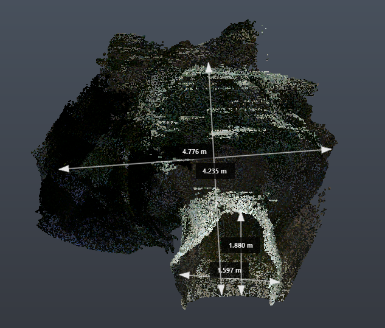

```{r echo=FALSE}
library(knitr)
#opts_knit$set(eval.after = "fig.cap")
```

## Potential titles 

1. CF bats do not show changes in echolocation calls in the presence of conspecifics
1. Echolocation remains unaltered in the presence of conspecifics in CF bats
1. Echolocation calls in the field remain unaltered even in groups of CF bats
1. Echolocation calls in the field remain unaltered in the presence of CF bats
1. Conspecifics do not affect echolocation call structure in CF bats


## 1.0 Introduction 

Active sensing animals like echolocating bats face a sensory challenge when engaging in social behaviours like group emergences or foraging with conspecifics [@ulanovsky2008bat;@gillambrasiliensis]. Echolocating bats emit loud ultrasonic calls and detect their surroundings by listening for the echoes reflecting off objects around them[Griffing;FentonBrock]. In groups however, a bat's returning echoes can be overlapped by calls and echoes from other bats, preventing detection of its surroundings. [@surlykke;;@ulanovsky2008bat;maskingstudies]. A combination of laboratory and field studies have shown the diverse responses bats show in groups and similar situations with loud sounds like noise or playbacks. Bats increase their call emission levels, alter temporal features such as call rate, duration and duty cycle [@amichai2015calling;@jarvis2013groups, @lu2020echolocating;@hage2013ambient;@lin2016bats], along with spectral properties such as bandwidth and terminal frequency [@hase2018bats;@cvikel2015board;@gotze2016no;@fawcett2015clutter]. Each of these responses however seem to be species specific, with different species showing seemingly opposite responses to similar situations [@ulanovsky2004dynamics;@amichai2015calling;@jarvis2013groups;@adams2017suppression]. A wider variety of species need to be studied, to understand the myriad of echolocation responses in context of their ecology and auditory systems.


There are two broad groups of echolocating bats [@fenton2012evolution] characterised by their duty cycle, or the fraction of time spent emitting calls. The first and major group of bats are low-duty cycle bats, which typically emit frequency-modulated (FM) calls. The second group is the high-duty cycle bats which typically emit calls with both FM and constant-frequency (CF) components in them, also called CF-FM calls. From a temporal perspective, low-duty cycle bats typically emit calls of a few milliseconds (1 to 20ms) duration at duty cycles between 5-20%. In contrast, high-duty cycle bats emit relatively longer calls (10 to $\geq$ 50ms), at much higher duty cycles of 25% upwards. Echolocation duty cycle is directly proportional to the probability of calls overlapping echoes [@Beleyur26662]. High-duty cycle bats such as rhinolophids and hipposiderids are thus likely to be more affected in group echolocation than low-duty cycle bats, making them a particularly valuable study system to understand the sensory strategies echolocators use in challenging conditions.

A typical CF-FM call may consist of upto three call components (sensu @tian1997echolocation) consisting of an initial upwards FM sweep (iFM), leading to the CF segment (CF), and a terminal downward FM sweep (tFM). The CF component is used for the flutter detection of prey wingbeats [@??], and the auditory system of high-duty cycle bats shows a pronounced sensitivity to a narrow band of frequencies around the frequency component [@neuweiler2000biology] called the acoustic fovea. Bats show inter-individual variation in the frequency tuning of their acoustic foveas [@schnitzler1976peripheral]. Bats compensate for flight-induced Doppler shifts to maintain the frequency of the CF component's returning echo within the acoustic foveal range [@schnitzler1973control;@schoeppler2018precise]. Previous investigations  [@jones1994individual;@jones1993echolocation;@furusawa2012convergence] of group echolocation in CF-FM bats centred around whether CF-FM bat showed 'jamming avoidance' type responses [sensu @ulanovsky2004dynamics], where individual bats may shift the spectral ranges of their calls to reduce overlap. Previous studies have not found support [@jones1994individual;@jones1993echolocation;@fawcett2015echolocation]  for changes in CF frequencies. While the CF component is involved in prey detection, the FM components are thought to be involved in distance ranging [@tian1997echolocation;@neuweiler1987foraging]. The role of the iFM is relatively ambiguous, while the tFM has been strongly linked with distance ranging. CF-FM bats show rapid alterations in tFM bandwidth and duration based on the behavioural context at hand, eg. resting, landing or prey capture [@neuweiler1987foraging;@schoeppler2018precise;@tian1997echolocation]. Due to the historical focus on the CF call component, alterations in the FM components in group flight have not been quantified in most studies. There has been only one study [@fawcett2015echolocation] to our knowledge that has quantified FM components, and found an increased tFM duration and bandwidth in the presence of conspecifics. Given the tFM's malleability and role in ranging , there is a strong need for its explicit quantification in multi-bat contexts. The tFM may show the same kinds of changes in multi-bat contexts as shown in low-duty cycle bats, which also use their FM calls primarily for ranging [@fawcett2015echolocation;@amichai2015calling;@hase2018bats].

A majority of studies on group echolocation have so far investigated low-duty cycle bats [@lin2016bats;@fawcett2015clutter;@gotze2016no], likely due to their speciosity (most bats except the ~160/1428 species are high-duty cycle species [@fenton2012evolution;@mammdivdatabase]) and ease of call analysis. Studying group echolocation in high-duty cycle bats entails analysing audio with overlapping calls. The analysis of recordings with overlapping calls is a nascent field [but see @izadi2019segmentation], and call parameter estimation has not been attempted before to the best of our knowledge. Even studies with multiple high-duty cycle bats have been limited to 2-3 bats in flightroom conditions [@fawcett2015echolocation;@jones1994individual;@jones1993echolocation;]. Flightrooms provide controlled conditions that can allow direct interpretation of results. However the echolocation of animals is also affected by familiarity [@von2020shrew;@chen2015variation;@yamada2020modulation], and properties of the experimental room [@surlykke2009echolocating]. Studying multi-bat echolocation in the wild provides a direct glimpse into the acoustic challenge animals face in a familiar environment and how they respond to changes in group size.

In our study we fill the gaps by 1) shedding light on the group echolocation in the understudied high-duty cycle bats 2) presenting a methodology to quantify echolocation parameters in the presence of overlapping calls and 3) studying group echolocation in the field. 

## 2.0 Methods

### 2.1 Study species and site
Two species of rhinolophid bats *Rhinolophus mehelyi* and *R. euryale* were recorded in their natural environment. Both study species emit CF-FM calls [sensu @tian1997echolocation] with peak frequencies between 102-112 kHz, and are not acoustically distinguishable  due to the overlap in their call characteristics [@dietz2016bats]. While phylogenetically different species, for the purposes of this study we treat them as a single group of bats that may face the problem of acoustic jamming due to the similarity in spectro-temporal call structure.

We used an audio-video recording setup positioned in a dome-shaped cave (Figure 1) next to the main entrance of the Orlova Chuka cave system, Bulgaria. The cave was 5x3x1.6m (lxbxh) in dimensions. The cave had only one opening with roosting sites on the inside where most bats flew in and out of through the night. 

### 2.2 Experimental setup

The experimental setup consisted of an audio-video recording system made of three microphones and two infrared cameras. The audio and video feeds were synchronised using the low-cost method described in Laurijssen et al. 2018. ON-OFF signals between 0.08-0.5 s were generated by a portable computer (Raspberry Pi 3). The ON-ON-OFF voltage signal was directly fed into one of the channels of the soundcard. The same voltage signal was also used to drive the blinking of an LED that was recorded by  the two cameras. (See Supplementary Information (SI) 1.0 for signal generation script, electronic circuit and associated notes).

For the video recording, two consumer grade CCTV cameras with infrared lamps were connected to a digital video recorder to record the flight of bats as they flew in and out of the cave. The system recorded video mostly at 22 Hz, however there was frame rate variation between 18-27 Hz. The video stream of the two cameras was not frame-synchronised, however, we were still able to view the same bat flight on both cameras due to the common timestamps burnt-in on each frame. The two cameras were placed in approximately the same position on every recording night. The cameras were so placed to maximise the total cave volume recorded while also capturing the blinking LED light. Only sections of the video that had stable camera positions were analysed. Video was recorded continuously through the night and resulted in two video files (one per camera) for each recorded hour.

Three Avisoft CM16 microphones (Avisoft Bioacoustics, Germany) were connected to an Avisoft 416H (Avisoft Bioacoustics, Germany) soundcard running at 250kHz sampling rate. Horseshoe bat calls are known to be directional (Matsuta et al. 2013), and the three microphones were placed at different positions in the cave to increase the number of on-axis calls captured. Microphones were placed in the same location with an estimated +/- 10cm error in the cave across multiple nights. The fourth channel of the Avisoft 416H was used to record the audio sync signal. Audio was recorded continuously through the night in the form of consecutive multichannel files of 1 minute length. Our audio recordings showed that the dome was visited by multiple species of bats aside from our two main study species, and we only analysed audio data with *R. euryale* and/or *R. mehelyi* calls in it.


```{r cavesetupschematic, echo=FALSE,  fig.cap="\\label{fig:cavesetupschematic} Schematic of how the three microphones and two cameras were placed in the recording volume/Klaus will send a more processed version OR Neetash to make a better one? 3D scanning by Klaus Hochradel, UMIT Tirol"}


```

## 3. Data analysis


### 3.1 Video analysis to determine group sizes

Bat activity in the cave was recorded for a total of about 12 hours across four nights in the cave. Bats flew in and out of  the cave often showing different flight behaviors such as circling, approaching and following. Sometimes however, bats spent time (few seconds to several minutes) in the roosting sites within the cave and then only exited. The start and end of all bat flight bouts in the video was manually annotated following a series of pre-defined criteria to ensure repeatability (SI 2.0). Each flight bout annotation recorded the number of flying bats as seen in the two camera views.


### 3.2 Matching video annotation to obtain synchronised audio 

For each video annotation of a bat flight bout, we attempted to match the corresponding region of recorded audio. For each successfully matched video annotation, we created a separate audio file. Audio matching was done by cross-correlating the blinking ON/OFF LED signal over the video annotation with the recorded ON/OFF voltage signal in the audio. We managed to successfully find audio matches for 1181 video annotations, ($N_{total \:video \:annotations=2132}$ i.e., 55% of all video annotations). The low match rate is primarily due to the fluctuating camera frame rates, and because many of the matched audio files had non-target bat species calls. Multiple species were seen in the audio files as during video annotation it was not possible to distinguish bat species by their flight behaviour. The other observed bat species were from *R. ferrumequinum*, vespertilionid and miniopterid FM bats, all of which are known to occur in the Orlova Chuka cave system [@ivanova2005important]. For the acoustic analysis we chose matched audio files that only had *R. euryale* and/or *R. meheyli* calls. The audio files varied in duration between 0.08-62.08 seconds ($N_{matched \:audio \:files}=1181$, median duration: 1.04s , 95%ile range: 0.5-8.54s). 

## 4.0 Acoustic parameter analysis

All matched audio files were first forward-backward high-pass filtered at 70 kHz. For the analysis we used recordings from the first microphone, as it appeared to have consistently  captured calls with the least reverberance of the three channels. The first microphone was located facing the cave opening, perhaps therefore capturing calls of both entering and exiting bats well.

We quantified frequency, duration and amplitude across different parts of the echolocation call (iFM,CF and tFM) using two complementary acoustic analyses. The first analysis is the ‘individual call' analysis, where we measured parameters of one horseshoe bat call from each matched audio. The second analysis is the ‘window’ analysis.Each matched audio was split into 50ms windows. We then measured the acoustic parameters from all windows of a matched audio file. In recordings with multiple bats, the 50 ms windows could have overlapping calls. 

The advantage of the individual call analysis is that the measurements made on the calls are directly interpretable as call component alterations reveal the sensory decisions of the bats. On the other hand, the disadvantage of the individual call analysis is that especially in multi-bat contexts, it can be difficult to find a non-overlapped call. The window analysis complements individual call analysis by enabling measurements even on audio with overlapping calls. Window analysis also allows a kind of null-hypothesis testing where the observed multi-bat audio can be compared with 1) single bat audio and 2) ‘virtual’ multi-bat audio files created by adding multiple single bat audio files. These 'virtual' multi-bat audio files recreate a scenario where two bats echolocate in the same volume without actively responding to each other's presence. The disadvantage with window analysis is the lack of call-level measurements. Ultimately, using the two approaches simultaneously strengthens the interpretation of results.

### 4.1 Individual call measurements

```{r, samplesizes, echo=FALSE}
sampsizes <- read.csv('../combined_analysis/indcall_sample_sizes.csv')

```
Individual calls which were not overlapped by other calls and with sufficient signal-to-noise ratio (Figure \@ref(fig:itsFMdemo)) were manually chosen through a random search protocol (SI 3.0). Briefly, an experimenter began searching from a randomly chosen time point in an audio file for a non-overlapped horseshoe bat call. From this point in the file, the experimenter randomly began searching to the left or right until a suitable horseshoebat call could be identified. The start and end time of this call in the audio file were noted. 

We were able to find a total of `r sampsizes$N[1]` individual calls ($N_{single \:bat}$: `r sampsizes$N[2]`, $N_{multi \:bat}$: `r sampsizes$N[3]`) across all the synchronised audio files.  Calls were automatically segmented into their corresponding parts iFM, tFM or CF [@tian1997echolocation] (Figure \@ref(fig:itsFMdemo)) using the *itsfm* package [@itsfmcitation;*biorxivpaper*]. Most approaches to date focus on indirectly segmenting CF-FM calls into their components by high/low pass filtering around the peak frequency of the call [@siemers2005species;@schuchmann2012horseshoe;@tian1997echolocation;@lu2020echolocating;@schoeppler2018precise].
For an accurate estimate of the peak frequency, this approach requires an on-axis recording of the call with a prominent CF component. While suitable for laboratory studies, filtering around the peak frequency fails in the analysis of CF-FM calls recorded in the field under a variety of conditions eg. calls with loud FM and faint CF components. *itsfm* overcomes these limitations by tracking the *change* in frequency over the call to segment it into FM and CF components. 


```{r itsFMdemo,echo=FALSE, fig.cap="\\label{fig:itsFMdemo} Example of a single CF-FM call with automatically segmented iFM, CF and tFM regions. The raw data is a manually selected audio segment, which is then automatically segmented by the *itsfm* package based on frequency modulation across the call. The *itsfm* package allows accurate segmentation into call parts under challenging recording conditions"}


include_graphics('figures/fig1_labelled_original_from_20180816_21502300_30.png')

#\begin{figure}
#\includegraphics{figures/fig1_labelled_original_from_20180816_21502300_30.png}
#\caption{Example of a single CF-FM call with automatically segmented iFM, CF and tFM regions. The raw data is a manually selected audio segment, which is then automatically segmented by the *itsFM* #package based on frequency modulation across the call. The *itsFM* package allows accurate segmentation into call parts under challenging recording conditions}
#\label{itsFM_demo}
#\end{figure}
```

From the segmented CF and FM components we measured the following parameters. In the CF component, we measured the peak frequency, RMS amplitude and duration. The CF peak frequency was quantified as bats may shift their CF frequencies in the presence of conspecifics. ‘Jamming avoidance’ type reponses have been a parameter of investigation in previous studies [@habersetzer1981adaptive;@jones1994individual;@jones1993echolocation;@fawcett2015echolocation;
@lu2020echolocating]. From the FM components, we measured the lower frequency (-10 dB peak frequency of the FM audio segment), bandwidth (defined as difference between the CF peak frequency and  the lower frequency of the FM segment), RMS amplitude and duration. The bandwidth is important for target ranging in CF-FM bats. An increase in bandwidth in the presence of conspecifics has been shown in at least one previous study [@fawcett2015echolocation]. We also calculated the relative i/tFM-CF amplitude ratios (in dB). The relative call component measures were calculated as CF-FM bats are known to independently vary the level of call components in a context specific manner [@tian1997echolocation;@lu2020echolocating].


### 4.2 Window measurements

Each audio file was split into consecutive windows of 50ms (SI 4.0). The time window of 50ms was chosen as it provided high spectral resolution (20Hz for 12500 samples at 250kHz sampling rate) to distinguish multiple CF components that may be in it. Often in the multi bat contexts, the 50 ms windows consisted of one to many horseshoe bat calls. Initial observations showed that 50 ms was about the longest observed duration of a bat call in our data, and was also about twice the length of typical calls. This allowed a 50 ms window to contain one long call or multiple short calls. 

Over the course of an audio file, there may be multiple windows without calls or very faint calls in them. These 'silent' windows were removed from the analysis, and only the 'non-silent' windows with bat calls in them were analysed. Non-silent windows were defined as those that were 20 dB RMS more than manually annotated silent audio segments (SI 4.1). On each non-silent window, the following acoustic measurements were performed: 1) received level (dB RMS), 2) dominant frequencies and 3) FM terminal frequencies. Dominant frequencies here are defined as frequency peaks in the smoothed power spectrum that are within 14 dB of the window's peak frequency. Dominant frequencies are extracted from the various peaks of the power spectrum and are thus a proxy measurement for the CF component frequencies of calls in a window (SI 4.2). FM terminal frequencies were determined by a spectrogram based method which identified FM regions and chose the lowest frequency in each FM region of a given audio window (SI 4.3). There may be multiple terminal frequencies and dominant frequencies values for a single window, however only one received level measurement per window. All measurements chosen in the whole audio analysis were done in an attempt to be analogous to the measurements performed in the individual call analyses. For instance, the dominant frequencies in the whole audio analysis complements the CF peak frequency measuremeents in the individual call analysis. The FM terminal frequencies and RMS measurements are again analogous to the bandwidth and RMS of the individual call analysis.

### 4.3 Virtual multi-bat audio

The advantage of the window analysis is the possibility to make ‘virtual multi-bat’ data [@fawcett2015echolocation;@ratcliffe2004conspecifics] by combining observed single bat call sequences. We created virtual multi-bat audio files by combining single bat files that were of similar file lengths (SI 4.4). This allowed us to create a ‘null’ dataset where multiple bats were echolocating, but not responding to each other’s presence. The virtual multi-bat audio was handled using the window analysis as described above.

## 5.0 Statistical analysis 

We observed upto 1-4 bats flying in the cave at the same time. However, the sample sizes in group sizes $\geq$ 2 bats were low (SI 5.0), and we thus decided to combine all annotations with $\geq$ 2 into a 'multi' bat class. We thus performed comparisons of 'single' and 'multi' bat calls in the individual call analysis. To maintain consistency with individual call analysis we also performed comparisons of 'single','multi' and 'virtual-multi' windows. 


### 5.1 Individual call measurements

We calculated the median difference ($median_{multi}-median_{single}$) between multi and single bat call parameters for all parameters except CF peak frequency. For CF peak frequencies, we calculated the range (max-min) of CF peak frequencies in single and multi bat data. The range was calculated as 'jamming avoidance' type responses imply an alteration in the frequencies. Bats may decide to shift their call frequencies, leading to an increased range, or as has been experimentally observed, paradoxically converge [@furusawa2012convergence]. Permutation tests were performed to assess the significance of the observed difference between the groups. 

Our dataset has calls from a group of resident wild bats that may have visited the cave site multiple times over the course of a night. Moreover, bat activity over the course of a single night was relatively clustered in time, and flight annotations were thus fairly close to each other at <= 1 minute (median inter-annotation times was 36 s for annotations used in individual calls and 54 s for annotations used in window analysis). Due to the clustered nature of activity, our dataset may have had a disproportionate representation of a few individuals, leading to pseudo replication, and thus a lowering of variation in the data.

To account for the temporal pseudo-replication in our data, we repeated the median/range difference analysis by creating two subsets from our full dataset. We created the 'clustered' subset, where all calls from annotations that were less than or equal to 1 min from each other were taken together. The 'isolated' subset included all calls from annotations that were at least 1 minute away from other annotations. The 'isolated' and 'clustered' subsets had unique datapoints, with no overlap in the calls used. One minute was chosen as it was slightly larger than the observed median inter-annotation interval. Broadly speaking, we expect that if the results of our analysis are comparable across the isolated and clustered subsets, there is a common underlying effect that is independent of temporal clustering. However, if the results of the subset analysis do not corroborate each other, it hints at an effect due to temporal clustering/isolation in the dataset. 

### 5.2 Window measurements

In analogy to CF peak frequency range in the individual call analysis, we calculated the dominant frequency range ($max_{dominant \: frequency}-min_{dominant \:frequency}$) across an audio file. Even in single bat audio files, we expect variation in recorded dominant frequency due to the combined effect of the bat's active Doppler shift compensation and Doppler shift due to its flight past the microphone.  Multi-bat and virtual-multi bat audio files are expected to have an increased range due to presence of multiple bats. We performed a comparison of the median dominant frequency range difference between multi-single and multi-virtual multi audio. A permutation test was performed to assess the significance of the observed difference. 

Unlike dominant frequency range, there are multiple, potentially correlated received level and terminal frequency measurements from a single file. We accounted for this potential file-level pseudo-replication by resorting to repeated random subsampling and median difference calculation. To estimate the median difference across groups we randomly chose one measurement value per file for the single, multi and virtual-multi bat groups. The median difference between multi-single and multi-virtual multi group was calculated and followed by the next subsampling round. We performed 10,000 such subsampling iterations, and report the 95 percentile range of median difference for received level and terminal frequency. No tests were run on the median difference estimates obtained for received level and terminal frequency. 

To account for temporal pseudo-replication in our study, we also repeated the entire window analysis using clustered and isolated subsets as described in section 5.1. A threshold of 1 minute was used to create the clustered and isolated subsets. 

To understand the expected dominant frequency range from single and multi bat flights, (and thus the range difference) we also performed simulations parametrised by the observed data (SI 8.0). The dominant frequency range estimates from the simulations informed the interpretation of the observed data.

### Software packages used in this paper
This paper was enabled by a series of open-source packages. Signal analysis, data manipulation and visualisation were done in Python [@van1995python] through its scientific ecosystem: the scipy, numpy, matplotlib, soundfile and pandas packages [@2020SciPy;@numpy;@matplotlib;@soundfile;@pandas]. Median difference and permutation tests were performed with the dabest [@ho2019moving]. Reproducible analysis, documentation and presentation were enabled by the Jupyter Notebook and Rmarkdown projects[@jupyter;@rmarkdown]. Audio visualisation, preliminary measurements and single call annotations were done with Audacity [@audacity].

## 6.0 Results

### 6.1 Individual call analysis

```{r indcallsampsizes,echo=FALSE}
indcall <- read.csv('../combined_analysis/indcall_final.csv')
nindcalls <- as.data.frame(table(indcall$groupsize))
nmulti_indcall <- nindcalls[1,2]
nsingle_indcall <- nindcalls[2,2]
```

```{r indcallrawdata, echo=FALSE, fig.cap=paste("\\label{fig:indcallrawdata} Measured acoustic parameters for the CF, iFM and tFM components of individual calls emitted under single and multi bat conditions. Each column shows the measurements on a call component, while each row shows a group of related measurements A-C) duration  D-F) spectral measurements G-I) received level J-K) relative FM-CF ratios L-M) FM component bandwidths. $Ncalls_{single}=$",nsingle_indcall, ", $Ncalls_{multi}$=",nmulti_indcall)}

include_graphics('../combined_analysis/measurements_and_derivedparams_multipanel.png')
```

The measured acoustic parameters of call components are shown in Figure \@ref(fig:indcallrawdata). Call parameters showed little difference between multi and single bat groups (Table \@ref(tab:alldataindcall)). Among the temporal parameters, median CF duration appeared to show a ~3ms decrease in multi-bat calls, indicating shorter calls. The iFM and tFM median durations seemed to differ between the groups by around 0.1 ms in opposite directions. Among the spectral parameters, CF peak frequency range, iFM and tFM lower frequencies all differed by around 1 kHz in different directions. Among the received level parameters, iFM and CF components showed a ~ 1.5 dB decrease, while tFM level showed a slightly larger ~-3 dB decrease in multi-bat calls.  The i/tFM-CF level ratios however showed very slight differences of less than 1 dB magnitude. Median tFM bandwidth seemed to be slightly increased in multi-bat calls by 1.8 kHz, while showing not very much difference in the iFM bandwidth (~300 Hz). Our 'whole dataset' results broadly match with the results using the 'clustered' and 'isolated' subset data (SI 6.0). One complicating factor in the interpretation of the isolated subset is however the severe drop in sample sizes of the multi-bat calls in this subset. In the isolated subset, $N_{multi}$ = 5 calls, in contrast to the much higher $N_{single}$=53. 


```{r alldataindcall, echo=FALSE, tab.cap="\\label{tab:alldataindcall} *Difference between multi and single bat call parameters. The median difference is reported for all parameters except CF peak frequency, where the difference in range is reported.*"}
library(flextable)
indcall.analysis <- read.csv('../combined_analysis/alldata_indcall_ci.csv')
msmt.names <- c("CF duration (median ms)", "tFM duration (median ms)", "iFM duration (median ms)",
                "CF peak frequency (range kHz)", "tFM lower frequency (median kHz)", "iFM lower frequency (median kHz)",
                "CF level (median dB RMS)", "tFM level (median dB RMS)", "iFM level (median dB RMS)",
                "tFM-CF ratio (median dB)", "iFM-CF ratio (median dB)", "tFM bandwidth (median kHz)", "iFM bandwidth (median kHz)")

pvalues <- round(indcall.analysis$perm_pvalue,2)
pvalues[1] <- round(indcall.analysis$perm_pvalue[1],3)
meddiff <- round(indcall.analysis$difference,2)

meddiff.table<- data.frame(cbind(msmt.names, meddiff, pvalues))
colnames <- c("Measurement","Difference (Multi-Single)","Permutation test p-value")
medditab <- flextable(meddiff.table)
medditab <- set_header_labels(medditab, msmt.names= colnames[1], 
    meddiff = colnames[2], pvalues= colnames[3]
    )
medditab <- autofit(medditab)
medditab
```


### 6.2 Window analysis 
```{r windowsampsizes,echo=FALSE}

get.window.samplesizes <- function(df)
  {
  n_samples <- as.data.frame(table(df$groupsize))
  n_samples
  }


domfreq_singlemulti_whole <- read.csv('../combined_analysis/obs_singlemulti_domfreq.csv')
ndomfreq_singlemulti_whole <- get.window.samplesizes(domfreq_singlemulti_whole)

domfreq_multivirt_whole <- read.csv('../combined_analysis/multivirtmulti_domfreq.csv')
ndomfreq_multivirt_whole <- get.window.samplesizes(domfreq_multivirt_whole)


```

Multi-single comparisons (Table \@ref(tab:windowsinglemulti)) revealed an increased dominant frequency range in multi bat audio windows by around 2 kHz. The estimated median differences for received level and FM terminal frequency showed no systematic trend, indicating no relative increase or decrease. Subset analysis also revealed similar trends (SI 7.0).

```{r windowsinglemulti, echo=FALSE, tab.cap=paste("\\label{tab:windowsinglemulti}*Multi-single bat comparison of window parameters. For dominant frequency, the range difference was calculated along with running permutation test. Dominant frequency range is larger by 2.2 kHz in multi-bat windows as expected. 95 percentile estimated range for median difference are reported for received level and FM terminal frequency. Received levels and FM terminal frequency median differences indicate no systematic trend towards a relative increase or decrease in multi-bat audio windows.*","$Nfiles_{single}$=",ndomfreq_singlemulti_whole[2,2],"$Nfiles_{multi}=$",ndomfreq_singlemulti_whole[1,2])}
wholewindow.results <- read.csv('../combined_analysis/whole_window_summary.csv')
wholewindow.results <- wholewindow.results[,-1]
window.colnames <- c("Parameter",
                     "Difference",
                     "Permutation test p-value",
                     "Median difference, 2.5%ile",
                     "Median difference, 97.5%ile",
                     "comparison")
colnames(wholewindow.results)<- window.colnames

singlemulti.wholewindow <- subset(wholewindow.results,comparison=='multi-single')
ft.sm.ww <- flextable(singlemulti.wholewindow[,seq(1,5)])
ft.sm.ww <- fit_to_width(ft.sm.ww, max_width =6.6)

ft.sm.ww
```

Multi-virtual multi comparisons (Table \@ref(tab:windowmultivirt)) revealed a small increase in dominant frequency range  of around 0.5 kHz in multi bat audio windows. Received levels and FM terminal frequency median differences indicate no systematic trend towards a relative increase or decrease in multi-bat audio windows.Subset analysis also revealed similar trends (SI 7.0)

```{r windowmultivirt, echo=FALSE, tab.cap=paste("\\label{tab:windowmultivirt}*Multi-virtual multi bat comparison of window parameters. For dominant frequency, the range difference was calculated along with running permutation test. Dominant frequency range difference is small and hints at a scenario with no active change in CF frequencies. 95%ile estimated ranges are reported for received level and FM terminal frequency. Received levels and FM terminal frequency median differences indicate no trend towards a relative increase or decrease in multi-bat audio windows.* $Nfiles_{multi}$=",ndomfreq_multivirt_whole[1,2],"$Nfiles_{virtual \':multi}$=",ndomfreq_multivirt_whole[2,2])}
multivirt.wholewindow <- subset(wholewindow.results,comparison=='multi-virtual multi')

ft.mvm.ww <- flextable(multivirt.wholewindow[,seq(1,5)])
ft.mvm.ww <- fit_to_width(ft.mvm.ww, max_width =6.6)
ft.mvm.ww
```

## Discussion 


```{r echo=FALSE}
# broad overview of what we did and that we didnt find any difference
```
We quantified the difference in horseshoe bat echolocation calls when alone and with conspecifics in the field. Our results do not support a biologically meaningful difference in echolocation calls with reference to group size for all of the call parameters measured using two different approaches. This may seem somewhat unexpected, especially considering the fact that bats in our field site were flying in an enclosed reverberant volume - which would only amplify the problem of masking in multi-bat echolocation. We interpret our results below in more detail.


```{r echo=FALSE}
# The CF peak frequency + dominant frequency range story
```
The idea that bats may alter their call frequencies to reduce spectral overlap in groups has been investigated with mixed results over many studies [@jones1993echolocation;@jones1994individual;@ulanovsky2004dynamics]. Specifically in CF-FM bats  the results do not support the idea that bats may alter their CF frequencies [@jones1993echolocation;@jones1994individual;@fawcett2015clutter;@pye1972bimodal]. @habersetzer1981adaptive seems to suggest CF frequency shifting in a quasi-CF bat, *Rhinopoma hardwickei* (but see @cvikel2015board for an alternative interpretation). However, the echolocation of *R. hardwickei* is not entirely comparable with those of the hipposiderids and rhinolophids in previous studies [@simmons1984echolocation]. Hipposiderids and rhinolophids are more constrained in their echolocation as they show a marked individual-specific acoustic fovea that does not vary over short periods of time[REFS]. CF-FM bats are thus constrained to emit calls so that the Doppler-shifted echoes arrive within the acoustic fovea's range. Our data (Figure \@ref(fig:indcallrawdata), Tables \@ref(tab:alldataindcall),\@ref(tab:windowsinglemulti),\@ref(tab:windowmultivirt))) also supports previous studies showing an absence of active CF frequency shifting in the presence of conspecifics. If bats were to show 'jamming avoidance' type responses, one would expect an overall increase in the CF frequency range in groups, and thus an increased difference in the ranges between single and multi bat audio. If they were to show 'convergence' [eg. as in @furusawa2012convergence], we expect a reduction in range.  The observed CF and dominant frequency range differences of around 2 kHz  between single and multi bats falls within the expected magnitude seen when bats do not show any special responses to each other. More convincingly however, the low difference in dominant frequency range between multi and virtual multi audio shows that even when bats are indeed flying together they are not actively altering their CF frequencies to reduce or increase overlap. Moreover, as our simulations and experimental data have shown (SI 8.0), a receiver (eg. a microphone or another bat) placed in the proximity of a CF-FM bat flying by may hear a series of CF frequencies that vary by upto 3 kHz from the emitted frequency. This relatively large variation in the received frequency thus decreases the extent of spectral overlaps during multi-bat echolocation. The combination of individual specific acoustic foveas and Doppler-shift driven variation in received CF frequency make it unlikely that the CF component based echolocation would be affected in groups. 


```{r echo=FALSE}
# the i/tFM components, bandwidth
```
The tFM call component may also be expected to undergo alterations in groups. The tFM component is known to be involved in ranging and undergoes spectro-temporal changes across behavioural contexts such as landing and prey capture [@tian1997echolocation;@schoeppler2018precise]. @fawcett2015echolocation found an average of 5 kHz tFM minimum frequency (-10 dB call peak frequency) decrease in pairs. We failed to find effects that matched their results, with a drop in tFM lower frequency (-10 dB tFM peak frequency) of around 1 kHz at most, and an increase in tFM bandwidth of at most 1.8 kHz, while our window analysis revealed no systematic differences in terminal frequency estimates between single and multi bat windows. Alterations to duration are also known to occur in calls in the presence of conspecifics and noise [@fawcett2015echolocation;@lu2020echolocating]. @fawcett2015echolocation found an average increase in tFM duration  by 1.8 ms in pairs, while we find a slight median increase by about 0.1 ms in multi-bat calls. In another study with artifical playbacks, @lu2020echolocating found an increase of 0.6ms in comparison to calls in silence. Compared to previous studies, our effects are small, and unlikely to have biological significance. We also found a median decrease in CF component duration by around 3 ms in multi-bat calls. This decrease matches the finding of @fawcett2015echolocation where average call duration decreases by around 1.2 ms in pairs. However, whether our observed decrease in CF duration is a result of an increased call duty cycle or an artifact of our individual call selection protocol is difficult to tell apart. Our individual call selection protocol specifically looked for non-overlapping calls, meaning that it may have had a favoured the selection of shorter calls. 

```{r echo=FALSE}
# The received level story -- needs a bit more work
```
Bats are known to increase their call levels in the presence of experimental playbacks [@hage2013ambient;@hage2014ambient;@lu2020echolocating;]. In our study, we did not have access to the source level of the calls as we did not track the bats' position in 3D space. We only had access to the *received* level at the microphone, which is modulated broadly by 1) the bat-microphone distance, and 2) source level of the call. With these caveats in mind, we discuss our results. Aside from the 3dB median drop in tFM received level, the multi-single difference in other call components were smaller (~1.5dB) in the individual call analysis. Window analysis revealed no systematic alteration in received level in multi-single and multi-virtual multi comparisons. The relative iFM-CF and tFM-CF ratios were at most 1 dB. Why was there no major difference in received levels even in the window analysis, despite that intuitively overlapping sounds are expected to have a higher received level? The similarity in received levels of multi and single bat audio-segments can be explained by the inequal contribution the nearest bat's makes to the received level. Due to the spherical spreading of sound, the received level at the microphone primarily reflects that of the bat calling closest to the microphone. Thus, even when there are multiple bats - the nearest bats' call dominates the received level measurements. This nearest-bat dominance means we typically measure the received level of one bat's call even when the audio has overlapping calls. Multi and virtual-multi bat audio-segments having similar received levels thus indirectly suggests there is no change in source level even in the presence of another bat. However, the tFM received level showed a drop of around 3dB that we are not sure how to interpret. This apparent drop in received level could be the result of bats flying further away or emitting more directional calls. 


```{r echo=FALSE}
# What new things did we bring to the field?
```
We introduced two automated analyses that can be performed on audio recordings of multiple CF-FM bats. Automated individual call analyses using the open-source ```itsfm``` package allows call component segmentation according to the rate of frequency modulation across the sound.  The frequency-modulation based segmentation in our experience is also more robust to field recordings with fainter CF components, and thus performs better than filtering around the peak frequency as done in previous studies. To analyse audio with overlapping calls we measured acoustic parameters of short audio windows without assigning the measurements to individual calls. While coarser than the individual call analysis, the window based approach still provides complementary support to the individual call analyses by parametrising variables such as FM terminal frequency and dominant frequency range. 

```{r echo=FALSE}
# WHAT WE DID NOT MEASURE --- POINTING IT OUT 
```
There are a set of parameters that we were not able to measure and thus excluded in our analyses. We did not measure call-sequence related parameters such as inter-call-intervals or duty-cycle. Bats in acoustically difficult situations are known to alter their call rate [@amichai2015calling;@jarvis2013groups;], and thus their duty cycle. Measuring inter-call-intervals is possible in single bat contexts, but extremely challenging in multi-bat recordings with overlaps and reverberation. The study of call-sequence related measures in multi-bat contexts is hindered by the difficulty in call identity assignment. In our individual call analyses we specifically avoided audio recordings with only overlapping calls, and this represents an unavoidable observational bias in our dataset. The use of a full microphone array with at least four microphones to assign calls to the emitting bats is the next step in the investigation of group echolocation in CF-FM bats. With the acoustically localised positions of each bat in the group, estimates of flight speed, and thus Doppler shift could also be directly made from the audio recordings. 


```{r echo=FALSE}
# Why did we not see anything? Discussing possibilities
tfm.95pctile <- round(quantile(indcall$tfm_duration,0.975,na.rm=TRUE),1)
tfm.2.5pctile <- round(quantile(indcall$tfm_duration,0.025,na.rm=TRUE),1)

dutycycle.range <- tfm.95pctile/c(40,50)
dutycycle.sorted <-  sort(dutycycle.range)*100

# load simulation results
overlap.probs <- read.csv('associated_docs/2-3bat_tfm_overlap_prob.csv')
overlap.probs2 <- subset(overlap.probs,num_bats==2)
tfm.probs <- round(sort(overlap.probs2$tfm_overlap_prob),3)*100

```
What are the possible explanations for the absence of a echolocation response in groups? The main explanation we posit is that situations with 2-3 bats may not be very challenging echolocation-wise for multiple reasons. CF-FM bats rely on the tFM component to detect the distance of objects around them [@tian1997echolocation]. The tFM components are short (`r tfm.2.5pctile`-`r tfm.95pctile`ms, 95 percentile range), and likely emitted every 40-50 ms (calculated using typical duty cycle values. Interval includes CF duration and inter-pulse interval), which is equivalent to a tFM duty cycle between `r dutycycle.sorted[1]`-`r dutycycle.sorted[2]`%. For a pair of bats at these duty cycles, the probability of one tFM echo being overlapped by another conspecific call is relatively low at most between `r paste(tfm.probs[1],'-',tfm.probs[2])`% (SI 9.0). Even if a single tFM echo is overlapped by another call's tFM component, a bat may still be able to detect it if the signal-to-noise ratio is sufficient. Bats in small groups are unlikely to face major detriments to their echolocation [@Beleyur26662], and thus not show specific alterations from solitary echolocation. Secondly,  @fawcett2015echolocation observed an increased tFM duration and bandwidth in *R. capensis* flying in pairs in a flight room. This result highlights the importance of the tFM component in CF-FM echolocation. The experiments in @fawcett2015echolocation  were done in a novel flight room setting. The combination of flight room characteristics [@surlykkebatsinvolumes] and species differences, may perhaps have led to the responses seen in this study. Bats show long-term spatial memory [@barchi2013spatial;@mohres1949versuche] and familiarity with the cave's structure may have allowed them to easily recognise their location over time.  Bats also use echoes across multiple calls and are thus resistant to occasional disruptions in echo arrival [@Salles202011719]. The combination of spatial memory and multi-echo integration may have allowed our bats to continue echolocating with conspecifics without altering their calls drastically. 

Previous manipulative studies [@hage2013ambient;@hage2014ambient;@lu2020echolocating;] have revealed the exquisite control bats have over each call component. However, these call alterations are typically elicited in response to artifical stimuli with little resemblance to their natural auditory scenes. Our results suggest that bats may not regularly be employing strategies observed from playback and flightroom studies to enhance their echo detection while flying with conspecifics. We highlight the importance of observational studies in field settings to understand the frequency with which various sensory strategies are actually employed in ecological contexts. 

```{r, other-comments, echo=FALSE}
#1. ONE VERY IMPORTANT FACTOR TO CONSIDER -- overlapping calls -- the FM segments are relatively short (2-5ms), and at group sizes of 2-5, there's very unlikely to be an issue with detecting objects in their surroundings. ref Beleyur & Goerlitz. Even though Fawcett et al. 2015 see a difference..
#1. An important reason we don't see any difference between single and multi bat calls may also be because the bats are flying in a familiar natural setting. This may exclude the need for bats to 'compensate'.

#Our results stand in contrast to other comparable studies that show differences in echolocation call parameters based on conspecific presence in CF-FM and quasi-CF bats [@fawcett2015echolocation;@habersetzer1981adaptive;@cvikel2015board]. 


#1. **importance of field studies**: Bats may not show the same kinds of dramatic responses to conspecifics when studied in their natural habitat. Despite its challenging nature, we stress the importance of observing echolocation/behaviour in the wild. 
#1. We also present a method to assess differences in call behaviour with overlapping calls in the form of 'windows' than can incorporate a few calls. 
#1. One important aspect of the dataset missing in our study is the position of the bats as they called. 
#1. It maybe surprising that single and multi-bat audio windows didn't seem to show very much difference. This does not mean that bats did  not change their source level, and may be explained by a simple geometric consideration. The simplest factor is that when two sounds overlap, their dB received level is often dominated by the loudest sound. This means that in our case, when two bats fly past each other, one bat is always closer to the microphone - and its call is likely to dominate the measured received level (See Supplementary Information). Assessing source levels from the received levels requires knowledge of the bat positions. The source level calculations are in turn challenging due to the overlap of calls. One solution despite the presence of overlap is to exploit the slight interindividual difference in CF peak frequencies, and infer the individual call received levels from the power spectrum, and thus back calculate the source levels of the two overlapping calls. 

#1. Our study has the advantage of wild bats flying in relatively small volumes. Unlike observational studies done in the wild, where it is difficult to assess how far away the bats may have been - we can be sure that the bats were flying at most +/-X m away from each other. 
#1. Our measurement methods advance the state of the art a bit, but there is still a long way to go. All of our whole audio analysis methods include a lot of noise from echoes and reverberation. It would be good to be able to account/exclude such things. 
```

## Data and code availability
All data and code used process data and generate the results and figures in the paper are available in the Zenodo repository [INSERT DOI HERE].

## Acknowledgements 
The authors would like to specially thank the electronics team (Markus Abels, Hannes Sagunsky, Reinhard Biller) at the MPIO workshop for help preparing the electronic circuits to run the ON/OFF signal splitting. We would also like to thank Antoniya Hubancheva for logistical support, Stefan Greif for help collecting the data, the 2018 Tabachka field crew, Diana Schoeppler and Hans-Ulrich Schnitzler for their helpful discussions. We also thank Manjari Jain for her support and and encouragement of the project. TB was funded by a DAAD doctoral fellowship and the IMPRS for Organismal Biology, HRG was funded by the Emmy Noether program of the DFG (German Research Foundation) *INCLUDEDFGGRANTNUMBERHERE????*. 

## Author Contributions 
Study design and conception: NMR, TB; Data collection: AK, NMR, TB;  Audio and video annotation: AK, NM; Audio-video synchronisation: TB; Analysis: HRG, TB, NMR; Interpretation of results: HRG, NMR, TB;  Manuscript preparation: HRG, NMR, TB. 

## References 
