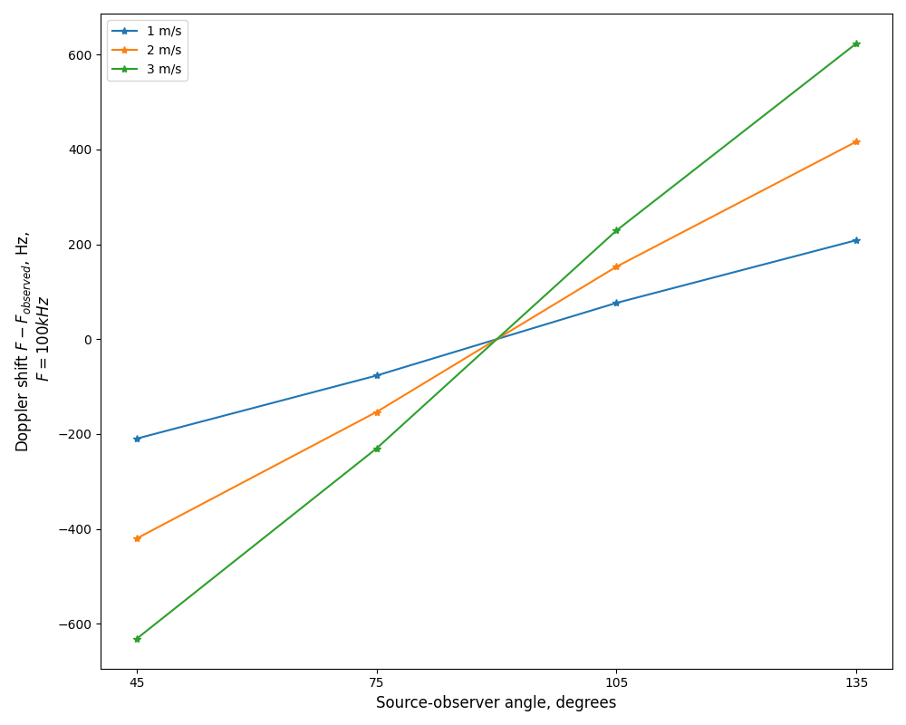
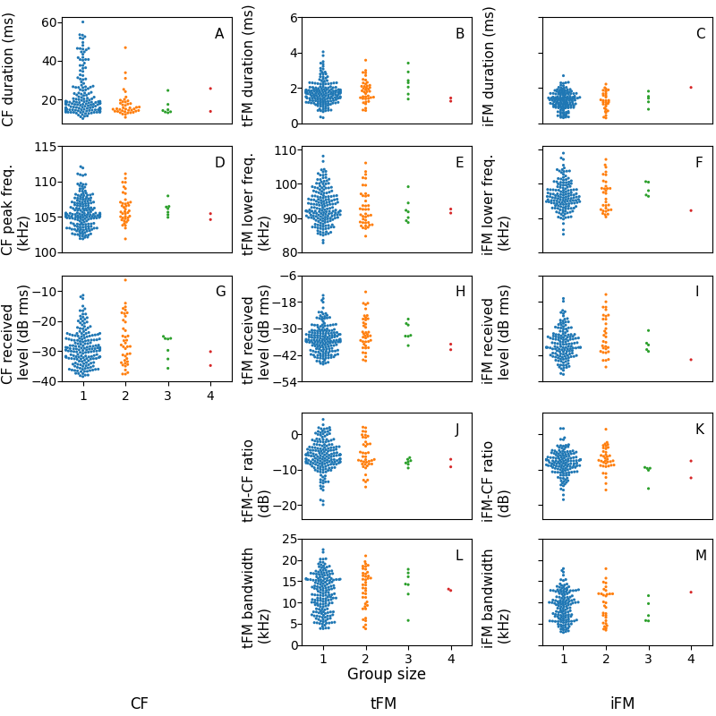

```{r echo=FALSE}
library(knitr)
```

## Video annotation of bat flights in the cave
The start and end of bat flights, along with the number of bats flying during the period were noted across all recorded video data. A series of pre-defined criterion were used during the annotation, as defined below:

*THIS NEEDS SOME MORE FINALISATION AND WORKING -- BUT PASTING IT IN HERE FOR NOW...*

1. Annotate behaviours by viewing cam1 and cam2 videos playing simultaneously. 
1. For each annotation row, use the burnt timestamps on either cam1 or cam2 and NEVER both to log the start and end times of observed flight activity. The time is logged in “yyyy-mm-dd hh:mm:ss” format, with frame number in an adjacent column.  
1. The moment a bat is observed to fly in any camera view, that time is considered as the start time of the activity. Similarly, the moment bat is not observed in either camera view, that time is logged as end of activity. The timestamp to log is chosen from the view that shows most of the behavior that can be observed from the start to the end. - Thinking of scrapping the previous reasoning and introducing - Use camera 2/1 burnt timestamps to log the behaviour as it is the wide angle camera/has clear LED on/off signals for cross-correlation. This way, one will not have to describe another objective way to quantify which of the two views showed most of the behaviour. (A decision is required ASAP)
1. If there are multiple bats flying and involves several transitions. From 1-2-1-2-1-1-1, choose the parts of the video with maximum number of bats showing flight behaviour to annotate. 
1. To separate one activity from the next, ensure a difference of at least 6 frames. 6 frames was chosen because it corresponds to a duration of about 240-273 ms. This time gap could have a 2-3 horseshoe bat calls. 
1. Whenever it is extremely difficult to classify bat events (to 1 bat, 2 or more bats) because of how dynamic (= craziness) the flights of many bats are, drop them from annotating. Instead focus on obtaining a clean data set. 
1. While generating data set for 8 randomly chosen 2 mins of videos to annotate, use “star trek”, an online tool, to generate random numbers (https://stattrek.com/statistics/random-number-generator.aspx#error)
Include annotating no flight activity windows (control) to account for potential bats calling from the roost.
1. For control data set, annotate the parts of video where there are no flying bats observed. These annotations will be used for parameter extraction too and will serve as a measure to account for bats calling from the roost or perching sites in the cave space or the bats that are vocalising just outside the cave space and yet the calls are being picked up by the microphones inside the cave.
1. On how to annotate the control events: For each annotation, choose 1 second long video start and end timestamps from either camera 1 or camera 2 and never a combination of the two. How many to annotate for each 2 minute window?: Choose at least more than half of the number of bat flight annotations for those 2 minutes. (2 minute with reference to the 8 random selections of 2 minutes of video). 


## Individual call analysis 

#### Individual call selection 

Individual calls were selected from the audio files based on a set of pre-defined search protocol:

* All measurements and signal processing will be done using Audacity. 
* dB rms measurements made with the 'Contrast' function in Audacity. Highpassing done with the inbuilt highpass filter. The SNR is calculated by difference between the foreground (bat call region) and background (silent region)

    1. Load annotation audio file, and delete all non-target channels. 
    1. View audio in spectrogram mode. Set dynamic range of audio to 60dB. 
    1. Highpass filter audio file with 12 dB roll off/octave at 80 kHz cutoff frequency
    1. For given audio file, choose  a start point using a random number generator between 0-1. 
    1. Go to that fraction of time corresponding to the length of the annotation audio file 
    1. Choose another random number between 0-1. If it's <=0.5 search towards left, else search towards right. 
    1. Look for a horseshoebat call with no overlaps, no interference patterns in the CF or FM, that can be isolated well. 
    1. While selecting horseshoe bat calls, zoom in max till 60 milliseconds of audio occupy the whole screen. Do not zoom in more or less while selecting. 
    1. Check the SNR of the selected horseshoe bat call by using a 'silent period' of the audio file as background.  If there is not suitably long 'silent period' to serve as background in this audio file, choose another random audio file and measure the background dB rms. 
        a. If SNR >= 20 dB, this is a suitable call to measure. Note down the start and end time of this call in the audio file.
        b. If SNR < 20dB
            i. Go back to search start point calculated in 4), and begin searching in opposite direction. 
            ii. Look for first suitable call to measure using criteria in 7) onwards.
        c. If a suitable call is still NOT found:
            i. No measurement takes place in this audio annotation. Proceed to next audio annotation file.

Audacity version 2.3.3 was used during the manual call selection.


## Whole audio analysis 

#### Choosing the 'silent window threshold'

A series of manually annotated audio clips were used to set the reference silent window threshold. The manually annotated audio clips were the same as those used to calculate the reference 'silence' segments in the individual call analysis ($N_{files}=406$, min-max duration=0.002-0.03s). The threshold for a window to be chosen as silent was set at 20dB above the maximum measured dB rms of all silent windows. This resulted in any window that was less than -23 dB rms as being considered 'silent'. This is a conservative approach that prevents windows with poor signal-to-noise ratio from being analysed. 

The code to execute this analysis is available in the ```what qualifies as a silent audio segment.ipynb``` notebook and its HTML printout. 

#### Making virtual multi bat audio files


```{r virtualmultibat, echo=FALSE, fig.cap="\\label{fig:virtualmultibat} Example showing the steps involved in creating a virtual multi bat file. Shown here are spectrograms of the first 500ms of two single bat audio files (A), (B), along with the resulting virtual multi bat audio file. Vertical lines delineate 50ms windows that are used for acoustic measurements"}

include_graphics('figures/figX_virtualmultibat.png')

#\begin{figure}[H]
#    \includegraphics{figures/figX_virtualmultibat.png}
#    \caption{Example showing the steps involved in creating a virtual multi bat file. Shown here are spectrograms of the first 500ms of two #single bat audio files A,B, along with the resulting #virtual # multi bat audio file. Vertical lines delineate 50ms windows that are used for #acoustic measurements}
#\end{figure}
```


Virtual multi bat audio files (Figure \@ref(fig:virtualmultibat)) were created with the following steps:

1. For each multi bat file generate a virtual multi bat audio file
    1. Among the pool of single bat audio file choose all files that are within 0.9-1.1 times the length of the current multi bat file.
    1. From the pool of duration matched single bat audio files, randomly select 2 or 3 files - depending on how many bats were observed in the current multi bat file 
    1. Add the chosen single bat audio files together. Set the final virtual multi bat length to the length of the shortest single bat audio file. 
    1. Remove the chosen single bat audio files from the pool of single bat audio files. The single bat audio files will not be used again to generate a virtual multi bat file. 

The code to execute this function is available in the ```Making virtual multi bat audio.ipynb``` notebook and its HTML printout. 

#### FM terminal frequency measurement

The FM terminal frequency (Figure \@ref(fig:fmterminal)) is determined in the following steps:

1. Make spectrogram of the audio window (512 samples FFT, 256 samples overlap). 
1. Identify all spectrogram 'pixels' in the FM frequency band that are above the baseline level. The baseline power level across pixels was calculated by looking at 95%ile value of power in a frequency band of the spectrogram without any bat calls in it (below 70 kHz). All pixels that were 46 dB above the baseline power level and below 98 kHz were considered valide FM pixels. 
1. Identify continuous clusters of FM pixels. These clusters represent single iFM or tFM components of calls. 
1. From the identified continuous clusters, extract the lowest frequency pixel in a cluster

Given the current parameter values used for our analysis, the terminal frequency measurements have a spectral resolution of 488 Hz.

The code to execute this function is available in the ```inbuilt_measurement_functions.py``` module. 

```{r, fmterminal, echo=FALSE,fig.cap="\\label{fig:fmterminal}Example showing extracted FM terminal frequencies from the spectrogram of a 50ms window. The method allows extraction of terminal frequencies in the presence of multiple overlapping calls, though it doesn't allow discrimination of iFM and tFM components "}

include_graphics('figures/fm_terminal_0_matching_annotaudio_Aditya_2018-08-16_2324_231_hp..png')

#\begin{figure}[H]
#  \includegraphics{figures/fm_terminal_0_matching_annotaudio_Aditya_2018-08-16_2324_231_hp..png}
#  \caption{Example showing extracted FM terminal frequencies from the spectrogram of a 50ms window. The method allows extraction of terminal frequencies in the presence of multiple overlapping calls, #though it doesn't allow discrimination of iFM and tFM components}
#\end{figure}
```


#### Dominant frequency measurement
Unlike typical measures used to quantify echolocation calls like peak frequency or-10 dB frequency, the dominant frequencies provide a glimpse of what may be happening in the presence of multiple calls. 

The dominant frequency was determined with the following steps:

1. Create a smoothed power spectrum. A smoothed power spectrum is generated by passing the raw spectrum with a running-mean filter of the pre-defined spectral smoothing width. The spectral smoothing width defines the 'width' or the number of frequency bins of the running-mean filter. We used a smoothing width of 100 Hz, which corresponds to 5 frequency bins. The smoothing is necessary as the raw power spectrum can be very 'jagged' otherwise, and impede peak detection which corresponds to the CF components of calls in the input audio. 
1. Extract the peaks in the smoothed power spectrum. Only peaks that are a minimum 'distance' from each other, and that are within a threshold of the highest peak are chosen. We chose an inter-peak distance of 250 Hz, and all valid dominant frequency peaks needed to lie within 14 dB of the peak with the highest power. 
1. Map the valid peaks to the frequencies they correspond to. These are the dominant frequencies in this

The code to execute this function is available in the ```inbuilt_measurement_functions.py``` module. 

## Audio-video synchronisation: hardware and software implementations

The audio and video data were synchronised using the protocol of [@laurijssen2018low]. A Raspberry Pi 3 was used to drive an ON/OFF signal from an GPIO port. This ON/OFF signal was then split between an LED and a circuit linked to capacitor. The capacitor converted the DC ON/OFF signal into positive and negative spikes - thus allowing the signal to be correctly digitised. Not all soundcards are capable of digitising DC voltages, and thus the capacitors helps in making the protocol independent of soundcard type. The entire circuit can be assembled from easily available parts (Figures \@ref(fig:breadboard), \@ref(fig:circuitschematic))

```{r breadboard, echo=FALSE, fig.cap="\\label{fig:breadboard} The experimental realisation of the audio-video synchronisation signal splitting. The components can easily be assembled onto a hobby breadboard, and are easily portable. Here the breadboard is pasted on the inside of a lunch box lid, allowing easy and safe transport of the breadboard and the Raspberry Pi in the box itself."}

include_graphics('associated_docs/breadboard_circuit_trim_labelled.png')

#\begin{figure}[H]
#    \includegraphics{associated_docs/breadboard_circuit_trim_labelled.png}
#    \caption{The experimental realisation of the audio-video synchronisation signal splitting. The components can easily be assembled onto a hobby breadboard, and are easily portable. Here the breadboard #is pasted on the inside of a lunch box lid, allowing easy and safe transport of the breadboard and the Raspberry Pi in the box itself.}
#    \label{breadboard}
#\end{figure}
```

```{r circuitschematic, echo=FALSE, fig.cap="\\label{fig:circuitschematic} The circuit plan of the synchronisation signal splitter shown in the figure above"}
include_graphics('associated_docs/rpi_circuit.png')

#\begin{figure}[H]
#    \includegraphics{associated_docs/rpi_circuit.png}
#    \caption{The circuit plan of the synchronisation signal splitter shown in Figure \ref{breadboard}}
#    \label{circuit_schematic}
#\end{figure}
```

The code to drive the GPIO port runs on Python 2 (and should also run on Python 3). For best results the python file 
can be set to automatically run on boot-up. This makes the synchronisation protocol field-friendly, and reduces the need
of the experimenter manually running the code. 

```
#!/usr/bin/python
'''
script that switches a RED LED on and off
This script and the circuit used to
run the system is based on the post at thePiHut
'Turning on an LED with your Raspberry Pi's GPIO Pins' 
URL: https://thepihut.com/blogs/raspberry-pi-tutorials/
27968772-turning-on-an-led-with-your-raspberry-pis-gpio-pins
Accessed June 11 2015
'''
import RPi.GPIO as GPIO
import sys
import time
GPIO.setmode(GPIO.BCM)
GPIO.setwarnings(False)
GPIO.setup(18,GPIO.OUT)
import numpy as np

time_ranges = np.arange(0.08,0.5,0.0001)

while True:
    try:
        #print ('LED ON')
        GPIO.output(18,True)
        on_time = np.random.choice(time_ranges,1)
        time.sleep(on_time)
        #print('LED OFF')
        off_time = np.random.choice(time_ranges,1)
        GPIO.output(18,False)
        time.sleep(off_time)
    except KeyboardInterrupt:
        GPIO.output(18,GPIO.LOW)
        sys.exit()

 ```

One optional change that can be made to the code above is to set the seed manually with ```np.random.seed``` after the numpy import. 
Setting a fixed seed can have the advantage that problems in audio-video file synchronisation post data collection can be better
fixed. A fixed seed however means that the output signal is the same across all sessions used - which might make distinguishing 
audio and video recordings from different sessions difficult, though not exclude it.

Another important aspect to pay attention to is the ```time_ranges``` variable. In this experiment it was assumed that the camera frame rate
was going to be 25 Hz, and thus the lowest ON/OFF time was set to 0.08s, which corresponds to a signal with 12.5Hz periodicity of the Nyquist frequency. However, as [@laurijssen2018low] suggest, it would have been better to set the lowest duration to a longer period, which was a few times lower than the Nyquist frequency of 12.5 Hz, eg. 0.2s (5 Hz). In our experiments, the cameras turned out to have a frame rate of 22Hz, which meant that the LED signal was aliased. However, despite the
aliasing, we were still able to synchronise audio and video - showing the robustness of the methodology. 


## Calculating estimated Doppler shifts in our study

The amount of Doppler shift in our audio recordings is primarily affected by two factors: 1) the flight speed of the bat 2) the flight direction of the bat with respect to the microphone. In our recordings, most of the flights were with bats flying past the microphone, and the flight direction is thus an important variable to investigate. Our calculations (Figure \@ref(fig:dopplershift))  show that our audio recordings may have between ~200-600 Hz of Doppler shift in it, considering an emitted frequency of 100kHz. This calculation was done across a range of flight speeds (1-3m/s) and relative flight directions (45-135$^{\circ}$). It is very unlikely that bats would fly head-on to the microphone, and this was thus not included. 'Head-on' flight calculations over or under estimate the amount of Doppler shift in the data.	

```{r dopplershift, echo=FALSE,fig.cap="\\label{fig:dopplershift}Calculating the estimated amount of Doppler shift in the CF peak and dominant frequency estimates. This calculation applies only to the direct calls incident onto the microphone. The relative angle can be thought of as the progressive shift in position of a bat as it flies from the right to the left. 180deg is when the bat is the bat is very far away and on the right of the microhpone, 90deg is when the bat is exactly opposite the microphone, and 0 degrees is when it is very far away on the left of the microphone. The range between 45-135deg is chosen to match the relative positions of bats as they fly by the microphone in the field-site." }


#\begin{figure}[H]
#    \includegraphics{associated_docs/SI_dopplershift.png}
#    \caption{Calculating the estimated amount of Doppler shift in the CF peak and dominant frequency estimates. This calculation applies only to #the direct calls incident onto the microphone. The relative angle can be thought of as the progressive shift in position of a bat as it flies #from the right to the left.180$^{\circ}$} is when the bat is the bat is very far away and on the right of the microhpone, 90$^{\circ}$ is when #the bat is exactly opposite the microphone, and 0 degrees is when it is very far away on the left of the microphone. The range between #45-135$^{\circ}$ is chosen to match the relative positions of bats as they fly by the microphone in the field-site.
#    \label{dopplershift}
#\end{figure}
```

The code used to generate this figure is in the Supplementary Information B, and is called ```doppler_shift_estimation.py```

## Group-wise individual call measurements


```{r indcallwgroupsize, echo=FALSE,fig.cap="\\label{fig:indcallwgroupsize} Individual call measurements according to group size. The low sample sizes in >=2 bat group sizes led us to combine the calls into single and multi categories." }


```


## References 


