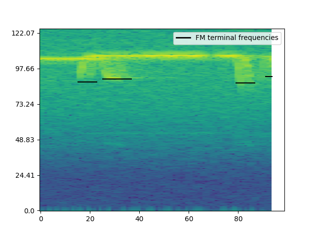
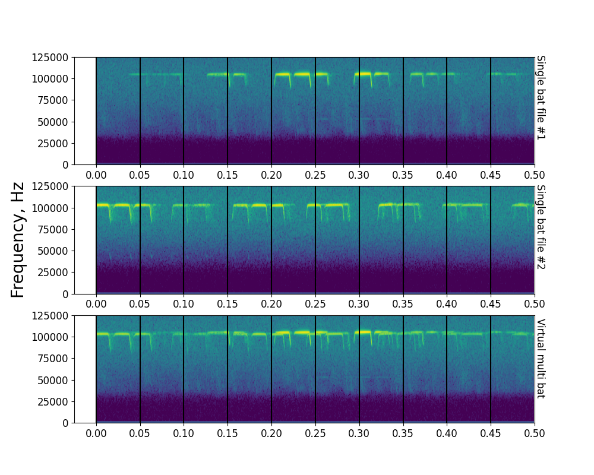
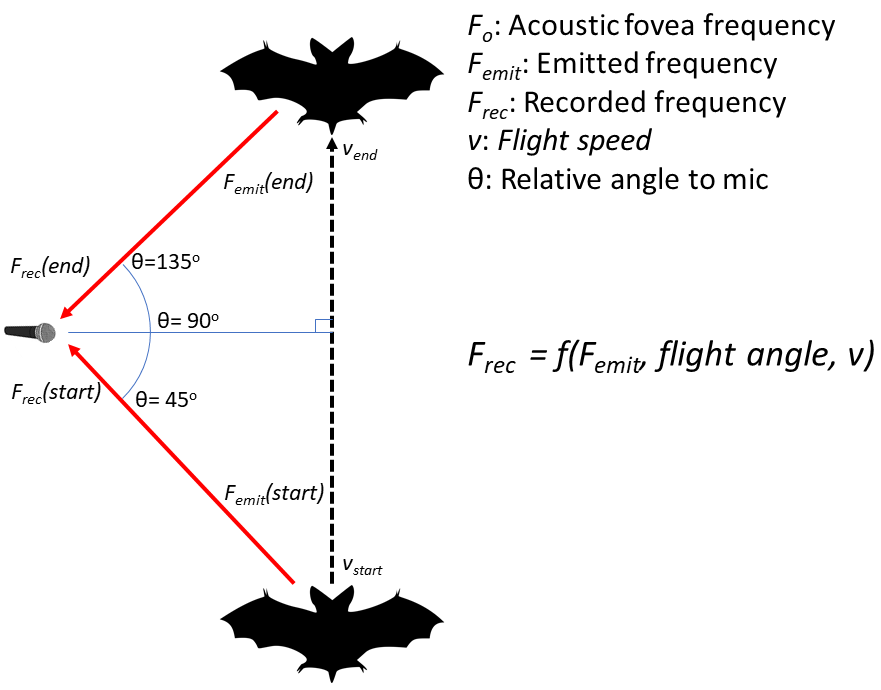

```{r echo=FALSE}
library(knitr)
```


## Audio-video synchronisation: hardware and software implementations

The audio and video data were synchronised using the protocol of [@laurijssen2018low]. A Raspberry Pi 3 was used to drive an ON/OFF signal from a GPIO port. This ON/OFF signal was then split between an LED and a circuit linked to capacitor. The capacitor converted the DC ON/OFF signal into positive and negative spikes - thus allowing the signal to be correctly digitised. Not all soundcards are capable of digitising DC voltages, and thus the capacitor helps in making the protocol independent of soundcard type. The entire circuit can be assembled from easily available parts (Figures \@ref(fig:breadboard), \@ref(fig:circuitschematic))

```{r breadboard, echo=FALSE, fig.cap="\\label{fig:breadboard} The experimental realisation of the audio-video synchronisation signal splitting. The components can easily be assembled onto a hobby breadboard, and are easily portable. Here the breadboard is pasted on the inside of a lunch box lid, allowing easy and safe transport of the breadboard and the Raspberry Pi in the box itself."}

include_graphics('associated_docs/breadboard_circuit_trim_labelled.png')

#\begin{figure}[H]
#    \includegraphics{associated_docs/breadboard_circuit_trim_labelled.png}
#    \caption{The experimental realisation of the audio-video synchronisation signal splitting. The components can easily be assembled onto a hobby breadboard, and are easily portable. Here the breadboard #is pasted on the inside of a lunch box lid, allowing easy and safe transport of the breadboard and the Raspberry Pi in the box itself.}
#    \label{breadboard}
#\end{figure}
```

```{r circuitschematic, echo=FALSE, fig.cap="\\label{fig:circuitschematic} The circuit plan of the synchronisation signal splitter shown in the figure above"}
include_graphics('associated_docs/rpi_circuit.png')

#\begin{figure}[H]
#    \includegraphics{associated_docs/rpi_circuit.png}
#    \caption{The circuit plan of the synchronisation signal splitter shown in Figure \ref{breadboard}}
#    \label{circuit_schematic}
#\end{figure}
```

The code to drive the GPIO port runs on Python 2 (and should also run on Python 3). For best results the python file 
can be set to automatically run on boot-up. This makes the synchronisation protocol field-friendly, and reduces the need
of the experimenter manually running the code. 

```
#!/usr/bin/python
'''
script that switches a RED LED on and off
This script and the circuit used to
run the system is based on the post at thePiHut
'Turning on an LED with your Raspberry Pi's GPIO Pins' 
URL: https://thepihut.com/blogs/raspberry-pi-tutorials/
27968772-turning-on-an-led-with-your-raspberry-pis-gpio-pins
Accessed June 11 2015
'''
import RPi.GPIO as GPIO
import sys
import time
GPIO.setmode(GPIO.BCM)
GPIO.setwarnings(False)
GPIO.setup(18,GPIO.OUT)
import numpy as np

time_ranges = np.arange(0.08,0.5,0.0001)

while True:
    try:
        #print ('LED ON')
        GPIO.output(18,True)
        on_time = np.random.choice(time_ranges,1)
        time.sleep(on_time)
        #print('LED OFF')
        off_time = np.random.choice(time_ranges,1)
        GPIO.output(18,False)
        time.sleep(off_time)
    except KeyboardInterrupt:
        GPIO.output(18,GPIO.LOW)
        sys.exit()

 ```

One optional change that can be made to the code above is to set the seed manually with ```np.random.seed``` after the numpy import. 
Setting a fixed seed can have the advantage that problems in audio-video file synchronisation post data collection can be better
fixed. A fixed seed however means that the output signal is the same across all sessions used - which might make distinguishing 
audio and video recordings from different sessions difficult, though not exclude it.

Another important aspect to pay attention to is the ```time_ranges``` variable. In this experiment it was assumed that the camera frame rate
was going to be 25 Hz, and thus the lowest ON/OFF time was set to 0.08s, which corresponds to a signal with 12.5Hz periodicity of the Nyquist frequency. However, as @laurijssen2018low suggest, it would have been better to set the lowest duration to a longer period, which was a few times lower than the Nyquist frequency of 12.5 Hz, eg. 0.2s (5 Hz). In our experiments, the cameras turned out to have a frame rate of 22Hz, which meant that the LED signal was aliased. However, despite the
aliasing, we were still able to synchronise audio and video - showing the robustness of the methodology. 


## Video annotation of bat flights in the cave (*Needs cleaning and finalisation from N and Aditya*)
Manual annotation of the video data was carried out to determine the group sizes of free-flying horseshoe bats in their natural habitat. To annotate, the video feeds from both IR cameras were viewed simultaneously on Shotcut [@shotcut]. The following information was documented from the video: the start and end times of bat flight activity from the burnt in timestamps from either camera 1 or 2 in “yyyy-mm-dd hh:mm:ss” format, frame number, number of bats flying, flight behavior. To have an unbiased approach at annotating video flight behaviors, for a given hour of recording eight random numbers were generated using “star trek”, an online tool, to generate random numbers (https://stattrek.com/statistics/random-number-generator.aspx#error). For each of the random numbers, 2 minutes from the random number were annotated. We defined the start of bat activity as the moment a bat is visible/observed to fly in either camera views. Similarly, the end of bat flight activity was when a bat is not observed in either camera view. In multi-bat contexts that can have dynamic transitions in the number of bats, we annotated the multi-bat activity start and end times with parts of the video that had the maximum number of bats showing flight behaviour. In order to separate one flight activity from another, we ensured a difference of at least 6 frames between successive bat activity annotations. A gap of 6 frames was chosen because it corresponds to a duration of about (240-)273 ms for a frame rate of 22 fps. This time gap corresponds to the length of 2-3 horseshoe bat calls and we considered a gap of this length to be sufficient to separate one event from the next. 

We prioritized obtaining a clean data set and refrained from annotating extremely difficult bat flight annotations because of how dynamic the group size shifts can be in groups of horseshoe bats flying in a tight cave space like in our field site. We also annotated the parts of video where there are no flying bats observed as control data set. These control data annotations were used for parameter extraction to serve as a measure to account for bats calling from the roost or perching sites in the cave space or the bats that are vocalising just outside the cave space and yet the calls are picked up by the microphones inside the cave. We chose to annotate at least half the number of bat flight annotations and annotated no bat activity for 1 s long. 


## Individual call analysis 

### Individual call selection 

Individual calls were selected from the audio files based on a set of pre-defined search protocol:

* All measurements and signal processing will be done using Audacity. 
* dB rms measurements made with the 'Contrast' function in Audacity. Highpassing done with the inbuilt highpass filter. The SNR is calculated by difference between the foreground (bat call region) and background (silent region)

    1. Load annotation audio file, and delete all non-target channels. 
    1. View audio in spectrogram mode. Set dynamic range of spectrogram to 60dB. 
    1. Highpass filter audio file with 12 dB roll off/octave at 80 kHz cutoff frequency
    1. For given audio file, choose  a start point using a random number generator between 0-1. 
    1. Go to that fraction of time corresponding to the length of the annotation audio file 
    1. Choose another random number between 0-1. If it's <=0.5 search towards left, else search towards right. 
    1. Look for a horseshoebat call with no overlaps, no interference patterns in the CF or FM, that can be isolated well. 
    1. While selecting horseshoe bat calls, zoom in max till 60 milliseconds of audio occupy the whole screen. Do not zoom in more or less while selecting. 
    1. Check the SNR of the selected horseshoe bat call by using a 'silent period' of the audio file as background.  If there is not suitably long 'silent period' to serve as background in this audio file, choose another random audio file and measure the background dB rms. 
        a. If SNR >= 20 dB, this is a suitable call to measure. Note down the start and end time of this call in the audio file.
        b. If SNR < 20dB
            i. Go back to search start point calculated in 4), and begin searching in opposite direction. 
            ii. Look for first suitable call to measure using criteria in 7) onwards.
        c. If a suitable call is still NOT found:
            i. No measurement takes place in this audio annotation. Proceed to next audio annotation file.

Audacity version 2.3.3 was used during the manual call selection.


##  Window analysis 

### Choosing the 'silent window threshold'

A series of manually annotated audio clips were used to set the reference silent window threshold. The manually annotated audio clips were the same as those used to calculate the reference 'silence' segments in the individual call analysis ($N_{files}=406$, min-max duration=0.002-0.03s). The threshold for a window to be chosen as silent was set at 20dB above the maximum measured dB rms of all silent windows. This resulted in any window that was less than -23 dB rms as being considered 'silent'. This is a conservative approach that prevents windows with poor signal-to-noise ratio from being analysed. 

The code to execute this analysis is available in the ```what qualifies as a silent audio segment.ipynb``` notebook and its HTML printout. 


### Dominant frequency measurement
Unlike typical measures used to quantify echolocation calls like peak frequency or-10 dB frequency, the dominant frequencies provide a glimpse of what may be happening in the presence of multiple calls. 

The dominant frequency was determined with the following steps:

1. Create a smoothed power spectrum. A smoothed power spectrum is generated by passing the raw spectrum with a running-mean filter of the pre-defined spectral smoothing width. The spectral smoothing width defines the 'width' or the number of frequency bins of the running-mean filter. We used a smoothing width of 100 Hz, which corresponds to 5 frequency bins. The smoothing is necessary as the raw power spectrum can be very 'jagged' otherwise, and impede peak detection which corresponds to the CF components of calls in the input audio. 
1. Extract the peaks in the smoothed power spectrum. Only peaks that are a minimum 'distance' from each other, and that are within a threshold of the highest peak are chosen. We chose an inter-peak distance of 250 Hz, and all valid dominant frequency peaks needed to lie within 14 dB of the peak with the highest power. 
1. Map the valid peaks to the frequencies they correspond to. These are the dominant frequencies in this

The code to execute this function is available in the ```inbuilt_measurement_functions.py``` module. 


###  FM terminal frequency measurement

The FM terminal frequency (Figure \@ref(fig:fmterminal)) is determined in the following steps:

1. Make spectrogram of the audio window (512 samples FFT, 256 samples overlap). 
1. Identify all spectrogram 'pixels' in the FM frequency band that are above the baseline level. The baseline power level across pixels was calculated by looking at 95%ile value of power in a frequency band of the spectrogram without any bat calls in it (below 70 kHz). All pixels that were 46 dB above the baseline power level and below 98 kHz were considered valide FM pixels. 
1. Identify continuous clusters of FM pixels. These clusters represent single iFM or tFM components of calls. 
1. From the identified continuous clusters, extract the lowest frequency pixel in a cluster

Given the current parameter values used for our analysis, the terminal frequency measurements have a spectral resolution of 488 Hz.

The code to execute this function is available in the ```inbuilt_measurement_functions.py``` module. 

```{r, fmterminal, echo=FALSE,fig.cap="\\label{fig:fmterminal}Example showing extracted FM terminal frequencies from the spectrogram of a 50ms window. The method allows extraction of terminal frequencies in the presence of multiple overlapping calls, though it doesn't allow discrimination of iFM and tFM components "}



#\begin{figure}[H]
#  \includegraphics{figures/fm_terminal_0_matching_annotaudio_Aditya_2018-08-16_2324_231_hp..png}
#  \caption{Example showing extracted FM terminal frequencies from the spectrogram of a 50ms window. The method allows extraction of terminal frequencies in the presence of multiple overlapping calls, #though it doesn't allow discrimination of iFM and tFM components}
#\end{figure}
```


### 4.4 Making virtual multi bat audio files


```{r virtualmultibat, echo=FALSE, fig.cap="\\label{fig:virtualmultibat} Example showing the steps involved in creating a virtual multi bat file. Shown here are spectrograms of the first 500ms of two single bat audio files (A), (B), along with the resulting virtual multi bat audio file. Vertical lines delineate 50ms windows that are used for acoustic measurements"}



#\begin{figure}[H]
#    \includegraphics{figures/figX_virtualmultibat.png}
#    \caption{Example showing the steps involved in creating a virtual multi bat file. Shown here are spectrograms of the first 500ms of two #single bat audio files A,B, along with the resulting #virtual # multi bat audio file. Vertical lines delineate 50ms windows that are used for #acoustic measurements}
#\end{figure}
```


Virtual multi bat audio files (Figure \@ref(fig:virtualmultibat)) were created with the following steps:

1. For each multi bat file generate a virtual multi bat audio file
    1. Among the pool of single bat audio file choose all files that are within 0.9-1.1 times the length of the current multi bat file.
    1. From the pool of duration matched single bat audio files, randomly select 2 or 3 files - depending on how many bats were observed in the current multi bat file 
    1. Add the chosen single bat audio files together. Set the final virtual multi bat length to the length of the shortest single bat audio file. 
    1. Remove the chosen single bat audio files from the pool of single bat audio files. The single bat audio files will not be used again to generate a virtual multi bat file. 

The code to execute this function is available in the ```Making virtual multi bat audio.ipynb``` notebook and its HTML printout. 


## Individual call measurements: parameter ranges

```{r indcallsampsizes,echo=FALSE}
indcall <- read.csv('../combined_analysis/indcall_final.csv')
```

```{r include=FALSE, echo=FALSE}
singleind <- subset(indcall, num_bats==1)
multiind <- subset(indcall, num_bats>1)

getminmax<-function(X){ round(c(min(X,na.rm=TRUE), max(X,na.rm=TRUE)),2)}

# durns
single.cfdurn <- getminmax(singleind$cf_duration);multi.cfdurn <- getminmax(multiind$cf_duration)
single.ifmdurn <- getminmax(singleind$ifm_duration);multi.ifmdurn <- getminmax(multiind$ifm_duration)
single.tfmdurn <- getminmax(singleind$tfm_duration);multi.tfmdurn <- getminmax(multiind$tfm_duration)
# freqs
single.cfpfr <- getminmax(singleind$cf_peak_frequency);multi.cfpfr <- getminmax(multiind$cf_peak_frequency)
single.tfmtemfreq <- getminmax(singleind$tfm_terminal_frequency);multi.tfmtemfreq <- getminmax(multiind$tfm_terminal_frequency)
single.ifmtemfreq <- getminmax(singleind$ifm_terminal_frequency);multi.ifmtemfreq <- getminmax(multiind$ifm_terminal_frequency)
# reclevel
single.cflevel <- getminmax(singleind$cf_dbrms);multi.cflevel <- getminmax(multiind$cf_dbrms)
single.tfmlevel <- getminmax(singleind$tfm_dbrms);multi.tfmlevel <- getminmax(multiind$tfm_dbrms)
single.ifmlevel <- getminmax(singleind$ifm_dbrms);multi.ifmlevel <- getminmax(multiind$ifm_dbrms)
# cf-ratios
single.tfmcf <- getminmax(singleind$tfm.cf_dbratio);multi.tfmcf <- getminmax(multiind$tfm.cf_dbratio)
single.ifmcf <- getminmax(singleind$ifm.cf_dbratio);multi.ifmcf <- getminmax(multiind$ifm.cf_dbratio)
# fm bandwidths 
single.tfmbw <- getminmax(singleind$tfm_bw);multi.tfmbw <- getminmax(multiind$tfm_bw)
single.ifmbw <- getminmax(singleind$ifm_bw);multi.ifmbw <- getminmax(multiind$ifm_bw)

```

|Parameter name                  | Single-bat range (min-max)                        | Multi-bat range (min-max)                       |
|--------------------------------|---------------------------------------------------|-------------------------------------------------|
|CF duration (ms)                | `r single.cfdurn[1]`-`r single.cfdurn[2]`         |  `r multi.cfdurn[1]`-`r multi.cfdurn[2]`      |
|tFM duration (ms)               | `r single.tfmdurn[1]`-`r single.tfmdurn[2]`       |  `r multi.tfmdurn[1]`-`r multi.tfmdurn[2]`    |
|iFM duration (ms)               | `r single.ifmdurn[1]`-`r single.ifmdurn[2]`       |  `r multi.ifmdurn[1]`-`r multi.ifmdurn[2]`    |
|CF peak frequency  (kHz)        | `r single.cfpfr[1]`-`r single.cfpfr[2]`           |  `r multi.cfpfr[1]`-`r multi.cfpfr[2]`      |
|tFM lower frequency  (kHz)      | `r single.tfmtemfreq[1]`-`r single.tfmtemfreq[2]` |  `r multi.tfmtemfreq[1]`-`r multi.tfmtemfreq[2]`|
|iFM lower frequency  (kHz)      | `r single.ifmtemfreq[1]`-`r single.ifmtemfreq[2]` |  `r multi.ifmtemfreq[1]`-`r multi.ifmtemfreq[2]`|
|CF level  (dB RMS)      | `r single.cflevel[1]`-`r single.cflevel[2]` |  `r multi.cflevel[1]`-`r multi.cflevel[2]`|
|tFM level  (dB RMS)      | `r single.tfmlevel[1]`-`r single.tfmlevel[2]` |  `r multi.tfmlevel[1]`-`r multi.tfmlevel[2]`|
|iFM level  (dB RMS)      | `r single.ifmlevel[1]`-`r single.ifmlevel[2]` |  `r multi.ifmlevel[1]`-`r multi.ifmlevel[2]`|
|tFM-CF ratio (dB)        | `r single.tfmcf[1]`-`r single.tfmcf[2]` |  `r multi.tfmcf[1]`-`r multi.tfmcf[2]`|
|iFM-CF ratio (dB)        | `r single.ifmcf[1]`-`r single.ifmcf[2]` |  `r multi.ifmcf[1]`-`r multi.ifmcf[2]`|
|tFM bandwidth (kHz)        | `r single.tfmbw[1]`-`r single.tfmbw[2]` |  `r multi.tfmbw[1]`-`r multi.tfmbw[2]`|
|iFM bandwidth (kHz)        | `r single.ifmbw[1]`-`r single.ifmbw[2]` |  `r multi.ifmbw[1]`-`r multi.ifmbw[2]`|

##  Temporal subsets: individual call statistical analysis 

### 'Clustered' data subset results 
```{r clusteredsampsizes, echo=FALSE}
clustindcalls <- read.csv('../combined_analysis/clustered_indcall.csv')
clustindcalls.n <- as.data.frame(table(clustindcalls$groupsize))
```

All individual calls from annotations that are less than 1 minute away from adjacent annotations are included in this subset. $N_{single}$=`r clustindcalls.n[2,2]`,  $N_{multi}$=`r clustindcalls.n[1,2]`.

```{r indcallclustered, echo=FALSE, tab.cap="\\label{tab:indcallclustered}*Difference between multi and single bat call parameters using the clustered data subset. The median difference is reported for all parameters except CF peak frequency, where the difference in range is reported.*"}
library(flextable)
indcall.analysis <- read.csv('../combined_analysis/clustered_subset_clusteringbased_bootci.csv')
msmt.names <- c("CF duration (median ms)", "tFM duration (median ms)", "iFM duration (median ms)",
                "CF peak frequency (range kHz)", "tFM lower frequency (median kHz)", "iFM lower frequency (median kHz)",
                "CF level (median dB RMS)", "tFM level (median dB RMS)", "iFM level (median dB RMS)",
                "tFM-CF ratio (median dB)", "iFM-CF ratio (median dB)", "tFM bandwidth (median kHz)", "iFM bandwidth (median kHz)")

pvalues <- round(indcall.analysis$perm_pvalue,2)
pvalues[4] <- round(indcall.analysis$perm_pvalue[4],3)
meddiff <- round(indcall.analysis$difference,2)
meddiff[9] <- round(indcall.analysis$difference[9],3)

meddiff.table<- data.frame(cbind(msmt.names, meddiff, pvalues))
colnames <- c("Measurement","Difference (Multi-Single)","Permutation test p-value")
medditab <- flextable(meddiff.table)
medditab <- set_header_labels(medditab, msmt.names= colnames[1], 
    meddiff = colnames[2], pvalues= colnames[3]
    )
medditab <- autofit(medditab)
medditab
```

### 'Isolated' data subset results 

```{r isolatedsampsizes, echo=FALSE}
isolatedindcalls <- read.csv('../combined_analysis/isolated_indcall.csv')
isolatedcalls.n <- as.data.frame(table(isolatedindcalls$groupsize))
```

All individual calls from annotations that are more than or equal to 1 minute away from adjacent annotations are included in this subset. $N_{single}$=`r isolatedcalls.n[2,2]`, $N_{multi}$=`r isolatedcalls.n[1,2]`.

The low sample size of the multi-bat calls must be kept in mind while interpreting the results in Table 2 cautiously.

```{r isolatedindcall, echo=FALSE, tab.cap="\\label{tab:isolatedindcall}*Difference between multi and single bat call parameters using the isolated data subset. The median difference is reported for all parameters except CF peak frequency, where the difference in range is reported.*"}
indcall.analysis <- read.csv('../combined_analysis/isolated_subset_clusteringbased_bootci.csv')

pvalues <- round(indcall.analysis$perm_pvalue,2)
pvalues[4] <- round(indcall.analysis$perm_pvalue[4],3)

meddiff <- round(indcall.analysis$difference,2)

meddiff.table<- data.frame(cbind(msmt.names, meddiff, pvalues))
colnames <- c("Measurement","Difference (Multi-Single)","Permutation test p-value")
medditab <- flextable(meddiff.table)
medditab <- set_header_labels(medditab, msmt.names= colnames[1], 
    meddiff = colnames[2], pvalues= colnames[3]
    )
medditab <- autofit(medditab)
medditab
```

## Temporal subsets: window statistical analysis 
```{r echo=FALSE}
get.window.samplesizes <- function(df)
  {
  n_samples <- as.data.frame(table(df$groupsize))
  n_samples
  }


# for clustered data
domfreq_clust_singlemulti <- read.csv('../combined_analysis/clust_domfreq_singlemulti.csv')
domfreq_clust_multivirt <- read.csv('../combined_analysis/clust_domfreq_multivirt.csv')

domfreq_isol_singlemulti <- read.csv('../combined_analysis/isolated_domfreq_singlemulti.csv')
domfreq_isol_multivirt <- read.csv('../combined_analysis/isolated_domfreq_multivirt.csv')

nclust_singlemulti <- get.window.samplesizes(domfreq_clust_singlemulti)
nclust_multivirt <- get.window.samplesizes(domfreq_clust_multivirt)
  

nisol_singlemulti <- get.window.samplesizes(domfreq_isol_singlemulti)
nisol_multivirt <- get.window.samplesizes(domfreq_isol_multivirt)

```


###  Clustered subset results 
```{r capsetting, echo=FALSE}
cap.nclust = paste("\\label{tab:clustered} *Difference in window parameters  in clustered annotations between single and multi-bat audio.*","$Nfiles_{single}$=",nclust_singlemulti[2,2],", $Nfiles_{multi}=$",nclust_singlemulti[1,2],", $Nfiles_{multi \\:virtual}=$",nclust_multivirt[2,2])

cap.nisol = paste("\\label{tab:isolated} *Difference in window parameters  in isolated annotations between single and multi-bat audio.*","$Nfiles_{single}$=",nisol_singlemulti[2,2],", $Nfiles_{multi}=$",nisol_singlemulti[1,2],", $Nfiles_{multi \\:virtual}=$",nisol_multivirt[2,2])

```

```{r clustered, echo=FALSE, tab.cap=cap.nclust}
library(flextable)
clusteredwindow.results <- read.csv('../combined_analysis/clustered_window_summary.csv')
clusteredwindow.results <- clusteredwindow.results[,-1]
window.colnames <- c("Parameter",
                     "Difference",
                     "Permutation test p-value",
                     "Median difference (2.5%ile)",
                     "Median difference (97.5%ile)",
                     "comparison")
colnames(clusteredwindow.results)<- window.colnames

#singlemulti.wholewindow <- subset(clusteredwindow.results,comparison=='multi-single')
ft.sm.ww <- flextable(clusteredwindow.results)
ft.sm.ww <- autofit(ft.sm.ww)

ft.sm.ww
```

### Isolated subset results 

```{r isolated, echo=FALSE, tab.cap=cap.nisol}
isolatedwindow.results <- read.csv('../combined_analysis/isolated_window_summary.csv')
isolatedwindow.results <- isolatedwindow.results[,-1]
window.colnames <- c("Parameter",
                     "Difference",
                     "Permutation test p-value",
                     "Median difference (2.5%ile)",
                     "Median difference (97.5%ile)",
                     "comparison")
colnames(isolatedwindow.results)<- window.colnames

#singlemulti.wholewindow <- subset(isolatedwindow.results,comparison=='multi-single')
ft.sm.ww <- flextable(isolatedwindow.results)
ft.sm.ww <- autofit(ft.sm.ww)

ft.sm.ww
```


## Calculating expected dominant frequency ranges due to Doppler shift

The amount of Doppler shift in our audio recordings is primarily affected by multiple factors: 1) the flight speed of the bat 2) the flight direction of the bat with respect to the microphone 3) active Doppler shift compensation carried out by the bats and 4) the acoustic fovea of each individual bat. These factors may combine to give rise to a dominant frequency (DF) max-min range of upto around 3 kHz even when a single bat flies by the microphone. For example, a bat echolocating with a very high acoustic fovea that flies fast will result in a larger DF range than a slow flying bat with the same foveal frequency but flying slower. 

```{r, dopplerschematic, echo=FALSE,fig.cap="Schematic showing the simple model used to calculate the expected dominant frequency variation arising from a single bat flying past the microphone. $F_{e}$ is the doppler compensated emitted frequency. $F_{rec \\:start}$ is the received frequency at the start of the flight, $F_{rec \\:end}$ the received frequency at the end of the flight. $v_{start}$ and $v_{end}$ are the speed of the bat at the start and end of the flight. $F_{rec}$ is a function of the emitted frequency, relative flight angle and flight speed at the start and end of the fly by."}

```


Our simulations recreated the frequency recorded at the micrphone at the 'start' and 'end' of the bat's flight past the microphone (Figure \@ref(fig:dopplerschematic)). The start position was assumed to be 45 degrees and end position was 135 degrees relative to the microphone (where 90 deg. corresponds to the bat flying exactly perpendicular to the microphone's direction). The speed at the start and end flight positions of the bat was assumed to be between 1.5-4.5 m/s, and the acoustic fovea's of the bat population was assumed to be between 100-111 kHz, matching the range of the study species' *R. euryale/mehelyi*. The frequency recorded at the microphone due to Doppler shift from the bat flying at an angle was calculated by: $\frac{v_{sound}}{v_{sound}-v_{bat}cos(\theta)}$. The bat's Doppler shift compensation was modelled by assuming the bat perfectly compensated for Doppler shift due to it's own flight speed. The $F_{e}$ was calculated at the start and end points as $F_{e}=\frac{F_{o}}{\frac{v_{sound}+v_{bat}}{v_{sound}-v_{bat}}}$, where $v_{bat}$ depended on the flight speed at the start and end points, $v_{sound}=330$m/s, and $F_{o}$ was a randomly chosen value between 100-111 kHz.The DF range was calculated as $DF_{range}=abs(F_{rec\:start}-F_{rec\:end})$. Figure \@ref(fig:singledomfreqrangesim) shows that our the DF ranges from simulations match the observed DF ranges well for the single bat case.

```{r singledomfreqrangesim, echo=FALSE, fig.cap="\\label{fig:singledomfreqrangesim} Calculated (left) and observed (right) dominant frequency range for a single bat flying past the microphone. The calculated and observed ranges match fairly well, indicating the broad processes behind the observed  dominant frequency range have been captured."}
include_graphics('../combined_analysis/domfreq_range_single.png')
```

When two or more bats echolocate in the same volume, it is expected that the DF range will increase because of the unique acoustic fovea's each bat has. What is the range of expected range increase when the two bats echolocate independently however? To understand the expected DF range when multiple bats are flying we simulated the case of two bats echolocating independently in the same volume. The acoustic fovea of both bats was randomly chosen, and so were their start and end speeds. The DF range for the two bat case was thus calculated over a series of 1,000 random parameter combinations to reveal the range of dominant frequency ranges expected in two bat cases. In the two bat case, $DF_{range}=max(F_{rec})-min(F_{rec})$ without reference to when or which bat emitted the call. 

Figure \@ref(fig:multidomfreqsim) shows the dominant frequency ranges expected from single and a pair of bats. The median difference of the multi-single DF ranges is expected to be around 3.9 kHz, even though there is a wide variation in the observed DF ranges. The experimentally observed multi-single DF range difference of ~2 kHz falls within the range difference shown in Figure \@ref(fig:multidomfreqsim), however more detailed parametrisation of the flight speeds and relative positions may lead to a better match of the observed data. 


```{r multidomfreqsim, echo=FALSE, fig.cap="\\label{fig:multidomfreqsim} The distribution of dominant frequency ranges expected when a single bat echolocates (left), observed when a single bat (middle), and calculated when two bats fly."}
include_graphics('../combined_analysis/domfreqrange_singlemultisim.png')
```

The code to implement this calculation is in the ```Combined analysis notebook.ipynb``` and its HTML version. 

## tFM echo-call overlap probabilities
```{r echocall, echo=FALSE}

# load simulation results
overlap.probs <- read.csv('associated_docs/2-3bat_tfm_overlap_prob.csv')
overlap.probs3 <- subset(overlap.probs,num_bats==2)
tfm.probs <- round(sort(overlap.probs3$tfm_overlap_prob),3)*100
```

The probability of a tFM echo overlapping with the tFM portion of another bat's call was derived through simulation. The echo/call duration was fixed at 3.4ms and the inter-tFM duration was set to 40 and 50ms. A tFM echo was placed randomly in a time-span between 0-(echo + inter-tFM duration). A tFM call was also randomly placed in the same time-span, and a temporal overlap was checked. The random placement and overlap checking was done 20,000 times to derive a probability of echo-call overlap at the two inter-tFM intervals. 

For *3* bats, an echo may be overlapped by two calls. The probability of echo-call overlap here is between `r tfm.probs[1]` to `r tfm.probs[2]`%. Further details are in the Jupyter notebook titled ```tFM-overlaps.ipynb```.


## References 


