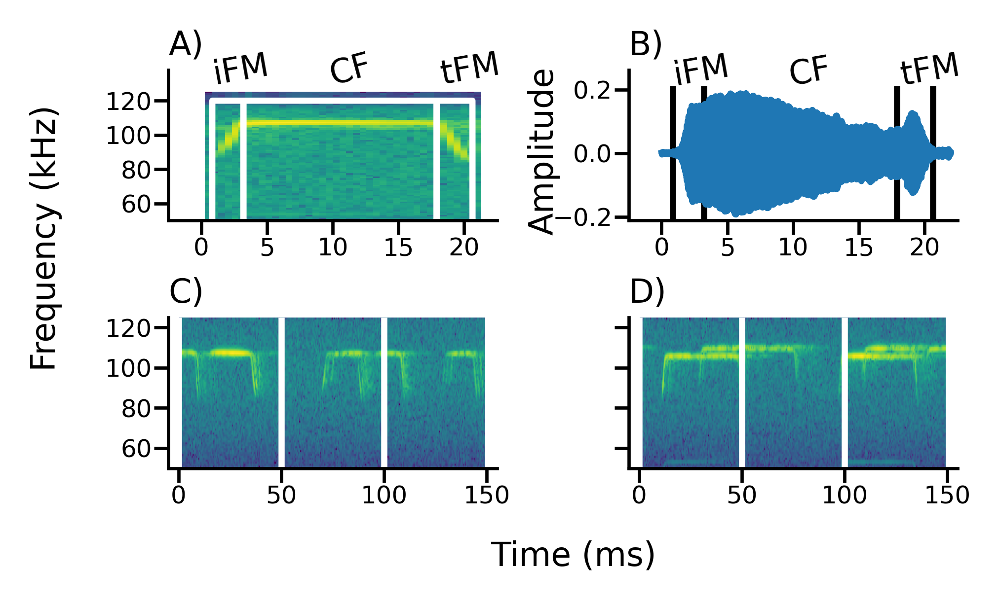

**Keywords : active sensing, echolocation, cocktail-party problem, group-living**

text to be incroporated?: *We thus show that horseshoe bats, despite their long calls that are prone to spectro-temporal overlap, do not alter their calls when flying in groups of up to four bats in a complex echoic cave environment*


For this version COAUTHORS CAN:

	#. Reduce word count, we're still *way* above 8000 words (~9200 !!!)
	#. Re-work abstract (200 word limit for R Soc Int. 
	#. More concrete points:
		#. In Discussion - not sure what was meant by 'Reference to data possible?'
		#. try implementing some of the points in the discussion that are pasted raw
		

OTHER THINGS TO DO:

	#. Finalise SI section numbers (They are blank right now on purpose)
	#. Check references for missing entries/typos
\newpage

```{r echo=FALSE}
library(knitr)
library(stringi)
#opts_knit$set(eval.after = "fig.cap")
``` 

# Introduction {#intro}
Living in groups provides both costs and benefits to the group members [@pulliam1984living;@krause2002living]. From a sensory perspective, group living can be challenging due to the multitude of dynamic sensory information provided by group members, for example in leks, at roosting sites, or at cocktail parties [@cherry1953a;@bee2008a]. Since only a small fraction of this information is relevant, it receiver apply massive filtering and selection during sensory processing and perception to extract relevant information [@carrasco2014spatial;@krauzlis2014attention]. This sensory challenge in groups is becoming worse for animals that perceive their environment by actively radiating energy (9-11), i.e., active sensing animals in the strict sense (7, 8) such as electrolocating fish and echolocating bats. 


Living in groups provides both costs and benefits to the group members, which individuals have to balance. Advantages of being in a group might be increased foraging success, offspring survival, or thermoregulation, while challenges might include increased parasitism, and competition [@pulliam1984living;@krause2002living]. An individual’s sensory perception is also challenged in groups, due to the multitude of dynamic sensory information from group members, for example in leks, roosting sites, or even at human gatherings [@cherry1953a;@bee2008a]. Only a small fraction of this information is relevant to a receiver [@carrasco2014spatial;@krauzlis2014attention], which necessitates various adaptations to filter out irrelevant information, including unique calls  or avoiding signal overlap with neighbours [@socialintegr]. 

Many studies to date have focused on sensory filtering in passive sensing animals, i.e., animals that sense their surroundings by receiving external energy (e.g., penguins, frogs, humans)[@zweifel2020defining;@nelson2006a]. As each passively-sensing group member receives external information independently, their sensory processes do not affect other individuals around them. In contrast, active sensing animals like electrolocating fish or echolocating bats face a unique sensory challenge when actively sensing in social groups  [@ulanovsky2008bat;@gillambrasiliensis;@watanabe1963change]. Echolocating bats emit intense ultrasonic calls and detect their surroundings by listening for the echoes reflecting off objects around them [@griffin1958listening]. In groups however, a bat’s returning echoes can be overlapped by the calls and echoes from its neighbours, preventing detection of its surroundings[@ulanovsky2008bat].  Active sensing animals thus face the issue that their information of interest is potentially masked by the multitude of surrounding signals in a group. An echolocating bat in a group may thus end up metaphorically flying ‘blind’, as without detecting its own echoes the bat cannot sense the environment. 

A combination of laboratory and field studies have shown the diverse behavioural responses of bats in response to sensory challenge from groups and experimental playbacks. Bats increase call levels, alter temporal features such as call rate, duration and duty cycle [@gillam2007rapid;@amichai2015calling;@jarvis2013groups;@lu2020echolocating; @hage2013ambient;@lin2016a;@gomes2020individual], and spectral properties such as bandwidth and terminal frequency [@hase2018bats;@cvikel2015board;@gotze2016no;@fawcett2015echolocation;@habersetzer1981adaptive]. These responses however are not uniform across species, with different species showing seemingly opposite responses to similar situations [@ulanovsky2004dynamics; @amichai2015calling;@jarvis2013groups;@adams2017suppression]. 

There are two broad groups of echolocating bats [@fenton2012evolution] characterised by their duty cycle, i.e., the fraction of time spent emitting calls. The first and major group of bats are the low-duty cycle bats. They typically emit frequency-modulated (FM) calls. The second group is the high-duty cycle bats which typically emit calls with a long constant-frequency (CF) component and one or two flanking short FM components (CF-FM calls). In contrast to low-duty cycle bats, the calls of high-duty cycle bats are longer (10 to $\geq$ 50ms) and thus have higher duty cycles of ~30-60$\%$ [@fenton2012evolution]. Higher duty cycle directly increases the probability of temporal overlap and thus masking of echoes by calls [@beleyur2019modeling]. High-duty cycle bats such as rhinolophids and hipposiderids are thus likely to be more affected in group echolocation than low-duty cycle bats, making them a unique system to understand the sensory strategies echolocators use in challenging conditions. Most studies on group echolocation so far have investigated low-duty cycle bats [@lin2016a;@fawcett2015clutter;@gotze2016no], likely due their speciosity (~87% of all echolocating bats [@fenton2012evolution;@mammdivdatabase] and ease of call analysis. A wider variety of species need to be studied, to understand the echolocation responses in context of their ecology and auditory systems.

A typical CF-FM call has up to three call components: a short initial upwards FM sweep (iFM), a long central CF segment (CF), and a short terminal downward FM sweep (tFM) (*sensu* @tian1997echolocation). The CF component is used for the flutter detection of prey wingbeats [@schnitzler2011auditory] based on high-resolution frequency analysis around the CF frequency in the bat’s auditory fovea [@neuweiler2000biology]. Different CF-FM bat species, and even individuals within a species use specific CF-frequencies that are matched to their acoustic foveas [@schnitzler1976peripheral]. Individual bats also compensate for flight-induced Doppler shifts to keep the CF-frequency of the returning echo within their acoustic fovea [@schnitzler1973control; @schoeppler2018precise]. Despite potential temporal overlap of emitted call and returning echo, Doppler-shift compensation spectrally separates the CF parts of the echo and call when a bat is echolocating alone. In groups however, temporal and spectral overlaps between neighbours’ calls and own incoming echoes is bound to occur. While the CF component is involved in prey detection, the tFM component is thought to be involved in target ranging [@tian1997echolocation;@neuweiler1987foraging], and the role of the iFM remains ambiguous. Comparable to call alterations in FM-bats [@Fenton2014], CF-FM bats show rapid alterations in tFM bandwidth and duration based on the behavioural context, e.g. resting, landing or prey capture [@neuweiler1987foraging;@schoeppler2018precise;@tian1997echolocation]. 

Previous investigations of group echolocation in CF-FM bats found no support for changes in CF frequencies to avoid spectral overlap (“jamming avoidance response”)[@jones1993echolocation;@jones1994individual;@fawcett2015echolocation]. Recent studies in low duty cycle FM bats also questioned the efficacy of a jamming avoidance response in groups [@gotze2016no;@mazar2020sensorimotor]. While there are multiple studes investigating the CF component, we are only aware of one study that quantified changes of the FM-component in group flight, reporting an increased tFM duration and bandwidth [@fawcett2015echolocation]. Given the tFM’s flexibility and role in ranging, there is a strong need for its explicit quantification in multi-bat contexts. The tFM may show the same kinds of changes in multi-bat contexts as shown in low-duty cycle bats, which also use their FM calls primarily for ranging [@fawcett2015clutter;@amichai2015calling;@hase2018bats].

To study the effect of group size on free flying horseshoe bats, we recorded bat activity in their natural habitat using a synchronized audio and video setup. We used two lines of acoustic analysis, the first extracts parameters from non-overlapping individual calls and the second, which extracts parameters from multiple overlapping and non-overlapping calls. The analysis of recordings with overlapping calls is a nascent field [but see @izadi2019segmentation], and acoustic measurements have not been attempted on overlapping CF-FM calls to the best of our knowledge. We compared the difference in CF and FM call parameters across single and multiple bat flight periods. The results from both lines of acoustic analysis suggest no major differences in the measured call parameters when bats were echolocating alone or in the presence of others. 

# Methods

## Study species and site
Two species of rhinolophid bats *Rhinolophus mehelyi* and *R. euryale* were recorded in their natural environment. Both species emit CF-FM calls with peak frequencies between 102-112 kHz, and are not acoustically distinguishable due to overlap in their call characteristics [@dietz2016bats]. For the purposes of this study, we thus treated them as a single group of bats that may face the problem of acoustic jamming due to the similarity in spectro-temporal call structure.

We observed bats that flew in and out of and rested inside a small dome-shaped cave (Figure \@ref(fig:cavesetupschematic)) next to the main entrance of the Orlova Chuka cave system, NE-Bulgaria. The cave had a size of approximately 5 x 3 x 1.6 m$^{3}$ (l x b x h), and one opening where bats flew in and out of throughout the night.

## Experimental setup

We placed an experimental audio-video setup inside the cave (Figure \@ref(fig:cavesetupschematic)), consisting of three microphones and two infrared cameras. Two consumer grade CCTV cameras (UVAHDBP716, 944x1080 pixels) with infrared lamps were connected to a digital video recorder (XVR1004) to record the flight of bats as they flew in and out of the cave. The system recorded video mostly at 22 Hz, however there was frame rate variation between 18-27 Hz. Video feeds were time-synchronised (but not frame-synchronised) by common time stamps burnt-in on the frame. The two cameras were placed in approximately the same position on every recording night. Audio from three CM16 microphones (Avisoft Bioacoustics, Glienicke, Germany) were recorded by a 416H soundcard (Avisoft Bioacoustics, 250 kHz sampling rate, 16-bit resolution). To increase the number of calls recorded on-axis, the three microphones were placed at three different positions, which remained approximately constant  across recording nights (Figure \@ref(fig:cavesetupschematic)). The audio and video feeds were synchronised by generating ON-OFF signals of variable durations (0.08-0.5 s; Raspberry Pi 3), which were recorded on the soundcard and used to flash an LED that was recorded by the two cameras (Laurijssen et al. 2018; see Supplementary Information (SI) \@ref(avmatching) for signal generation script, electronic circuit and associated notes). The video was recorded continuously throughout the recording nights (16th, 19th and 20th August 2018), which yielded between 1.75-8 hours of analysable video (16/8/2018: 8.17, 19/8/2018: 1.67, 20/8/2018: 2 hours), while audio was recorded as consecutive multichannel files of 1 minute duration.

```{r cavesetupschematic, echo=FALSE, out.width="100%", fig.cap='\\label{cavesetupschematic}Point cloud scan (A) and schematic of the cave, indicating the entrance/exit, the typical roosting sites inside the cave, and the position of microphones and cameras.   (3D scanning by Klaus Hochradel, UMIT Tirol) The numbers next to the microphone correspond to the positions in the main text.'}
include_graphics('figures/pointcloud_and_topview.png')
```

## Video analysis to determine group sizes
After entering the cave, bats typically flew around for a few seconds or flew to one of two roosting sites, where they stayed for several seconds to minutes, and later exited from the cave again. We watched the videos and manually identified periods of bat flight activity (hereby referred to as 'bat activity period' or 'bat activity'), noting its start and end time and the number of visible bats. We defined a bat activity period as the interval during which the number of visible bats flying inside the cave is constant.
(See SI \@ref(annotprotocol) for more details).

The annotated video bat activities were synchronised with the audio and inspected to check they only had *R. mehelyi/euryale* calls in them (See SI).


## Acoustic parameter analysis

For the acoustic analysis, we used only recordings from microphone 1, because it appeared to suffer least from reverberance and because it recorded calls of both entering and exiting bats. First, all audio files corresponding to the bat activity periods (henceforth referred to as flight-activity audio) were high-pass filtered at 70 kHz (2nd order zero-phase Butterworth filter). Next, we used two complementary acoustic analyses to quantify frequency, duration and amplitude parameters of the three components of the echolocation call (initial FM, CF and terminal FM). The first analysis is the ‘individual call’ analysis, where we measured parameters of one echolocation call from each flight-activity audio. The second analysis is the ‘windowed call’ analysis, were we split each flight-activity audio into consecutive 50-ms-long windows and measured the acoustic parameters of each window. In recordings with multiple bats, each window could contain multiple and potentially overlapping calls.

The analysis of individual calls is advantageous because it directly reveals sensory decisions of the bats. Its disadvantage, however, is that it can be difficult to find a non-overlapped call, particularly in reverberant and multi-bat situations. The windowed call analysis therefore complements the individual call analysis by enabling measurements even on audio with overlapping calls. Windowed call analysis also allows a kind of null-hypothesis testing where the observed multi-bat audio can be compared with 1) single bat audio and 2) ‘virtual’ multi-bat audio files created by adding multiple single bat audio files. These ‘virtual’ multi-bat audio files recreate a scenario where two bats echolocate in the same space without altering their calls in response to each other’s presence. The disadvantage of the windowed call analysis is the lack of call-level measurements. Using both approaches simultaneously strengthens the interpretation of our results.

```{r, samplesizes, echo=FALSE}
sampsizes <- read.csv('../combined_analysis/indcall_sample_sizes.csv')

```

### Individual call analysis {#indcallmethods}

Per bat activity audio, we chose one call that was not overlapped by other calls and that had a signal-to-noise ratio of at least 20 dB (Figure \@ref(fig:fig1composite)) through a random search protocol (SI \@ref(indcallprotocol)). Briefly, from a randomly determined time point, an experimenter began searching into a randomly determined direction (backward or forward in time) until a suitable horseshoebat call was found. We were able to find 226 individual calls  across all the synchronised audio files. Calls were automatically segmented into their corresponding parts iFM, tFM or CF (Figure \@ref(fig:fig1composite)) ) using the itsfm package [@itsfmcitation]. Most approaches to date segment CF-FM calls into their components by high/low pass filtering around the call's peak frequency [@siemers2005species;@schuchmann2012horseshoe;@tian1997echolocation;@lu2020echolocating;@schoeppler2018precise]. For an accurate estimate of the peak frequency, this approach requires a recording of the call with a prominent CF component, which is suitable under controlled laboratory settings. Peak frequency estimation often fails in the analysis of CF-FM calls recorded in the field under a variety of conditions eg. calls with loud FM and faint CF components. *itsfm* overcomes these limitations by tracking the change in frequency over the call time to segment it into FM and CF components. For our analysis, we defined FM components as those portions of a call where frequency modulation was larger than 2 kHz/ms. Further settings were a maximum acceleration of 3 kHz/ms$^{2}$, an extrapolation window of 50 $\mu$s and a window size of 375 samples. Threshold signal level and time-frequency clip range were manually tuned for each calls using the ```pwvd``` method, since each call had differing received levels.

```{r echo=FALSE}
# REMOVE THE CF PEAK FREQUENCY BIOLOGICAL JUSTIFICATION
```

From the three components of each call, we measured specific parameters. For the CF component, we measured the peak frequency, root-mean-square (RMS) level and duration. For the FM components, we measured the lowest frequency (at 10 dB below the level of the peak frequency of the FM component), bandwidth (defined as difference between the CF peak frequency and the lowest frequency of the FM component), RMS level and duration. We also calculated the iFM/CF and tFM/CF level difference, i.e., the level of the iFM and tFM components relative to the CF component, because CF-FM bats independently vary the relative levels of call components in a context specific manner [@tian1997echolocation;@lu2020echolocating].

Statistical analysis of the individual call data revealed that multi-bat calls showed a non-negligible reduction in CF duration (\@ref(tab:incalldata)). The apparent reduction may have also been due to a bias in our individual call selection that favoured shorter calls. Shorter calls with lower CF durations were potentially less likely to be overlapped and thus selected more often. To eliminate the possibility of a methodological bias we extended the CF duration analysis by measuring multiple calls within each bat activity audio. The spectrogram of a bat activity audio was calculated, and a 'main' band was chosen consisting of the peak frequency $\pm$ 1.5 kHz. The main band typically consisted of the CF portions of one bat (multi-bat audio where CF frequencies of the bats were ambigously close were not analysed).  Within the main band, continuous regions that were above a manually chosen threshold were detected, and labelled as candidate CF call components. These candidate detections were then manually verified and their duration was calculated (SI \@ref(miawmiaw) ). 

```{r echo=FALSE}
# introduce CF analysis #2
# 
# Names for this extended approach:
# * multi-call approach?
# * single-call/ multi-call 
# * 
# wE USEd another APPROACH that includes all det. individual calls coming from a single bat? 
# 
# given the possibility that the analysis 1 could introduce a methodlogical bias, 
```


```{r,include=FALSE,echo=FALSE}
# We were able to find a total of `r sampsizes$N[1]` individual calls ($N_{single \:bat}$: `r sampsizes$N[2]`, $N_{multi \:bat}$: `r sampsizes$N[3]`) across all the synchronised audio files.  Calls were automatically segmented into their corresponding parts iFM, tFM or CF [@tian1997echolocation] (Figure \@ref(fig:fig1composite)) using the *itsfm* package [@itsfmcitation;*biorxivpaper*]. Most approaches to date focus on indirectly segmenting CF-FM calls into their components by high/low pass filtering around the peak frequency of the call [@siemers2005species;@schuchmann2012horseshoe;@tian1997echolocation;@lu2020echolocating;@schoeppler2018precise].
# For an accurate estimate of the peak frequency, this approach requires an on-axis recording of the call with a prominent CF component. While suitable for laboratory studies, filtering around the peak frequency fails in the analysis of CF-FM calls recorded in the field under a variety of conditions eg. calls with loud FM and faint CF components. *itsfm* overcomes these limitations by tracking the *change* in frequency over the call to segment it into FM and CF components. 
```
\newpage

```{r fig1composite,echo=FALSE, out.width="100%",fig.cap="A-B: Example of a manually selected call used for individual call analysis, showing its spectrogram (A) and waveform (B) representation. The call was automatically segmented into its initial frequency-modulated (iFM), central constant-frequency (CF) and terminal frequency-modulated (tFM) components based on frequency change over time , using the ```itsfm``` package C-D: Examples of a single bat (C) and a multi-bat (D) recording used for windowed call analysis. The vertical lines indicate the borders between the 50-ms-long windows. "}

# Changes to implement (comments of 2021-07-28)
# make the labels stand out more
# make individual call analysis occupy 1st column, and windowed on second column
# add descriptive text (ind. call analysis and windowed call analysis) above the subplots on the columns 
#	# if required, reduce the size of the panels and add the text description
# Push the 'Time, ms' X label below
# Make the figure into a one column figure
# Reduce x/y tick fontsize (8 points), details in a panel (6/9 points)
# Put the units in brackets 'Time (ms)' or 'Frequency (kHz)'


```

### Windowed calls analysis {#wincallmethods}

We performed the 'windowed call' analysis to complement the individual call analysis weaknesses. Firstly, unlike the individual call analysis, the windowed call analysis focussed on entire bat activity periods. It provided a broad and somewhat coarse characterisation of the echolocation in single and multi-bat activities. Secondly, the windowed call analysis provided us the opportunity to create 'virtual multi-bat' activities [@fawcett2015echolocation;@ratcliffe2004conspecifics], by adding two single bat activity recordings together. 


Each bat activity audio was split into consecutive 50 ms windows (See Figure \@ref(fig:fig1composite), SI \@ref(windowdetails) for details of window splitting). We chose a window duration of 50 ms as it provided high spectral resolution (20 Hz at 250 kHz sampling rate) that allows to distinguish between multiple CF components that may be contained in the window. Initial observations showed that 50 ms was about the longest observed duration of a bat call in our data, and was about twice the length of typical calls. To exclude windows without calls or with very faint calls, we excluded all windows whose RMS level was less than 20 dB above the maximum RMS level of silent windows (for details, see SI \@ref(silentwindow)). From the remaining windows that contained echolocation calls, we measured each window's received RMS level, dominant frequencies and FM lower frequencies. We chose these measurements to complement the analogous measurements in the individual call analyses. The dominant frequencies describe the CF frequencies of multiple calls in the same windows and were defined as local peaks of the smoothed power spectrum (rolling mean average, 100 Hz bin-equivalent window) with a level of not more than 14 dB below the highest peak (for details see SI \@ref(domfreqdetails)). Dominant frequencies complement the CF peak frequency measurement of individual calls. For instance, if bats 'widen' the bandwidth of their CF frequencies in groups to reduce overlap, we expect an increased dominant frequency range in multi-bat activities.  FM lower frequencies were defined as the lowest frequencies extracted from each identified FM region in a spectrogram representation of the window (see SI \@ref(lowestfreqdetails)). FM lower frequencies in the windowed analysis are analogous to the i/tFM lower frequency of the individual call analysis.The RMS level describes the received level of the window, and was defined as the root-mean-square of all samples in a window. In a single window, there could be multiple terminal and dominant frequency measurement, but only one received RMS level measurement.

We created 'virtual multi-bat' data by combining single bat audio-files that were of similar durations (SI \@ref(virtualdetails)). This generated a 'null' dataset of multiple bats that were echolocating together without altering their calls in groups. We performed the same windowed call analysis on the virtual multi-bat audio as described above for the real multi-bat audio, to compare real echolocation during group flight during virtual group flight without call alterations.

# Statistical analysis {#stats}

We observed up to four bats flying in the cave at the same time. Especially in the individual call dataset the number of recordings of multi-bat ($\geq$ 2 bats) calls was low (N=177, 40, 7, 2 for group sizes of 1, 2, 3, 4 respectively,), we thus combined all bat activity periods with $\geq$ 2 bats into a multi-bat class and compared ‘single’ and ‘multi’ bat ($\geq 2$ bats) calls in the individual call analysis. 

## Individual call analysis {#indcallstatanalysis}


We ran linear mixed-models (LMMs) with the measurement as response, group size as a categorical predictor (single, multi) and video-file ID as random intercept for all parameters. Model fit was initially checked by performing residual diagnostics. Model coefficients were then estimated using a Bayesian approach with non-informative priors using the ```sim``` function of the 'arm' package [@arm], and the 95% highest posterior-density compatibility intervals (CoI) were used in reporting. The compatibility interval represents the lower and upper borders of the posterior distribution of the coefficient estimates. We would like to highlight that a compatibility interval is not equivalent to a confidence interval, even though the numerical values may be similar under certain cases [@nalborczyk2019pragmatism]. Unlike confidence intervals, the compatibility interval allows a true probabilistic interpretation, of a given probability that the underlying parameter value falls within a range for the given dataset. 

## Windowed call analysis {#windowstatanalysis}


The received level and lowest frequency measurements resulted in multiple values per flight-activity audio (one value per window). The measurements from one flight-activity audio are potentially correlated. We thus estimated the difference between single, multi and virtual-multi bat measurements using an LMM with group size as a categorical fixed effect (single, multi, virtual-multi), and flight-activity period and video-file ID as random intercepts. 

To quantify the change in dominant frequency range ($max_{dominant \: frequency}-min_{dominant \:frequency}$), we first calculated it  across each bat activity audio. We expect variation in the dominant frequency (and thus a non-zero\ dominant frequency range) across any bat activity for two reasons: 1) the effect of the bat’s Doppler shift compensation and 2) the Doppler shift due to the bat’s motion relative to the microphone will cause variation in the dominant frequency.  These two effects will lead to non-zero dominant frequency range even for single-bat activities (SI \@ref(simdomfreqranges)). An LMM was built where dominant frequency with dominant frequency as the response variable, group-type as the fixed effect, and the video-file as a random intercept (a proxy for time). 
Since different bat individuals emit different CF frequencies [@schnitzler1976peripheral], we expect an increased dominant frequency range in virtual multi-bat contexts compared to single-bat contexts. Furthermore, if bats in real multi-bat contexts actively alter their call frequency, we expected an increased dominant frequency range compared to both single-bat and to virtual multi-bat contexts.

To understand the theoretically expected dominant frequency range from single and multi bat flights, (and thus the expected range difference) we also performed simulations quantifying Doppler shift and Doppler shift compensation parametrised by the observed data (SI \@ref(simdomfreqranges) for details of simulation and results). Briefly we simulated a Doppler-shift compensating bat emitting frequencies between 100-111 kHz, flying past a microphone at various speeds between 1.5-4.5 m/s. The dominant frequency range was calculated as the absolute difference between the frequency recorded by the microphone at the beginning of the flight and the end of the flight. The dominant frequency range estimates from the simulations informed the interpretation of the observed data.

## Software packages used in this paper
Signal analysis, data manipulation and visualisation were done in Python [@van1995python] through its scientific ecosystem: the scipy, numpy, matplotlib, soundfile and pandas packages [@2020SciPy;@numpy;@matplotlib;@soundfile;@pandas]. Reproducible analysis, documentation and presentation were enabled by the Jupyter Notebook and Rmarkdown projects[@jupyter;@rmarkdown]. Audio visualisation, preliminary measurements and single call annotations were done with Audacity [@audacity]. LMMs were run in R [@R4] and its statistical ecosystem: the 'lme4','arm' and 'coda' packages [@lme4;@arm;@coda]. 

# Results

We recorded echolocation and flight behaviour of mixed-species groups of the high-duty cycle bats *Rhinolophus euryale* and *R. mehelyi* as they flew alone and with other bats in a natural cave. The bats performed various flight behaviours in the cave, such as circling, approaches (when two or more bats flew towards each other) and following (one bat behind another) flights.  The duration of continuously observed flight bouts varied strongly, ranging from about 0.1 s to 62 s (median: 1.04 s , 95%ile range: 0.5-8.54 s). 

In general, the acoustic parameters of individual calls mostly did not differ between single-bat and multi-bat contexts. Likewise, the windowed call-analysis revealed no major differences in received level and FM lowest frequency between single-bat and multi-bat and between multi-bat and virtual-multi-bat conditions. In contrast, the dominant-frequency range in the windowed analysis, however, was larger in multi-bat conditions compared to single-bat conditions.


## Individual call analysis 

```{r indcallsampsizes,echo=FALSE}
indcall <- read.csv('../combined_analysis/indcall_final.csv')
nindcalls <- as.data.frame(table(indcall$groupsize))
nmulti_indcall <- nindcalls[1,2]
nsingle_indcall <- nindcalls[2,2]
```

```{r include=FALSE, echo=FALSE}
singleind <- subset(indcall, num_bats==1)
multiind <- subset(indcall, num_bats>1)

getminmax<-function(X){c(min(X,na.rm=TRUE), max(X,na.rm=TRUE))}
# tfm durns
single.tfmdurn <- round(getminmax(singleind$tfm_duration),2)
multi.tfmdurn <- round(getminmax(multiind$tfm_duration),2)
# tfm bw
single.tfmbw <- round(getminmax(singleind$tfm_bw),2);multi.tfmbw <- round(getminmax(multiind$tfm_bw),2)
#cfpr
single.cfpfr <- round(getminmax(singleind$cf_peak_frequency),1);multi.cfpfr <- round(getminmax(multiind$cf_peak_frequency),1)


```

```{r indcallrawdata, echo=FALSE, fig.cap=paste("\\label{fig:indcallrawdata} Measured acoustic parameters for the constant frequency (CF), initial frequency modulated (iFM) and terminal frequency modulated (tFM) components of individual calls emitted under single-bat and multi-bat conditions. Each column shows the measurements per call component, while each row shows a group of related measurements: A-C) duration. A1 is the first individual call analysis which analysed the CF duration from single calls. A2 is the multi-call extension which measured CF component duration of multiple  calls. D-F) spectral measurements G-I) received level J-K) relative FM-CF ratios L-M) FM component bandwidths. $Ncalls_{single}=$",nsingle_indcall, ", $N_{multi-bat}$=",nmulti_indcall,". Raw data points are plotted over box plots (lines indicate 25, 50, 75 percentiles). The dots with bars indicate the mean MAP estimates and 95% compatibility intervals")}

# Comments after now
# horizontal line instead of circle 
# centre the single multi x labels
# increase digital file resolution (>600dpi)
# increase ytick separation between subplots
# make the yticks symmetrical 

include_graphics('figures/measurements_and_derivedparams_multipanel.png')
```


```{r incalldataprep, echo=F, message=F, warning=F}

# Make the headers just; Difference *Multi-single) and Ratio (multi/singe)
# lower row is then MAP lower 95%CoI etc..
# INCLUDE CF ALTERATION ANALYSIS ALSO AS CF analysis 1 and CF analysis 2
# include brackets for all units 

library(flextable)
library(dplyr)

cfdurn_multicall <- read.csv('../cf_alteration_analysis/statistical_analysis/cf_duration_change_summary.csv')
cfdurn2_small <- cbind(cfdurn_multicall[1,], cfdurn_multicall[2,])[c(2,3,4,6,7,8)]
cfdurn2_small <- cbind(' ','CF (multi-call extension)',cfdurn2_small)
cfdurn2_small[, 3:8] <- round(cfdurn2_small[, 3:8], 2)


indcallsummary <- read.csv('../combined_analysis/all_ind_summary.csv')
indcallsummary <- indcallsummary[,2:ncol(indcallsummary)]
indcallsummary <- cbind(indcallsummary[,2], indcallsummary[,1], indcallsummary[3:ncol(indcallsummary)])
colnames(indcallsummary)[c(1,2)] <- c('msmt', 'comp')
indcallsummary$msmt[c(2,3,6,8,9,11,13)] <- ' '
indcallsummary$msmt[10] <- 'Level difference, dB'
indcallsummary[c(7:11),c(6:8)] <- ' - '

# now add the cf durn analysis 2
colnames(cfdurn2_small) <- colnames(indcallsummary)
indcallsummary <- rbind(indcallsummary[1,], cfdurn2_small,indcallsummary[2:13,])
```


We measured 13 acoustic parameters of the initial and terminal frequency-modulated (iFM, tFM) and of the central constant-frequency (CF) component of 226 individual horseshoe bat echolocation calls (Figure \@ref(fig:indcallrawdata)). Most call parameters showed little or no difference between single-bat and multi-bat observations (Table \@ref(tab:incalldata)) with very small maximum a posteriori (MAP) estimates or compatibility intervals distributed either side of zero. The CF component of multi-bat calls showed slight reduction in duration between `r indcallsummary$diff_lower_95pcHPD[1]`-`r indcallsummary$diff_upper_95pcHPD[1]` ms (95% CoI). However, this apparent reduction in CF duration was not supported by the multi-call extension, indicating no change (Table \@ref(tab:incalldata) (multi-call extension)) between `r indcallsummary$diff_lower_95pcHPD[2]`-`r indcallsummary$diff_upper_95pcHPD[2]` ms (95% CoI). Multi-bat calls showe a slight decrease in amplitude of upto 0-4 dB in multi-bat calls, and a slight increase in tFM bandwidth of `r indcallsummary$diff_lower_95pcHPD[6]`-`r indcallsummary$diff_upper_95pcHPD[6]` kHz (95% CoI). All remaining had smaller differences between single and multi-bat contexts centered around zero Table \@ref(tab:incalldata). 

```{r indcallsampsizes2,echo=FALSE}
indcall <- read.csv('../combined_analysis/indcall_final.csv')
```

```{r indcallranges, include=FALSE, echo=FALSE}
singleind <- subset(indcall, num_bats==1)
multiind <- subset(indcall, num_bats>1)

getminmax<-function(X){ round(c(min(X,na.rm=TRUE), max(X,na.rm=TRUE)),2)}

# durns
single.cfdurn <- getminmax(singleind$cf_duration);multi.cfdurn <- getminmax(multiind$cf_duration)
single.ifmdurn <- getminmax(singleind$ifm_duration);multi.ifmdurn <- getminmax(multiind$ifm_duration)
single.tfmdurn <- getminmax(singleind$tfm_duration);multi.tfmdurn <- getminmax(multiind$tfm_duration)
# freqs
single.cfpfr <- getminmax(singleind$cf_peak_frequency);multi.cfpfr <- getminmax(multiind$cf_peak_frequency)
single.tfmtemfreq <- getminmax(singleind$tfm_terminal_frequency);multi.tfmtemfreq <- getminmax(multiind$tfm_terminal_frequency)
single.ifmtemfreq <- getminmax(singleind$ifm_terminal_frequency);multi.ifmtemfreq <- getminmax(multiind$ifm_terminal_frequency)
# reclevel
single.cflevel <- getminmax(singleind$cf_dbrms);multi.cflevel <- getminmax(multiind$cf_dbrms)
single.tfmlevel <- getminmax(singleind$tfm_dbrms);multi.tfmlevel <- getminmax(multiind$tfm_dbrms)
single.ifmlevel <- getminmax(singleind$ifm_dbrms);multi.ifmlevel <- getminmax(multiind$ifm_dbrms)
# cf-ratios
single.tfmcf <- getminmax(singleind$tfm.cf_dbratio);multi.tfmcf <- getminmax(multiind$tfm.cf_dbratio)
single.ifmcf <- getminmax(singleind$ifm.cf_dbratio);multi.ifmcf <- getminmax(multiind$ifm.cf_dbratio)
# fm bandwidths 
single.tfmbw <- getminmax(singleind$tfm_bw);multi.tfmbw <- getminmax(multiind$tfm_bw)
single.ifmbw <- getminmax(singleind$ifm_bw);multi.ifmbw <- getminmax(multiind$ifm_bw)

singlebat.ranges <- rbind(single.cfdurn,  single.tfmdurn,single.ifmdurn,
                          single.cfpfr,   single.tfmtemfreq,single.ifmtemfreq,
                          single.cflevel, single.tfmlevel,single.ifmlevel,
                          single.tfmcf  , single.ifmcf, 
                          single.tfmbw  , single.ifmbw)
multibat.ranges <- rbind(multi.cfdurn,  multi.tfmdurn,multi.ifmdurn,
                          multi.cfpfr,   multi.tfmtemfreq,multi.ifmtemfreq,
                          multi.cflevel, multi.tfmlevel,multi.ifmlevel,
                          multi.tfmcf  , multi.ifmcf, 
                          multi.tfmbw  , multi.ifmbw)

```
\newpage


```{r incalldata, echo=FALSE, message=FALSE, tab.cap="The predicted difference and ratio between multi and single bat call parameters. The maximum a posteriori (MAP) is the most likely estimate, and 95% highest posterior density compatibility intervals (CoI) provides the range of uncertainty in the parameter estimate."}
ft2 <- flextable(indcallsummary) 
ft2 <- fontsize(ft2, i=seq(1,14), size=8, part='body')
ft2 <- fontsize(ft2, i=1, size=8, part='header') 
ft2 <- ft2 %>% width(j=seq(4,8), width=0.6) %>% width(j=c(1,2), width=0.7)
ft2 <- ft2 %>% width(j=c(2,3), width=0.8) %>% width(j=1, width=0.85) %>% width(j=6, width=0.83)
ft2 <- ft2 %>% height( i = seq(1,13), height=0.125, part = "body")
ft2 <- ft2 %>% add_header_row(top=TRUE, values=c("Measurement", "Component", "Difference (Multi-Single)", "Difference, 95% CoI", "", "Ratio (Multi/Single)", "Ratio, 95% CoI", "")) %>% fontsize( size=10, part='header')
ft2 <- ft2 %>%  set_header_labels(msmt="",
                    comp="",
                    Difference.MAP='MAP',
                    diff_lower_95pcHPD='Lower',
                    diff_upper_95pcHPD='Upper',
                    Ratio.MAP='MAP',
                    ratio_lower_95pcHPD='Lower',
                    ratio_upper_95pcHPD='Upper') %>% hline(i=c(4,5,7,10,12), part='body') %>% merge_at(i = 1, j = 4:5, part = "header") %>% merge_at(i = 1, j = 7:8, part = "header") 
ft2 <- ft2 %>% merge_at(i=1, j=2, part='header') %>% merge_at(i=1, j=3, part='header') %>% merge_at(i=1, j=6, part='header')
ft2

```

\newpage


```{r domfreqraw,echo=FALSE}
dfraw <- read.csv('../combined_analysis/obsvirt_domfreq_range.csv')
single.dfrange <- getminmax(subset(dfraw,groupsize=='single')$file_value_range)
multi.dfrange <- getminmax(subset(dfraw,groupsize=='multiple')$file_value_range)
vmulti.dfrange <- getminmax(subset(dfraw,groupsize=='multiple_virtual')$file_value_range)
```

```{r windowresults,echo=F, tab.cap="Results of the windowed call analysis. The statistically estimated difference and ratio between the two comparisons (Multi-Single and Multi-Virtual multi) are reported."}
window.summary <- read.csv('../combined_analysis/window-analysis-table.csv')

rearranged <- rbind(window.summary[c(1,3,5),], window.summary[c(2,4,6),])
rearranged <- rearranged[,2:9]
#rearranged[,1] <- c('Received level (dB rms)', 'FM lower frequency (kHz)', 'Dominant frequency range (kHz)')
rearranged[,1] <- c('Multi-Single', ' ', ' ', 'Multi-Virtual multi', " ", ' ')
rearranged <- cbind(rearranged[,2], rearranged[,1], rearranged[,3:8])
colnames(rearranged) <- seq(1,8) #c(" "," ","MAP", "Lower ",'Upper ', 'MAP ',"Lower", "Upper")#c('', ' ','MAP','Lower','Upper','MAP','Lower','Upper')


win.sum.table <- flextable(rearranged)
win.sum.table <- fontsize(win.sum.table, i=seq(1,6), size=8, part='body')

win.sum.table <- win.sum.table %>%  set_header_labels('1'="",
                                                      '2'=" ",
                                                      '3'='MAP',
                                                      '4'='Lower',
                                                      '5'='Upper',
                                                      '6'='MAP',
                                                      '7'='Lower',
                                                      '8'='Upper') %>% hline(i=3, part='body') 
win.sum.table <- win.sum.table %>% add_header_row(top=TRUE,
                                                  values=c("Measurement", "Comparison", "Difference", "Difference, 95% CoI", "", "Ratio", " Ratio, 95% CoI", "")) %>%
  fontsize( size=10, part='header')
win.sum.table <- win.sum.table %>% merge_at(i=1, j=c(4,5), part='header') %>% merge_at(i=1, j=c(7,8), part='header')

win.sum.table <- win.sum.table %>% width(j=seq(3,8), width=0.6) %>% width(j=c(1,2), width=1) %>% width(j=3, width=0.85)
win.sum.table <- win.sum.table %>% height( i = seq(1,6), height=0.125, part = "body")
win.sum.table <- win.sum.table %>% align(i=1, j=seq(3,8), align='center', part='header') %>% align(i=1:6, align='center', part='body') %>% align(i=2, j=seq(3,8), align='center', part='header')
win.sum.table
```
```{r diffintervals, echo=FALSE, message=FALSE, warning=F}

#

reclevel.diff.multisingle <- paste(window.summary[1,5],window.summary[1,6], sep=' - ') #format.as.interval(window.summary[1,2])
lowerfreq.diff.multisingle <- paste(window.summary[3,5],window.summary[3,6], sep=' - ')
domfreq.diff.multisingle <- paste(window.summary[5,5],window.summary[5,6], sep=' - ')

reclevel.diff.multivirt <- paste(window.summary[2,5],window.summary[2,6], sep=' - ') #format.as.interval(window.summary[1,3])
lowerfreq.diff.multivirt <- paste(window.summary[4,5],window.summary[4,6], sep=' - ')
domfreq.diff.multivirt <- paste(window.summary[6,5],window.summary[6,6], sep=' - ')


```
## Windowed call analysis 


```{r windowsinglemulti, echo=FALSE}
wholewindowresults <- read.csv('../combined_analysis/whole_window_summary.csv')
wholewindowresults <- wholewindowresults[,-1]
window.colnames <- c("Parameter",
                     "Difference",
                     "Permutation test p-value",
                     "p2t5pctilemeddif",
                     "p97t5pctilemeddif",
                     "comparison")
colnames(wholewindowresults)<- window.colnames
```

```{r windowsampsizes,echo=FALSE}
get.window.samplesizes <- function(df)
  {
  n_samples <- as.data.frame(table(df$groupsize))
  n_samples
  }


domfreq_singlemulti_whole <- read.csv('../combined_analysis/obs_singlemulti_domfreq.csv')
ndomfreq_singlemulti_whole <- get.window.samplesizes(domfreq_singlemulti_whole)

domfreq_multivirt_whole <- read.csv('../combined_analysis/multivirtmulti_domfreq.csv')
ndomfreq_multivirt_whole <- get.window.samplesizes(domfreq_multivirt_whole)
```

For each window in a flight-activity audio we obtained received level and FM lower frequency ($Nfiles_{single}$=`r ndomfreq_singlemulti_whole[2,2]`,$Nfiles_{multi}=$ `r ndomfreq_singlemulti_whole[1,2]`). For each flight-activity audio we also measured the dominant-frequency range.

There was little difference in the received levels and FM lower frequency between multi and single bat contexts (received level: `r rearranged$'4'[1]`-`r rearranged$'5'[1]` dB 95% CoI, FM lower freq. `r rearranged$'4'[2]`-`r rearranged$'5'[2]` kHz 95% CoI) (Figure \@ref(fig:windowresultsgraph), Table \@ref(tab:windowresults)). 

The mean dominant frequency range (Figure \@ref(fig:windowresultsgraph)) was between `r reclevel.diff.multisingle` kHz (95% CoI) larger in multi-bat conditions compared to the single-bat condition. The observed difference in dominant frequency range matches the  magnitude in simulations when bats do not show any special responses to each other (SI \@ref(simdomfreqranges)). Received level showed little difference between multi and single bat recordings (`r reclevel.diff.multisingle` dB 95% CoI) as well as did FM lower frequency (`r lowerfreq.diff.multisingle` kHz 95% CoI). 
Compared to single-bat contexts, the dominant frequency range during multi-bat contexts was larger by `r rearranged$'4'[3]` – `r rearranged$'5'[3]` kHz (95% CoI).

We compared the observed multi-bat recordings to virtual-multi bat recordings to estimate if bats were adjusting their echolocation behaviour to the presence of conspecifics. There was little difference in received level and FM lower frequency (received level: `r rearranged$'4'[4]`-`r rearranged$'5'[4]` dB 95% CoI, FM lower freq. `r rearranged$'4'[5]`-`r rearranged$'5'[5]` kHz 95% CoI). The difference in dominant frequency range between observed and virtual multi-bat was low as well (`r domfreq.diff.multivirt` kHz 95% CoI) (Table \@ref(tab:windowresults). 

All these results taken together suggest bats did not change their echolocation behaviour in the presence of conspecifics.


```{r windowresultsgraph, echo=FALSE,fig.cap='\\label{windowresultsgraph} Windowed analysis measurements and mean estimates: A) Dominant frequency range B) FM lower frequency C) Received level. The raw data points are plotted over a boxplot  (lines indicate 25,50 and 75th percentiles). The modelled mean estimates with the MAP (dot) and the 95% CoI (vertical bar). For most means, the central point engulfs the compatibility interval.'}


multivirt.wholewin <- subset(wholewindowresults,comparison=='multi-virtual multi')

```


# Discussion {#discussion}

High duty-cycle bats fly regularly with conspecifics and in cluttered environments [pers obs.;@rossiter2002relatedness;@denzinger2016guild]. While many FM bats alter their echolocation call parameters in the presence of conspecifics [REFSSS], this still remains unclear for CF-bats, particularly in the wild, even though they are more likely to suffer from acoustic interference due to their long call durations. We quantified the difference in horseshoe bat echolocation calls when alone and with conspecifics in the field. Our results do not support a biologically meaningful difference in echolocation calls with reference to group size for all of the call parameters measured using two different approaches. This may seem somewhat unexpected, especially considering the fact that bats in our field site were flying in an enclosed reverberant cave - which would only amplify the problem of masking in multi-bat echolocation. 

The calls of horseshoe bats pose a problem for signal analysis due to their long duration leading to spectral and temporal overlap. To address this problem, we introduced two automated analyses that can be performed on audio recordings of multiple CF-FM bats. First, we analyzed individual calls using the open-source ```itsfm``` package that segments sounds based on their rate of frequency change, which results in more accurate CF-FM call component segmentation, and thus improved reproducible measurements, compared to filtering around the peak frequency [@itsfmcitation]. Second, to analyse audio with overlapping calls, we measured the overall acoustic parameters of short audio windows without assigning the measurements to individual calls. While coarser in time than the individual call analysis, the window-based approach returns frequency- and level-measurements that are related to individual call parameters and thus complements the individual call analyses. With this, our work presents a useful methodological advance for quantifying overlapping echolocation calls. 

```{r echo=FALSE}
# The CF peak frequency + dominant frequency range story
cfdurns.single <- subset(indcall, groupsize=='single')$cf_duration
cfdurns.multiple <- subset(indcall, groupsize=='multiple')$cf_duration


```
## CF component 

To avoid spectral overlap in groups, the spectral jamming avoidance response (JAR) hypothesis predicts that individual bats in groups will shift their call frequencies away from those of other individuals [@ulanovsky2004dynamics]. JAR received mixed support for constant-frequency bats. Several studies in hipposiderid & rhinolophid bats found no changes in CF frequencies [@jones1993echolocation;@jones1994individual;@fawcett2015clutter;@pye1972bimodal]. In contrast, @habersetzer1981adaptive observed CF frequency shifting in groups of the quasi-CF bat, while @cvikel2015board found no support in the congeneric *Rhinopoma microphyllum*. Note, however, that R. hardwickei is not entirely comparable to the specialized CF-bats of the families Hipposideridae and Rhinolophidae [@simmons1984echolocation], which possess individual-specific acoustic fovea that constrain their echolocation call frequency [@neuweiler2000biology;@schnitzler1976peripheral].

Our data does not support CF frequency shifting in group echolocation. The spectral jamming avoidance response (JAR)
predicts that bats diverge their call frequencies to reduce overlap [@ulanovsky2004dynamics]. Compared to single bats, this divergence would lead to an increase in the overall CF frequency range in groups. In our windowed analysis we observed an increase of ~2 kHz in CF frequency range. This observed increase falls within the range of expected values from simulations with no active avoidance responses in them. Variation in flight speed, relative angle to the microphone and inter-individual CF frequency variation can explain the observed increase in dominant frequency range in groups - without any special responses of bats to each other (SI \@ref(miaowmiaow)). Furthermore, our comparison between observed and virtual multi-bat contexts shows that the CF frequency range observed during real multi-bat contexts does not differ from the CF-peak-frequency range of a random combination of non-reacting bat individuals (virtual multi-bat context). Together, the results suggest that bats that are flying together do not actively change their CF frequencies to reduce or increase overlap. 

Our simulations (SI \@ref(miaowmiaow)) and our recordings of single bats (REFERENCE TO DATA POSSIBLE?) show that a receiver (e.g., a microphone or another bat) in the proximity to a flying CF-FM receives a series of CF frequencies that vary by up to $\pm$3 kHz (Figure \@ref(fig:blahblah)). This natural variation in received frequency thus decreases the extent of spectral overlap during multi-bat contexts. The combination of individual-specific call frequencies and Doppler-shift driven variation in received CF-peak-frequency makes it unlikely that the CF component would be strongly masked even in groups. 

While our individual call analysis suggested a small reduction in multi-bat CF durations by about `r indcallsummary$'3'[1]` ms (MAP). This result was not supported by the more robust extended analysis, which showed a negligible difference of`r indcallsummary$'3'[2]` ms (MAP) between multi and single bats. We suspect the results from the individual call analysis to be a result of biased sampling as it favoured shorter calls that had a slight advantage in not being overlapped by other calls. Along with CF frequency, *Rhinolophus mehelyi/euryale* do not seem to alter their CF duration too. 

## FM component {#discussion.fmcomponent}

```{r echo=FALSE}
# the i/tFM components, bandwidth
```
The FM component of CF-FM high duty-cycle bats is likely used for ranging and undergoes large variation as bats approach objects [@Fenton2014]. Frequency-changes in group flying FM-bats could indicate a JAR, but could also be a response to the physical presence of other bats in the vicinity [@cvikel2015board;@fawcett2015clutter]. While not much is known about the iFM-component of CF-FM bats, they do change their tFM-component as they approach objects and during landing  [@tian1997echolocation;@schoeppler2018precise;@Fenton2014]. CF-FM bats may thus be expected to respond to conspecifics like FM-bats in groups. @fawcett2015echolocation found that the tFM minimum frequency (-10 dB call peak frequency) decreased by 5 kHz on average in pairs of *Rhinolophus capensis*. In contrast, we only found a decrease of about `r indcallsummary[6,3]` kHz of the tFM lower frequency (-10 dB tFM peak frequency) from the individual call analysis. Our windowed analysis revealed an even smaller decrease of `r rearranged$'3'[2]` kHz in multi-bat calls. Both FM and CF-FM bats also change call duration in the presence of conspecifics and noise [@cvikel2015board;@amichai2015calling;@fawcett2015echolocation;@lu2020echolocating;@gomes2020individual]. While we found an increase of tFM duration from single- to multi-bat contexts of `r indcallsummary[3,3]` ms,@fawcett2015echolocation found an increase of 1.8 ms in pairs, and @lu2020echolocating found a median increase of 0.35 ms in noise compared to calls in silence. Our results are closer to those of @lu2020echolocating, while clearly not as strong as @fawcett2015echolocation. FM bats too are known to increase their call durations in the presence of noise [@amichai2015calling;@luo2015linking;@gomes2020individual], though here too the extent of increase varies across species. While increasing call duration improves echo detection [@amichai2015calling;@luo2015linking], the increase in duration we observed here corresponds to about ~10% increase (Table \ref(tab:indcallsummary)), which falls on the lower end of effects seen in FM bats. At least compared to the one other rhinolophid study [@fawcett2015echolocation], our effects are small. Whether such small increses in tFM duration lead to biologically relevant improvements in detecting the surroundings in groups remains to be seen. 

```{r echo=FALSE}
# The received level story -- needs a bit more work
```

## Call level
A direct way of improving echo detection is to increase the call level, which both FM bats [@amichai2015calling;@luo2015linking;@gomes2020individual] and CF-FM bats [@hage2013ambient;@hage2014ambient;@lu2020echolocating] regularly do in the presence of experimental playbacks. Because we did not track the 3D-position of the bats in our study, we could not measure their source level and instead analyzed the received level at the microphone. Received levels depend not only on the bat’s source level, but also on the bats’ distance to and calling direction relative to the microphone. Our individual call analysis showed that the received levels of all three call components were ~2 dB lower (MAP) during group flight compared to the single-bat context. In contrast, our windowed call analysis revealed no systematic difference in received level between multi-bat and single-bat contexts and between observed multi-bat and virtual multi-bat contexts.

Despite the observed increase of individually analyzed received levels, there was no change in the windowed analysis, although overlapping calls in multi-bat contexts should lead to a higher received level. We suggest that the similarity in received levels of multi-bat and single-bat windows can be explained by the inequal contribution the nearest bat’s call makes to the received level due to spherical spreading, and the directionality of calls. The fact that multi-bat and virtual-multi bat audio have similar received levels thus indirectly suggests there is no change in source level even in the presence of another bat. However, the tFM received level during group flight showed a drop of around 2 dB that we are unsure how to interpret. This apparent drop in received level could be the result of bats flying further away or emitting more directional calls.

*TB: Not sure how/where to put the points below in...please helppp!!!*

*We expect that 1) the spectral parameters of the CF is less prone to change given that CF-FM bats need to adjust emitted calls to match their acoustic foveal frequency tuning, while the CF duration in multi bats decreases to avoid overlap from other bats calls. 2) While role of iFM is less well understood, the tFM parts of the call can be altered in both spectral and temporal domains, and we expect both the bandwidth and duration to increase in multi bat contexts. The FM parts are less prone to overlap due to their inherently short duration and by altering the parameters can maximize the information encoded in the returning echoes. 3) As for duration of CF or the entire call, we expect that short duration calls will be emitted in multi bat contexts to reduce the possibility of overlap with calls of other bats. (this is not essentially important because if anyways, the CF is not used as part of resolving complexity in multi bat contexts, then the overlap of calls is not important as long as the overlap of the FM is avoided). 4) As a proxy for the measure of change in amplitude, we expect the received levels in multi-bat contexts to reduce in multi-bat contexts in an echoic natural cave and also presence other bats very close to one another. *

# Outlook {#outlook}

```{r echo=FALSE}
# Why did we not see anything? Discussing possibilities
tfm.95pctile <- round(quantile(indcall$tfm_duration,0.95,na.rm=TRUE),1)
dutycycle.range <- tfm.95pctile/c(40,50)
dutycycle.sorted <-  sort(dutycycle.range)*100

# load simulation results
overlap.probs <- read.csv('associated_docs/2-3bat_tfm_overlap_prob.csv')
overlap.probs2 <- subset(overlap.probs,num_bats==2)
tfm.probs <- round(sort(overlap.probs2$tfm_overlap_prob),3)*100
```

Bats adjust many different call parameters in a task- and context-specific ways to adjust and optimize sensory information. Besides changes in temporal, spectral and amplitude parameters on the level of individual calls, some of which we analyzed in this study, bats also change parameters on the level of call sequence, such as call intervals and duty cycle [@amichai2015calling;@jarvis2013groups]. In contrast to single-bat contexts, measuring call intervals is challenging in multi-bat recordings due to difficulties in assigning calls to individuals and temporal overlap between multiple calls and echoes. 

In summary, our results showed no obvious change in call parameters, suggesting that free-flying CF-bats do not suffer from sensory problems when flying in small groups (2-4 bats), even in reverberant environments. We propose that multiple reasons can explain why such situations are not very challenging, and why bats thus do not alter their calls.What are the possible explanations for the absence of a strong echolocation response in groups? Our data suggests that echolocation in groups with a few bats (2-4) bats may not be very challenging for multiple reasons. CF-FM bats rely use on the tFM component to detect the distance of objects around them for object ranging [@tian1997echolocation]. The tFM components are short ($\\leq$`r tfm.95pctile`ms, 95 percentile value), and likely emitted about every 40-50 ms which is equivalent to a tFM duty cycle between `r dutycycle.sorted[1]`-`r dutycycle.sorted[2]`%. When two bats fly togetherFor a pair of bats at these duty cycles, the probability that the tFM-component of one bat overlaps the other bat’s tFM-echo of one tFM echo being overlapped by another bat’s tFM call component is only relatively low at most between up to `r paste(tfm.probs[1],'-',tfm.probs[2])`% (see SI 0.10 for calculations). Even if a single tFM echo is overlapped by another call, a bat may still be able to detect it if the signal-to-noise ratio is sufficient.  Modelling showed that FM- bats can detect all of their echoes in small groups of up to 10 individualsare unlikely to face major detriments to their echolocation [@beleyur2019modeling]. FM bats integrate echoes across multiple calls and are thus resistant to occasional disruptions in echo arrival [@Salles202011719]. We suggest that the same resistance to jamming, should also apply in CF-FM bats using the FM component for ranging, explaining why the horseshoe bats here did not show call change their calls during group flights from solitary echolocation. 

In contrast to our results, @fawcett2015echolocation observed an increased tFM duration and bandwidth in R. capensis flying in pairs in a novel flight room setting. Potential explanations for this difference might be potential species-differences and the test in a novel versus familiar environment. Since bats possess long-term spatial memory [@barchi2013spatial;@mohres1949versuche], the bats in our study might be sufficiently familiar with the cave to tolerate occasional echo masking, particularly in combination with multi-echo integration [@Salles202011719].

In our opinion, the primary obstacle to furthering studies in group echolocation is technical, especially in analysing overlapping sounds. Here, we presented a series of workflows such as the windowed call analysis and measurement of CF durations in multi-bat contexts. To improve the reliability of call component measurement, we also developed the ```itsfm``` toolkit to segment call-components. Further work still remains to be done, as highlighted above, in the development of call-identity assignment when there are multiple overlapping calls recorded under reverberant conditions. 

Bats alter and adjust their echolocation strategy to the specific sensory [@lewanzik2021task;@stidsholt2021hunting;@taub2020segregating;]. Our results add to the growing body of literature [@jones1994individual;@gotze2016no;@cvikel2015board] showing that echolocation in (small) groups is not so special after all and can be solved by the bats’ general repertoire of sensory strategies for dealing with sensory challenges. While bats do indeed alter their echolocation behaviour in the face of sensory challenge in groups, it is important to consider that not all types of group-situations will lead to the same type of sensory challenge. Our results thus match the increasing evidence that jamming does not pose a problem for FM-bats [@amichai2015calling;@cvikel2015board;@gotze2016no;@beleyur2019modeling;@mazar2020sensorimotor] now extending this to high-duty cycle CF bats. We highlight the importance of observational studies in field settings to understand the frequency with which various sensory strategies are actually employed in ecological contexts.

# Data and code availability
All data and code used process data and generate the results and figures in the paper are available at the following Github repository: https://github.com/thejasvibr/mhbc-online/ and the Zenodo link *INSERT ZENODO LINK HERE*

# Acknowledgements 
The authors would like to specially thank the electronics team (Markus Abels, Hannes Sagunsky, Reinhard Biller) at the MPIO workshop for help preparing the electronic circuits to run the ON/OFF signal splitting. We would also like to thank Antoniya Hubancheva for logistical support, Stefan Greif for help collecting the data, the 2018 Tabachka field crew, Klaus Hochradel for the point-cloud scan of the cave and Diana Schoeppler and Hans-Ulrich Schnitzler for their helpful discussions. We also thank Manjari Jain for her support and and encouragement of the project. TB was funded by a DAAD doctoral fellowship and the IMPRS for Organismal Biology, HRG was funded by the Emmy Noether program of the DFG (German Research Foundation, grant no. 241711556)

# Author Contributions 
Author contributions in alphabetical order. Study design and conception: NMR, TB; Data collection: AK, NMR, TB;  Audio and video annotation: AK, NMR; Audio-video synchronisation: TB; Analysis: HRG, NMR, TB; Interpretation of results: HRG, NMR, TB;  Manuscript preparation: HRG, NMR, TB. 

\newpage 

# References 
